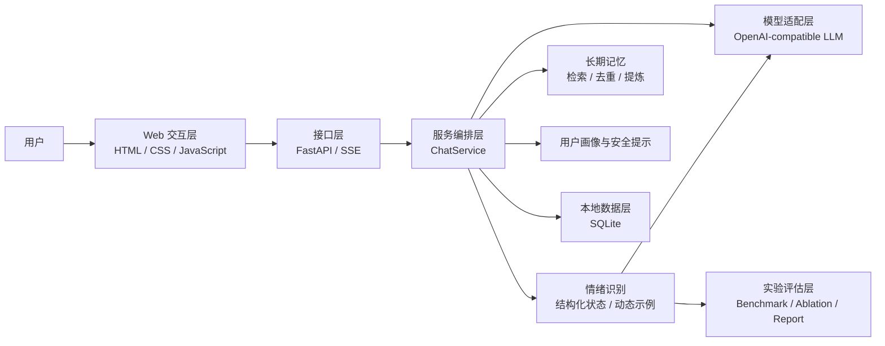

# 基于大语言模型的情绪感知陪伴式聊天机器人

本项目面向日常情绪陪伴场景，设计并实现了一套基于大语言模型的情绪感知聊天系统。系统不仅生成自然语言回复，还会结合多轮对话识别用户当前情绪，将结构化情绪状态、用户画像和长期记忆共同注入回复过程，旨在增强回答的连续性、个性化程度和情绪适配能力。

项目定位于“应用研究 + 工程实现 + 实验验证”相结合的专业硕士实践项目：一方面完成可实际运行的 Web 原型，另一方面围绕情绪识别模块建设数据集、对照实验、消融实验和指标报告工具，使系统设计能够被复现、分析和改进。

## 项目背景

通用大语言模型具备较强的语言生成能力，但直接用于情绪陪伴时仍存在三个问题：

1. 模型容易只关注当前一句话，难以稳定利用多轮对话中的情绪变化。
2. 用户画像、沟通偏好和长期约束缺少可靠的本地持久化机制。
3. 情绪识别策略往往与回复生成混在一起，难以通过对照实验判断各个组件的实际作用。

针对上述问题，本项目将“聊天生成、情绪识别、长期记忆、安全提示和实验评估”拆分为相对独立的模块，在保证系统可运行性的同时，为后续模型替换、参数调整和实验分析保留清晰边界。

## 项目目标

| 目标 | 项目实现 |
| --- | --- |
| 构建可运行的情绪陪伴原型 | 使用 FastAPI、LangChain 和免构建前端实现流式 Web 聊天。 |
| 提升回复的情绪适配能力 | 按固定回合识别 32 类情绪，并生成置信度、证据、回复策略和情绪轨迹。 |
| 保持多轮交流的连续性 | 将聊天历史、用户画像、近期情绪和相关长期记忆共同注入 Prompt。 |
| 保护用户本地数据 | 使用 SQLite 保存运行记录和长期记忆，不依赖托管记忆服务。 |
| 支持可复现的实验分析 | 提供公开数据基准、5 组消融配置、Accuracy、Macro F1 和报告生成工具。 |
| 保持模型接入的可替换性 | 通过 OpenAI-compatible 适配层支持聊天模型与情绪模型独立配置。 |

## 系统总体设计

系统采用分层设计，将用户交互、业务编排、情绪与记忆能力、模型调用和数据存储分开：



一次完整交互由 `ChatService` 统一编排：先保存用户输入并检索相关记忆，在指定回合执行情绪分析和安全判断，再把画像、记忆、情绪状态注入聊天 Prompt，最后流式生成回复并保存本轮结果。

## 主要研究与工程工作

### 1. 结构化情绪识别

项目将情绪识别从聊天生成中独立出来，使用固定的 32 类标签体系。识别结果不只有单一标签，还包含置信度、次级情绪、文本证据、回复策略、情绪变化说明和安全级别，便于后续回复生成和实验分析。

### 2. 多源上下文融合

系统将最近对话、近期情绪先验、动态选择的 EICL 示例、用户画像和长期记忆组织为不同上下文，再统一注入模型。各类上下文可以单独关闭或替换，便于定位性能变化来自哪个组件。

### 3. 本地长期记忆

项目使用 SQLite 实现长期记忆存储，通过保守规则抽取用户明确表达的偏好、画像、目标和边界，并支持词法检索、重复合并、冲突处理、替代关系和周期性跨轮提炼。

### 4. 情绪安全提示

系统根据当前输入和高置信度负面情绪生成 `normal`、`supportive` 或 `crisis` 级别的回复提示，用于约束回复策略。该模块属于工程辅助机制，不承担临床诊断或专业干预职能。

### 5. 可复现实验体系

项目提供 5 组情绪识别消融配置、JSON/JSONL 评估器、EmpatheticDialogues 公开数据基准和 Codex CLI 隔离运行器。实验输出以 exact Accuracy 与 Macro F1 为主，补充 95% 置信区间和情绪族诊断指标，并在调用前跳过对当前数据无效的 no-op 消融。

## 技术路线

项目按照以下路线完成系统设计与实验建设：

1. 分析情绪陪伴场景的功能需求，将系统拆分为聊天、情绪、画像、记忆、安全和评估模块。
2. 建立 OpenAI-compatible 模型适配层，实现聊天 LLM 与情绪 LLM 的独立配置。
3. 设计结构化情绪状态和动态示例检索方法，并接入多轮聊天流程。
4. 使用 SQLite 实现聊天记录、反馈、画像和长期记忆的本地持久化。
5. 接入公开情绪对话数据集并统一数据 Schema，形成可校验、可导出的实验输入。
6. 通过完整配置与受控消融配置进行对照，使用 Accuracy、Macro F1、失败数和分组指标生成实验报告。

## 系统功能

- 使用无需构建的 HTML、CSS 和 JavaScript 前端进行流式聊天。
- 支持 `openai`、`deepseek` 两类 OpenAI-compatible provider。
- 可为聊天和情绪识别分别配置 LLM；未单独配置时复用同一实例。
- 每隔固定用户回合执行一次结构化情绪识别，并在页面展示当前状态和近期轨迹。
- 将当前情绪、回复策略、安全提示、用户画像和相关长期记忆注入聊天 Prompt。
- 提供可跳过的首次画像录入，以及后续画像查看和编辑。
- 支持 AI 回复点赞、点踩、按原因重新生成，以及情绪识别正确性反馈。
- 使用本地 SQLite 保存长期记忆，执行词法检索、去重、冲突处理和周期性规则提炼。
- 提供 JSON/JSONL 离线评估、OpenAI-compatible LLM 消融和 Codex CLI 消融流程。

## 技术选型与运行要求

- Python 3.10+
- FastAPI、Uvicorn
- LangChain、`langchain-openai`
- Python 标准库 `sqlite3`
- OpenAI-compatible API 凭据
- 可选：已安装并登录的 Codex CLI，仅用于 `run_codex_cli_emotion_ablation.py`

项目没有前端构建步骤，也不依赖 Mem0 Platform、云端向量数据库或第三方托管记忆服务。

## 系统部署与运行

创建虚拟环境并安装依赖：

```bash
python3 -m venv .venv
source .venv/bin/activate
python -m pip install -r requirements.txt
```

复制配置模板：

```bash
cp .env.example .env
```

至少填写聊天 LLM 的 API Key。以下是 DeepSeek 示例：

```env
LLM_PROVIDER=deepseek
LLM_API_KEY=your_api_key_here
LLM_MODEL=deepseek-chat
LLM_BASE_URL=https://api.deepseek.com/v1
LLM_TEMPERATURE=0.7

EMOTION_INTERVAL=5
MEMORY_ENABLED=true
MEMORY_DB_PATH=data/records/memory.sqlite3
MEMORY_MAX_RESULTS=5
PROMPT_CONFIG_PATH=data/config/prompts.json
```

启动应用：

```bash
uvicorn chatbot.web:app
```

打开 <http://127.0.0.1:8000>。

`chatbot.main` 只用于配置校验和 Web 启动提示，不再提供交互式 CLI 聊天。

## 系统配置

`chatbot.config.load_config()` 按“CLI 参数 > 环境变量 > 默认值”解析 LLM 配置。Web 应用使用 `load_config([])`，因此 Web 运行时通常是“环境变量 > 默认值”。

### 聊天 LLM

| 变量 | 默认值 | 说明 |
| --- | --- | --- |
| `LLM_PROVIDER` | `openai` | 当前支持 `openai` 和 `deepseek`。 |
| `LLM_API_KEY` | 无 | 必填；未设置时兼容 `OPENAI_API_KEY`。 |
| `LLM_MODEL` | `gpt-4o-mini` | 未设置时兼容 `OPENAI_MODEL`。 |
| `LLM_BASE_URL` | 空 | OpenAI-compatible API 地址；兼容 `OPENAI_BASE_URL`。 |
| `LLM_TEMPERATURE` | `0.7` | 采样温度；兼容 `OPENAI_TEMPERATURE`。 |

### 情绪识别 LLM

如果所有 `EMOTION_LLM_*` 都未设置，情绪识别会复用聊天 LLM。只要出现任一 `EMOTION_LLM_*` 配置，程序就会创建独立情绪 LLM，空缺字段继承聊天 LLM。

| 变量 | 未设置时 |
| --- | --- |
| `EMOTION_LLM_PROVIDER` | 继承 `LLM_PROVIDER`。 |
| `EMOTION_LLM_API_KEY` | 继承 `LLM_API_KEY`。 |
| `EMOTION_LLM_MODEL` | 继承 `LLM_MODEL`。 |
| `EMOTION_LLM_BASE_URL` | 继承 `LLM_BASE_URL`。 |
| `EMOTION_LLM_TEMPERATURE` | 继承 `LLM_TEMPERATURE`。 |
| `EMOTION_INTERVAL` | `5`，必须为正整数。 |

独立情绪 LLM 示例：

```env
LLM_PROVIDER=deepseek
LLM_API_KEY=your_chat_api_key
LLM_MODEL=deepseek-chat
LLM_BASE_URL=https://api.deepseek.com/v1

EMOTION_LLM_PROVIDER=openai
EMOTION_LLM_API_KEY=your_emotion_api_key
EMOTION_LLM_MODEL=gpt-4o-mini
EMOTION_LLM_BASE_URL=https://api.openai.com/v1
EMOTION_LLM_TEMPERATURE=0
EMOTION_INTERVAL=5
```

### 本地长期记忆

| 变量 | 默认值 | 说明 |
| --- | --- | --- |
| `MEMORY_ENABLED` | `true` | `0`、`false`、`no`、`off` 会关闭记忆。 |
| `MEMORY_DB_PATH` | `data/records/memory.sqlite3` | 长期记忆数据库路径。 |
| `MEMORY_MAX_RESULTS` | `5` | 每轮最多注入的相关记忆数；非法值回退到默认值。 |
| `MEMORY_CONSOLIDATION_ENABLED` | `true` | 是否启用周期性记忆提炼；长期记忆关闭时也会关闭。 |
| `MEMORY_CONSOLIDATION_INTERVAL` | `5` | 两次提炼之间的用户回合数。 |
| `MEMORY_CONSOLIDATION_WINDOW` | `12` | 每次最多检查的近期 human/AI 消息数。 |
| `MEMORY_CONSOLIDATION_MODE` | `rules` | 当前仅支持本地规则模式，非法值回退为 `rules`。 |

单轮抽取会保守识别用户明确表达的偏好、画像、目标和边界；周期性提炼用于识别重复压力源和跨轮稳定偏好。SQLite provider 会合并重复记忆、保留更强边界，并只检索仍处于 active 状态的记录。

### Prompt 模板

| 变量 | 默认值 | 说明 |
| --- | --- | --- |
| `PROMPT_CONFIG_PATH` | `data/config/prompts.json` | 自定义聊天和情绪分析 Prompt。 |

可以复制 `data/config/prompts.example.json`：

```bash
cp data/config/prompts.example.json data/config/prompts.json
```

支持两个字段：

- `chat_system`：聊天 system Prompt 主体；画像、记忆和情绪上下文仍由程序追加。
- `emotion_analysis`：情绪识别模板，可使用 `{emotion_labels}`、`{example_block}`、`{likely_line}`、`{dialogue_context}`。

文件缺失、JSON 无效、字段为空或模板占位符错误时，程序会回退到内置默认 Prompt。

## 核心业务流程

1. 前端 `POST /api/chat/streams` 提交消息并取得一次性 `stream_id`。
2. 前端使用 `EventSource` 消费 `/api/chat/streams/{stream_id}`。
3. `ChatService` 将用户消息写入 `runtime.sqlite3`。
4. 服务使用当前输入、当前情绪和最近情绪检索本地长期记忆。
5. 到达 `EMOTION_INTERVAL` 时，情绪 LLM 分析最近对话并保存结构化结果。
6. `safety.py` 根据当前输入和情绪状态补充 `normal`、`supportive` 或 `crisis` 级别的回复提示。
7. 用户画像、相关长期记忆和情绪上下文被注入聊天 Prompt，聊天 LLM 开始流式生成。
8. 完整 AI 回复写入历史，并生成可用于反馈和重新生成的消息 ID。
9. 服务从本轮内容保守抽取长期记忆；到达间隔时再执行一次跨轮提炼。

记忆检索、记忆写入、记忆提炼或情绪识别失败不会阻断正常聊天；错误会通过 warning、SSE 状态或接口错误暴露。

## 情绪识别模块设计

标签集合定义在 `chatbot/emotion_labels.py`，共 32 类。默认情绪 Prompt 使用：

- 最近最多 `EMOTION_INTERVAL` 轮对话；
- 基于词法重叠和近期情绪先验选择的动态 EICL 示例；
- 最近 3 个成功情绪标签形成的候选先验。

LLM 应返回结构化 JSON：

```json
{
  "primary_emotion": "anxious",
  "confidence": 0.82,
  "secondary_emotions": ["hopeful"],
  "evidence": "I am worried about tomorrow's demo but I still want to try.",
  "reply_strategy": "Acknowledge the worry and suggest one small next step.",
  "trajectory_note": "Anxiety remains, with some hopeful intent.",
  "safety_level": "normal"
}
```

解析器会校验主情绪和次级情绪、把置信度限制在 0 到 1，并将未知安全级别回退为 `normal`。为兼容旧结果，`Emotion: anxious` 等行式输出仍可解析为最小状态。

安全层是本地关键词和高置信度情绪驱动的回复策略，不是临床评估、诊断或紧急服务。

## 系统接口设计

| 方法 | 路径 | 用途 |
| --- | --- | --- |
| `GET` | `/` | 返回聊天页面。 |
| `GET` | `/api/history?limit=10` | 返回最近 human/AI 消息。 |
| `GET` | `/api/session?limit=10` | 返回最近消息和与当前历史匹配的最新情绪。 |
| `GET` | `/api/profile` | 返回用户画像及是否为空。 |
| `PUT` | `/api/profile` | 保存经过字段过滤的用户画像并刷新聊天链。 |
| `GET` | `/api/profile/onboarding/questions` | 返回 5 个可跳过的画像问题。 |
| `POST` | `/api/profile/onboarding/draft` | 用聊天 LLM 生成画像草稿；不可用时回退为规则草稿。 |
| `GET` | `/api/emotion/timeline?limit=10` | 返回与当前历史匹配的近期结构化情绪状态。 |
| `POST` | `/api/chat/streams` | 创建一次性聊天流 ID。 |
| `GET` | `/api/chat/streams/{stream_id}` | 消费 SSE 流；同一 ID 只能使用一次。 |
| `POST` | `/api/messages/{message_id}/feedback` | 保存 `like` 或 `dislike`。 |
| `POST` | `/api/messages/{message_id}/regenerate` | 按固定原因重新生成一条 AI 回复。 |
| `POST` | `/api/emotion/feedback` | 保存情绪识别正确性反馈。 |

SSE 事件：

| 事件 | 含义 |
| --- | --- |
| `user_message` | 用户消息已写入。 |
| `emotion_start` | 开始情绪分析。 |
| `emotion_done` | 情绪分析成功，包含 state 和 safety。 |
| `emotion_error` | 情绪分析失败，本轮聊天继续。 |
| `token` | 一段回复内容。 |
| `done` | 回复完成，包含完整内容和消息元数据。 |
| `error` | 输入无效或聊天生成失败。 |

## 数据持久化设计

默认运行时文件均位于不会提交到 Git 的 `data/records/`：

| 文件 | 内容 |
| --- | --- |
| `data/records/runtime.sqlite3` | `chat_history`、`emotion_analysis`、`emotion_feedback` 等 JSON namespace，以及 `profile_entries` 用户画像表。 |
| `data/records/memory.sqlite3` | 长期记忆、状态、替代关系、使用次数和记忆提炼 checkpoint。 |

聊天历史、情绪状态和用户画像不会再从旧 JSON 文件加载，也没有自动迁移逻辑。离线评估脚本也不会直接读取 SQLite；需要向它提供 JSON 或 JSONL 实验结果。

## 实验设计与评估方法

### 1. 评估一份 JSON/JSONL 结果

```bash
python scripts/evaluate_emotion_analysis.py \
  --analysis-file data/examples/dynamic_eicl_sample.json \
  --labels-file data/examples/emotion_labels_sample.json
```

`--analysis-file` 和 `--labels-file` 都支持 JSON 数组或 JSONL。标注字段可使用 `expected`、`emotion` 或 `label`；记录依次按 `id/case_id`、`index`、`turn_count`、`timestamp` 或位置匹配。

输出包含样本数、正确数、Accuracy、Macro F1 和错误样例。

仓库保留了三份小型示例：

- `data/examples/emotion_labels_sample.json`
- `data/examples/static_few_shot_sample.json`
- `data/examples/dynamic_eicl_sample.json`

### 2. 运行 5 组 OpenAI-compatible LLM 消融

`scripts/run_emotion_ablation.py` 复用应用的情绪 LLM 配置并运行：

| Run | 示例策略 | 情绪历史先验 | 上下文 |
| --- | --- | --- | --- |
| `full` | 动态示例 | 开启 | 默认窗口 |
| `no_dynamic_examples` | 静态示例 | 开启 | 默认窗口 |
| `no_emotion_history` | 动态示例 | 关闭 | 默认窗口 |
| `short_context` | 动态示例 | 开启 | 最近 1 轮 |
| `zero_shot` | 无示例 | 关闭 | 默认窗口 |

先将 EmpatheticDialogues 的公开平衡子集导出为消融运行格式：

```bash
python scripts/benchmark/export_emotion_benchmark.py \
  --input data/benchmarks/empathetic_dialogues_v1/release/balanced_seed.jsonl \
  --output-dir data/records/empathetic_dialogues_seed_export
```

生成结果：

```bash
python scripts/run_emotion_ablation.py \
  --dialogues-file data/records/empathetic_dialogues_seed_export/dialogues.jsonl \
  --output-dir data/records/ablation
```

汇总指标：

```bash
python scripts/evaluate_emotion_ablation.py \
  --labels-file data/records/empathetic_dialogues_seed_export/labels.jsonl \
  --run full=data/records/ablation/full.json \
  --run no_dynamic_examples=data/records/ablation/no_dynamic_examples.json \
  --run no_emotion_history=data/records/ablation/no_emotion_history.json \
  --run short_context=data/records/ablation/short_context.json \
  --run zero_shot=data/records/ablation/zero_shot.json \
  --markdown-file data/records/ablation/summary.md \
  --csv-file data/records/ablation/metrics.csv
```

`zero_shot` 同时去掉 few-shot 示例和情绪历史先验，因此是组合消融，不能把指标变化单独归因于其中一个组件。

### 3. EmpatheticDialogues 真实数据基准（默认）

`data/benchmarks/empathetic_dialogues_v1/` 接入公开的 EmpatheticDialogues 官方测试集：

- 2,542 段英文人工众包对话，覆盖项目现有全部 32 类情绪；
- 正式集取首位说话者的第一条情境表达，使整段情绪标签与模型输入目标对齐；旧的后续轮次转换单列为弱标签诊断集；
- `balanced_seed.jsonl` 按每类 2 条组成 64 条平衡子集，前 32 条即覆盖全部 32 类；
- few-shot 示例只来自官方 train split，每类 2 条，test 样本不进入 Prompt；
- 标签与项目逐项一致，不需要把粗粒度标签主观映射到 32 类；
- 原始压缩包使用固定 SHA-256 校验，转换、数据校验、分布统计和旧格式导出均可复现；
- 数据许可为 CC BY-NC 4.0，只能用于非商业用途并需保留署名。

该数据由人类参与者按给定情绪情境撰写，不是生成式 AI 合成。不过，`expected` 是整段对话的情绪情境锚点，不是每个后续句子的独立复标，因此正式评测只使用情境起始表达；后续句子不得表述为“逐句人工复核金标准”。

```bash
python scripts/benchmark/prepare_empathetic_dialogues.py \
  --archive /path/to/empatheticdialogues.tar.gz

python scripts/benchmark/validate_emotion_benchmark.py \
  --input data/benchmarks/empathetic_dialogues_v1/release/test.jsonl

python scripts/benchmark/export_emotion_benchmark.py \
  --input data/benchmarks/empathetic_dialogues_v1/release/balanced_seed.jsonl \
  --output-dir data/records/empathetic_dialogues_seed_export
```

数据集选型对比、转换口径、来源、许可和研究限制详见 `data/benchmarks/empathetic_dialogues_v1/README.md`。

### 4. 可选：使用 Codex CLI 运行隔离消融

先把 seed 集导出为现有消融格式：

```bash
python scripts/benchmark/export_emotion_benchmark.py \
  --input data/benchmarks/empathetic_dialogues_v1/release/balanced_seed.jsonl \
  --output-dir data/records/empathetic_dialogues_seed_export
```

执行覆盖全部标签的 32 条 pilot。`--model` 必填，请替换为当前 Codex CLI 支持的模型，并只选择会实际改变 Prompt 的三组：

```bash
python scripts/run_codex_cli_emotion_ablation.py \
  --dialogues-file data/records/empathetic_dialogues_seed_export/dialogues.jsonl \
  --output-dir data/records/codex_cli_ablation/empathetic_dialogues_pilot \
  --limit 32 \
  --run full --run no_dynamic_examples --run zero_shot \
  --model YOUR_CODEX_MODEL
```

pilot 报告必须使用相同的 `--limit 32`，确保标注范围与运行结果一致：

```bash
python scripts/report_codex_cli_emotion_ablation.py \
  --seed-file data/benchmarks/empathetic_dialogues_v1/release/balanced_seed.jsonl \
  --limit 32 \
  --run full=data/records/codex_cli_ablation/empathetic_dialogues_pilot/full.json \
  --run no_dynamic_examples=data/records/codex_cli_ablation/empathetic_dialogues_pilot/no_dynamic_examples.json \
  --run zero_shot=data/records/codex_cli_ablation/empathetic_dialogues_pilot/zero_shot.json \
  --output-dir data/records/codex_cli_ablation/empathetic_dialogues_pilot
```

去掉 `--limit 32` 并更换输出目录即可运行全部 64 条 seed：

```bash
python scripts/run_codex_cli_emotion_ablation.py \
  --dialogues-file data/records/empathetic_dialogues_seed_export/dialogues.jsonl \
  --output-dir data/records/codex_cli_ablation/empathetic_dialogues_seed64 \
  --run full --run no_dynamic_examples --run zero_shot \
  --model YOUR_CODEX_MODEL
```

运行器为每个“样本 × 配置”启动独立的 `codex exec --ephemeral --sandbox read-only`，默认超时 180 秒、失败最多重试 1 次，并在每个任务后原子保存结果。只有 Prompt、模型、Schema、Codex CLI 版本和运行环境 provenance 全部一致时，已有成功结果才会被复用。

生成中文报告：

```bash
python scripts/report_codex_cli_emotion_ablation.py \
  --seed-file data/benchmarks/empathetic_dialogues_v1/release/balanced_seed.jsonl \
  --run full=data/records/codex_cli_ablation/empathetic_dialogues_seed64/full.json \
  --run no_dynamic_examples=data/records/codex_cli_ablation/empathetic_dialogues_seed64/no_dynamic_examples.json \
  --run zero_shot=data/records/codex_cli_ablation/empathetic_dialogues_seed64/zero_shot.json \
  --output-dir data/records/codex_cli_ablation/empathetic_dialogues_seed64
```

运行器会逐样本比较 treatment 与 `full` 的 Prompt，整组相同时直接跳过；所以 EmpatheticDialogues 正式集不会执行无历史可删的 `no_emotion_history` 和无上下文可截的 `short_context`。报告器会生成 `metrics.csv`、`summary.md` 和 `report-zh.md`，把调用失败计入正式指标，并再次记录 treatment 有效性。

## 项目完成情况

当前仓库已经形成从系统原型到实验分析的完整闭环：

- 完成可运行的情绪感知 Web 聊天原型；
- 完成聊天、情绪、画像、记忆、安全和反馈模块的解耦实现；
- 完成本地 SQLite 数据持久化和历史恢复；
- 完成固定标签、结构化输出和动态示例驱动的情绪识别链路；
- 完成 5 组消融配置、EmpatheticDialogues 公开数据基准、数据校验和指标报告工具；
- 建立覆盖后端服务、数据存储、Prompt、前端交互和实验脚本的自动化测试。

仓库不预设某个模型一定优于其他模型。具体实验结论应在固定代码提交、模型版本、运行参数和数据版本后，根据公开基准上的原始结果与报告得出。

## 项目结构

```text
chatbot/
  web.py                  FastAPI 应用、HTTP 路由和 SSE
  chat_service.py         聊天、情绪、安全、记忆和持久化编排
  config.py               聊天与情绪 LLM 配置
  llm.py                  LangChain Prompt、chain 和会话历史
  llm_adapter.py          OpenAI-compatible LLM 适配器

  emotion.py              情绪 Prompt 调用和分析记录
  emotion_state.py        结构化情绪状态解析与时间线
  emotion_prompt.py       情绪识别 Prompt 组装
  emotion_retrieval.py    动态 EICL 示例选择
  emotion_feedback.py     情绪正确性反馈
  safety.py               本地安全级别与回复提示

  runtime_store.py        通用 SQLite 运行时存储
  history.py              消息、点赞点踩和重新生成记录
  profile.py              用户画像持久化
  profile_onboarding.py   画像问题、草稿和字段过滤

  memory.py               长期记忆协议和配置
  local_memory.py         SQLite 记忆、检索、去重与冲突处理
  memory_extractor.py     单轮保守记忆抽取
  memory_consolidation.py 周期性跨轮记忆提炼
  prompt_config.py        可覆盖 Prompt 与内置回退
  static/                 无构建前端

scripts/
  evaluate_emotion_analysis.py         单组离线指标
  run_emotion_ablation.py              OpenAI-compatible LLM 消融
  evaluate_emotion_ablation.py         多组消融汇总
  run_codex_cli_emotion_ablation.py    Codex CLI 隔离运行器
  report_codex_cli_emotion_ablation.py Codex 消融报告
  benchmark/                           公开数据集转换、校验与导出工具

data/
  config/                 Prompt 示例和 Codex 输出 Schema
  examples/               小型评估与消融样例
  benchmarks/             EmpatheticDialogues 真实基准与 Emotion Ablation V2 合成诊断集
  records/                本地运行时数据与实验输出，不提交到 Git

tests/                    单元、Web、前端脚本和实验工具测试
```

## 系统测试

安装依赖后运行完整测试：

```bash
python -m pytest -q
```

只检查 README 中的关键路径和样例文件：

```bash
python -m pytest tests/test_readme.py -q
```

## 项目边界与后续工作

### 当前边界

- 应用固定使用 `default` session，面向本地单用户场景，没有认证、多用户隔离或生产级权限控制。
- 一次性 SSE stream id 保存在当前进程内存中；进程重启后失效，同一 id 只能消费一次。
- `runtime.sqlite3` 路径由代码中的默认值确定；只有长期记忆数据库提供 `MEMORY_DB_PATH` 环境变量。
- 关键词安全层只调整回复策略，不能替代专业心理健康服务或紧急援助。
- EmpatheticDialogues 的标签是整段情绪情境锚点，不是每个 utterance 的独立复标结果。

### 后续工作

- 增加用户认证、会话管理和多用户数据隔离，形成可部署的服务端架构。
- 引入人工双人标注、分歧仲裁和一致性统计，提高 benchmark 的标注可信度。
- 在固定模型和参数下重复运行实验，补充显著性分析、错误类型分析和跨模型对比。
- 研究更丰富的长期记忆检索与提炼方法，同时保留本地可控的数据边界。
- 将关键词安全提示升级为可评估的分层安全识别模块，并结合专业规范完善危机响应。
- 补充容器化部署、运行监控、数据备份和数据库迁移机制。
