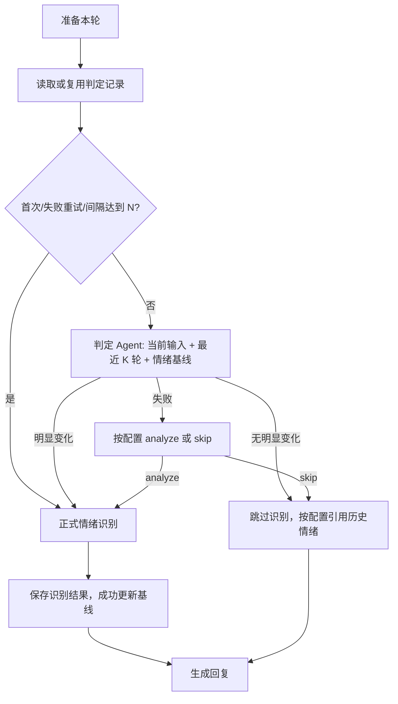

# 多用户情绪感知聊天机器人

基于 FastAPI、LangGraph 和 SQLite 的本地聊天应用。每条新用户输入先判断是否需要情绪识别，再生成 SSE 流式回复；聊天记录、情绪结果和调用审计持久化到同一个数据库。浏览器支持按用户标识进入或切换用户，每个用户使用一个默认对话。

当前运行代码位于 `chatbot/`；`archive/emotion-aware-chatbot-v1/` 是独立的旧版归档，不参与当前应用运行。

## 功能与架构

- 以用户标识解析或复用用户，并自动创建一个默认对话。
- 同一用户的已完成消息会进入下一轮模型 Prompt；不同用户的历史、Prompt 和 checkpoint 相互隔离。
- 默认首轮识别，之后由判定 Agent 按情绪变化提前触发，最多间隔 15 轮强制识别；间隔和历史窗口均可配置。跳过时默认引用最近成功情绪，标明来源轮次；识别失败默认普通回复，下轮再试。
- 聊天、情绪识别、是否需要识别的判定 Agent 系统提示词、情绪标签、分类映射和示例均可通过 JSON 文件配置。
- 聊天记录展示真实处理进度与本轮情绪识别结果，支持展开/折叠；右上角显示最近一次成功识别的情绪和时间。跳过和识别失败分别提示，不把旧结果当成本轮识别。
- 已完成的助手回复支持点赞、点踩，每条回复只能评价一次，刷新和请求重放后保留评价。
- 聊天回复按内容调整篇幅，通常展示 1～3 个完整气泡；每条可以包含几句话或完整段落。正常情况模型一次生成，页面按配置间隔逐条显示，刷新后保留分段。
- 流式回复支持 request ID 幂等重放；进程重启会保留已完成消息和正常 checkpoint，并把遗留中的回复标记为 `failed/process_interrupted`。
- 模型调用通过 OpenAI-compatible 接口完成；普通历史 API 和前端不会返回内部 `thread_id`、Prompt、reasoning 或 trace。

一次请求的主要路径如下：

```text
浏览器 → FastAPI → TurnCoordinator → LangGraph
                                      prepare_turn
                                           ↓
                                      decide_emotion → 按需调用判定 Agent
                                           ↓
                                      analyze_emotion → 情绪模型（触发时执行）
                                           ↓
                                      generate_response → 聊天模型（流式）
                                           ↓
                                      finalize_turn

SQLite：用户、对话、消息、判定及逐次调用审计、情绪分析和 LangGraph checkpoint
```

同一个 SQLite 文件包含六张业务表和 LangGraph SQLite Saver 的两张官方内部表：

| 表 | 职责 |
| --- | --- |
| `users` | 保存外部用户标识与内部自增用户 ID。 |
| `conversations` | 保存用户的默认对话、内部 `thread_id` 和对话状态。 |
| `messages` | 聊天与审计事实来源，保存正文、状态、供应商实际返回的 reasoning、Prompt、模型参数、Token、耗时和 trace。 |
| `emotion_gate_decisions` | 每轮 analyze/skip 决定、触发原因、配置、历史情绪来源和失败信息。 |
| `emotion_gate_attempts` | 判定 Agent 每次尝试的输入快照、输出、用量、耗时和错误。 |
| `emotion_analyses` | 实际触发的情绪分析记录：完整请求快照、配置、预算裁剪、原始输出、解析结果及失败诊断。 |
| `checkpoints` | 官方 Saver 保存的 LangGraph checkpoint；业务 API 不解析其 BLOB。 |
| `writes` | 官方 Saver 保存的中间写入；由 LangGraph 管理。 |

六张业务表的建表语句位于 `chatbot/db/schema.py`，每列均有中文备注。[SQLite 的注释语法](https://www.sqlite.org/lang_comment.html)使用 `--` 或 `/* ... */`，不提供 MySQL 式的独立列 `COMMENT` 元数据。本项目使用 `--` 列备注，新建表时会保存在 [`sqlite_schema.sql`](https://www.sqlite.org/schematab.html) 中，可在数据库客户端的建表 SQL/DDL 视图查看，例如：

```sql
SELECT sql FROM sqlite_schema
WHERE type = 'table' AND name = 'emotion_analyses';
```

客户端的列属性“备注”栏不一定会解析这些 SQL 注释。仅修改建表源码不会更新已经创建的表，本次备注补充不提升 schema 版本、不重建现有表；既有数据库重启后仍保留原建表 SQL。`checkpoints`、`writes` 由 LangGraph 创建，`sqlite_sequence` 由 SQLite 自动维护，不属于上述业务列备注的范围。

`reasoning_content` 只保存供应商确实返回的 reasoning；供应商没有返回时保持 `NULL`。它不会显示在当前前端或普通历史 API 中。

三个模型角色均支持通过 `.env` 配置思考模式。`CHAT_LLM_THINKING`、`EMOTION_LLM_THINKING`、`EMOTION_GATE_LLM_THINKING` 分别覆盖聊天、情绪识别、入口判定；留空时直接继承 `LLM_THINKING`。有效值只接受 `disabled`（关闭）和 `enabled`（开启），非法值会阻止启动，修改后重启服务生效。DeepSeek 官方接口的 V4 flash/pro 使用 `thinking.type`；阿里云百炼的 `ZHIPU/GLM-5.3` 使用 `enable_thinking=true`，不允许关闭思考，并支持 `LLM_REASONING_EFFORT=low/high/max` 及三个角色对应的 `*_REASONING_EFFORT` 覆盖。参数会写入各角色调用审计，其他模型或端点不自动添加上述供应商专用参数。参见 [百炼 GLM 文档](https://help.aliyun.com/zh/model-studio/glm-zhipu)和 [DeepSeek 思考模式文档](https://api-docs.deepseek.com/zh-cn/guides/thinking_mode/)。

## 项目结构

```text
chatbot/
├── web.py               # FastAPI 工厂、启动恢复、模型及数据库装配
├── main.py              # 兼容启动入口
├── api/                 # 用户解析、消息历史、SSE 接口及公开响应模型
├── services/            # 用户服务、轮次协调、事件订阅和中断恢复
├── graph/               # 主对话图、状态和节点
├── emotion/             # 情绪子图、配置加载、token 预算、示例检索与结果校验
├── llm/                 # 聊天模型适配器、系统提示词加载和凭据脱敏
├── db/                  # SQLite 连接、schema 和各业务表仓储
├── core/                # 通用配置、错误、路径和时间工具
└── static/              # 原生 HTML/CSS/JavaScript 聊天界面
data/
└── config/
    ├── emotion_gate.json    # 判定间隔、上下文窗口和失败策略
    ├── prompts/            # chat_prompts.json、emotion_prompts.json、emotion_gate_prompts.json
    ├── emotion_labels.json  # 34 类情绪及描述
    ├── emotion_families.json # 情绪到 family 的映射
    └── emotion_examples.json # 66 条动态检索示例
config/                  # 未指定 EMOTION_*_PATH 时使用的内置情绪配置
tests/                   # API、图、模型、数据库、前端和离线验收测试
docs/superpowers/         # 设计、实施计划与验收记录
archive/                 # 独立的旧版工程
.env.example             # 环境变量模板，不含真实凭据
requirements.txt         # Python 运行与测试依赖
pytest.ini               # pytest 配置
startup-local.sh         # 本地单 worker 启动命令
```

`data/chatbot.sqlite3` 及其 WAL/SHM 文件由应用运行时创建，不纳入版本控制。`data/config/` 中的 JSON 则随代码提交。

## 安装与启动

需要 Python 3.10 或更高版本；运行完整测试还需要 PATH 中有 Node.js。以下命令均从项目根目录执行。先确认解释器版本，再创建虚拟环境：

```bash
python3 --version
python3 -m venv .venv
.venv/bin/python -m pip install --upgrade pip
.venv/bin/python -m pip install -r requirements.txt
# 仅在尚无 .env 时创建，避免覆盖已有配置
[ -f .env ] || cp .env.example .env
```

`python3 --version` 必须显示 3.10、3.11、3.12 或更高版本。如果系统默认 `python3` 过旧，请把上述 `python3` 替换为实际的 Python 3.10+ 可执行文件；例如 Apple Silicon Homebrew 安装的 3.12 通常可用 `/opt/homebrew/bin/python3.12 -m venv .venv`。

编辑 `.env`，至少填写模型服务的 `LLM_API_KEY`，并按供应商设置 `LLM_MODEL` 和可选的 `LLM_BASE_URL`。所有模型均必须显式填写下述情绪模型的 `EMOTION_CONTEXT_TOKENS` 和 `EMOTION_TOKENIZER_MODEL`；缺失或留空会直接阻止启动，不按模型名称推断。随后以单 worker 启动：

```bash
.venv/bin/uvicorn chatbot.web:app --workers 1 --no-access-log
```

也可在项目根目录执行 `sh startup-local.sh`，它使用相同的单 worker 启动命令，不负责安装依赖或生成配置。

浏览器访问 [本地聊天界面](http://127.0.0.1:8000)，输入用户标识后开始聊天。API 交互文档位于 [Swagger UI](http://127.0.0.1:8000/docs)。

`chatbot.main:app` 是等价的兼容入口；如果需要工厂模式，也可运行 `.venv/bin/uvicorn chatbot.web:create_app --factory --workers 1 --no-access-log`。

模型连接与 Token 预算分别配置：`LLM_MODEL` / `EMOTION_LLM_MODEL` 是 API 模型名称，`EMOTION_TOKENIZER_MODEL` 明确指定本地计数器使用的分词器和消息模板。更换模型时，需要同步核对并填写实际上下文窗口和匹配的 tokenizer，代码不会自动补值。

当前 `.env.example` 使用百炼 `ZHIPU/GLM-5.3`，三个角色共同继承。复制后填写自己的北京业务空间 ID 和 API Key：

```dotenv
LLM_MODEL=ZHIPU/GLM-5.3
LLM_API_KEY=replace-with-provider-api-key
LLM_BASE_URL=https://YOUR_WORKSPACE_ID.cn-beijing.maas.aliyuncs.com/compatible-mode/v1
LLM_THINKING=enabled
LLM_REASONING_EFFORT=low
EMOTION_CONTEXT_TOKENS=1048576
EMOTION_TOKENIZER_MODEL=ZHIPU/GLM-5.3
EMOTION_OUTPUT_TOKENS=8192
```

百炼 GLM-5.3 支持 1M 上下文；若工作空间限制更小，应填写实际限制。输出预算包含思考和最终 JSON，因此模板为情绪识别和门控预留 8192 token。官方 tokenizer 随代码提供，固定版本和许可证见 `chatbot/llm/vendor/glm53/README.md`，启动不下载文件。计数覆盖完整纯文本消息及思考强度、历史思考和生成前缀，保留安全余量以应对服务端模板差异。模型和参数说明见 [百炼 GLM 文档](https://help.aliyun.com/zh/model-studio/glm-zhipu)。

如果改用 DeepSeek V4 Flash 官方服务，同步更换模型、接口和密钥，并在 `.env` 中显式填写：

```dotenv
EMOTION_CONTEXT_TOKENS=1048576
EMOTION_TOKENIZER_MODEL=deepseek-v4-flash
```

如果使用 OpenAI 模型，填写相匹配的 tokenizer（例如 `gpt-4o-mini`）和该部署的实际上下文窗口。如果自部署或代理限制了上下文，填写服务实际允许的值；不要把上面的 DeepSeek 数值套用到其他模型。未知或不支持的 tokenizer 会报错，需要接入对应计数器，不能只填写任意模型名称绕过校验。

同模型门控按现有规则继承已显式填写的情绪配置；不同模型的门控必须在 `data/config/emotion_gate.json` 中显式设置 `context_tokens` 和 `tokenizer_model`。升级代码后先运行 `.venv/bin/python -m pip install -r requirements.txt`，再执行 `sh startup-local.sh`。

DeepSeek 的官方 tokenizer 和消息编码器随项目提供，固定版本与许可证见 `chatbot/llm/vendor/deepseek_v4/README.md`；本地启动不下载模型。计数覆盖纯文本消息及角色、生成前缀，分别计算 chat/thinking 模板并取较大值，不支持将工具或图片载荷交给该情绪计数器。

## 配置

以 `.env.example` 为配置清单。已有进程环境变量优先于 `.env`，修改环境变量后需要重启应用。不要提交包含真实密钥的 `.env`。

### 聊天与存储

| 变量 | 默认值或要求 | 用途 |
| --- | --- | --- |
| `LLM_API_KEY` | 必填 | 默认模型服务密钥。 |
| `LLM_MODEL` | `gpt-4o-mini` | 默认供应商模型名称。 |
| `LLM_BASE_URL` | 留空使用 SDK 默认地址 | OpenAI-compatible 服务地址。 |
| `LLM_TEMPERATURE` | `0.7`，范围 0–2 | 默认采样温度。 |
| `LLM_THINKING` | `disabled` | 共享思考模式：`disabled` / `enabled`；三个角色可独立覆盖。 |
| `LLM_REASONING_EFFORT` | 留空使用供应商默认值 | 百炼 GLM-5.3 推理强度：`low` / `high` / `max`；角色通过对应的 `*_REASONING_EFFORT` 独立覆盖。 |
| `LLM_TIMEOUT_SECONDS` | `60`，大于 0 | 默认模型调用超时；各角色有效超时参与关闭等待预算。 |
| `CHAT_BUBBLE_GAP_MS` | `500`，整数范围 0–10000 | 气泡在浏览器中的最短展示间隔（毫秒）；0 表示立即展示，不延迟后台生成与保存。修改后重启。 |
| `CHAT_CONTEXT_MESSAGE_LIMIT` | `40`，范围 1–200 | 聊天 Prompt 中最近已完成消息的数量上限，含当前已入库的用户消息；不是轮数或 token 数。 |
| `SQLITE_DB_PATH` | `data/chatbot.sqlite3` | 业务与 checkpoint 共用的 SQLite 文件。 |
| `CHAT_SYSTEM_PROMPT_PATH` | 留空读取 `data/config/prompts/chat_prompts.json` | 聊天系统提示词文件。 |

### 情绪模型与预算

| 变量 | 默认值或要求 | 用途 |
| --- | --- | --- |
| `EMOTION_LLM_API_KEY` | 留空继承 `LLM_API_KEY` | 情绪模型服务密钥。 |
| `EMOTION_LLM_MODEL` | 留空继承 `LLM_MODEL` | 情绪模型名称。 |
| `EMOTION_LLM_BASE_URL` | 留空继承 `LLM_BASE_URL` | 情绪模型服务地址。 |
| `EMOTION_LLM_TEMPERATURE` | 留空继承 `LLM_TEMPERATURE`，范围 0–2 | 情绪采样温度。 |
| `EMOTION_LLM_TIMEOUT_SECONDS` | 留空继承 `LLM_TIMEOUT_SECONDS` | 情绪模型调用超时，必须大于 0。 |
| `EMOTION_CONTEXT_TOKENS` | **必填，无默认值** | 所部署情绪模型的实际上下文窗口大小。 |
| `EMOTION_TOKENIZER_MODEL` | **必填，无默认值** | 显式选择与部署匹配且受支持的分词器/聊天模板，不从 API 模型名称推断。 |
| `EMOTION_OUTPUT_TOKENS` | `1024` | 情绪输出预留 token 数。 |
| `EMOTION_SAFETY_TOKENS` | `256` | 输入计数的安全余量。 |
| `EMOTION_LABELS_PATH` | 模板指向 `data/config/emotion_labels.json` | 标签及描述文件。 |
| `EMOTION_FAMILIES_PATH` | 模板指向 `data/config/emotion_families.json` | 分类映射文件。 |
| `EMOTION_SYSTEM_PROMPT_PATH` | 留空读取 `data/config/prompts/emotion_prompts.json` | 情绪识别提示词文件，每次分析重新读取。 |
| `EMOTION_EXAMPLES_PATH` | 模板指向 `data/config/emotion_examples.json` | 动态检索示例文件。 |

`LLM_*` 是统一默认模型配置。三个角色分别通过 `CHAT_LLM_*`（聊天）、`EMOTION_LLM_*`（情绪识别）、`EMOTION_GATE_LLM_*`（入口判定）独立覆盖，未设置、空字符串或纯空白字段均直接继承对应的 `LLM_*`，不会继承其他角色的配置。

表格中的默认值是环境变量未配置时的代码回退值。当前 GLM-5.3 模板显式设置模型、接口、`enabled`、`low`、匹配的 tokenizer 和 8192 token 输出预算，以模板配置为准。

例如 `LLM_MODEL=default-model`、`CHAT_LLM_MODEL=chat-model`，其余两组模型留空时，聊天使用 `chat-model`，情绪识别和入口判定均使用 `default-model`。仅覆盖模型名不会切换密钥或服务地址；切换供应商时应同时配置对应角色的密钥和地址。

| 聊天覆盖项 | 留空时使用 |
| --- | --- |
| `CHAT_LLM_API_KEY` | `LLM_API_KEY` |
| `CHAT_LLM_MODEL` | `LLM_MODEL` |
| `CHAT_LLM_BASE_URL` | `LLM_BASE_URL` |
| `CHAT_LLM_TEMPERATURE` | `LLM_TEMPERATURE` |
| `CHAT_LLM_TIMEOUT_SECONDS` | `LLM_TIMEOUT_SECONDS` |
| `CHAT_LLM_THINKING` | `LLM_THINKING` |
| `EMOTION_LLM_THINKING` | `LLM_THINKING` |
| `EMOTION_GATE_LLM_THINKING` | `LLM_THINKING` |

兼容已有 `.env`：原 `LLM_*` 继续生效，含义变为共享默认配置；如果原配置仅供聊天使用，请移到 `CHAT_LLM_*`，并为 `LLM_*` 填写共享默认值。情绪识别温度需要保持为 0 时，显式设置 `EMOTION_LLM_TEMPERATURE=0`。

**情绪分析是当前默认启动流程的必需组件，没有 `.env` 开关可关闭。** 模板故意留空两个必填预算/计数器参数，需要按实际部署填写。缺少参数、情绪 JSON 无效或计数器不受支持都会阻止启动，这与运行中情绪分析失败后继续回复的行为不同。

OpenAI-compatible HTTP 接口可用不代表分词器兼容。当前计数实现依赖 LangChain/tiktoken；DeepSeek 等未被当前计数器支持的模型需要适配 `TokenCounter` 并注入 `EmotionRuntime`，或为情绪分析单独选择受支持的模型，不能填入无关的 OpenAI 模型名绕过校验。

### 情绪判定 Agent 与集中策略配置

日常编辑 `data/config/emotion_gate.json`。配置启动时加载，修改后重启生效；`EMOTION_GATE_CONFIG_PATH` 可覆盖位置。未知或重复键、非法数值/枚举和缺失版本会阻止启动。未写出的可选策略使用集中默认值，预算字段的 `null` 表示继承正式情绪模型的有效设置。

| 配置字段 | 默认值 | 用途 |
| --- | --- | --- |
| `max_interval_turns` | `15` | 正整数，距上次成功识别的最大轮次差，程序强制保证。 |
| `history_turn_limit` | `5` | 最近完整对话轮数，非负整数；可大于 5，0 表示只用当前输入及情绪基线。 |
| `force_first_analysis` | `true` | 首轮直接识别。关闭后无基线也必须在第 N 轮触发。 |
| `gate_failure_action` | `analyze` | 判定失败后 analyze 或 skip；不能否决间隔上限。 |
| `retry_failed_analysis_next_turn` | `true` | 正式识别失败后下一条新输入再试，失败不重置间隔。 |
| `reuse_last_success_on_skip` | `true` | 跳过时提供历史情绪和来源。 |
| `reuse_last_success_on_analysis_failure` | `false` | 正式识别失败时是否提供历史情绪。 |
| `model_retry_count` | `0` | 判定模型额外尝试次数，每次单独审计，SDK 隐式重试关闭。 |
| `retry_delay_seconds` | `0` | 显式重试间固定等待秒数。 |
| `context_tokens`、`output_tokens`、`safety_tokens`、`history_ratio`、`tokenizer_model` | `null` | 逐项继承情绪模型预算，可显式覆盖。history_ratio 在 (0,1] 内。 |

判定 Agent 的 prompt **独立存放于 `data/config/prompts/emotion_gate_prompts.json`**，包含 `version` 和 `system`，通过 `EMOTION_GATE_SYSTEM_PROMPT_PATH` 覆盖路径。情绪变化标准和判定指令都在该文件中维护。输出协议固定为 `should_analyze`（布尔值）和 `reason`（简短理由），修改提示词时须保留此协议。启动校验并加载提示词，修改后重启；每次判定保存实际版本、正文与调用快照。

判定连接支持 `EMOTION_GATE_LLM_API_KEY`、`EMOTION_GATE_LLM_MODEL`、`EMOTION_GATE_LLM_BASE_URL`、`EMOTION_GATE_LLM_TEMPERATURE`、`EMOTION_GATE_LLM_TIMEOUT_SECONDS`，留空逐项直接继承 `LLM_*` 默认配置。判定模型与情绪识别模型不同时，必须在策略 JSON 显式提供匹配的 `context_tokens` 和 `tokenizer_model`；服务地址和密钥不会随模型名自动切换。

一轮是一条被接受的新用户输入，重复 request_id 不计新轮，同文不同请求计新轮。第 1 轮识别成功后，无提前触发时第 16 轮再次识别；若第 8 轮提前成功，则最迟第 23 轮识别。完整历史轮次指用户消息＋已完成助手回复，当前输入另算；失败或未完成配对排除。判定窗口与正式识别历史预算独立，正式识别仍按自己的 token 预算选择历史。


```mermaid
flowchart TD
    A[准备本轮] --> B[读取或复用判定记录]
    B --> C{首次/失败重试/间隔达到 N?}
    C -- 是 --> E[正式情绪识别]
    C -- 否 --> D[判定 Agent: 当前输入 + 最近 K 轮 + 情绪基线]
    D -- 明显变化 --> E
    D -- 无明显变化 --> F[跳过识别，按配置引用历史情绪]
    D -- 失败 --> G[按配置 analyze 或 skip]
    G -- analyze --> E
    G -- skip --> F
    E --> H[保存识别结果，成功更新基线]
    H --> I[生成回复]
    F --> I
```

模型或解析失败按配置处理；数据库写入失败终止本轮，不继续生成缺少审计的回复。启动恢复保留终态记录，将遗留判定与调用标记为中断失败，不自动重复外部调用。审计查询示例（使用目标会话 ID 替换参数）：

```sql
SELECT id, request_id, action, reason, analysis_id, snapshot_json, error_json
FROM emotion_gate_decisions WHERE conversation_id = :conversation_id ORDER BY created_at;
SELECT a.attempt_no, a.status, a.snapshot_json, a.facts_json
FROM emotion_gate_attempts a JOIN emotion_gate_decisions d ON d.id = a.decision_id
WHERE d.conversation_id = :conversation_id AND d.request_id = :request_id ORDER BY a.attempt_no;
```

正式情绪识别的示例数量、先验加分和近期标签数量也可通过 `EMOTION_EXAMPLE_LIMIT`（默认 4）、`EMOTION_PRIOR_BOOST`（默认 2.0）、`EMOTION_RECENT_LABEL_LIMIT`（默认 3）配置；前后两项数量可设为 0 以关闭示例或标签先验。以上均集中校验，配置快照记录实际值。

### 回复风格与多气泡

`data/config/prompts/chat_prompts.json` 控制回复风格，默认倾向自然、口语化，按闲聊、倾诉或求助决定篇幅，不设固定字数，也不强制每次提问或输出三条。内容较多时可以保留完整段落、步骤和代码。提示词修改后下一轮生效。

聊天适配器使用 OpenAI-compatible 的 `response_format={"type":"json_object"}`，接口需支持 JSON 输出模式（[DeepSeek 官方说明](https://api-docs.deepseek.com/api/create-chat-completion/#request)）。固定格式由程序附加到提示词：`{"messages":["第一条","第二条"]}`，不会在界面显示。服务端用 JSON 字符串的完成边界识别气泡，不按标点或普通换行拆分。一轮仍只保存一条助手记录；`content` 是用空行连接的正文，`bubbles_json` 保存原始气泡数组，模型历史与情绪识别继续使用原来的轮次和正文。

首两条完整字符串解析后，先事务保存再推送；第三条等整个对象校验完成后推送。模型偶尔生成超过三项时，把多出的内容合入第三条，不截断正文。未按协议返回的普通文本作为一个气泡在生成结束后展示；JSON 结构错误、空内容或模型输出被截断时记录失败，保留已完成气泡，不把半段协议展示出来。供应商原始输出保存在内部调用轨迹，普通历史 API 不返回。

页面收到 `run_started.bubble_gap_ms` 后启用整条展示：`bubble` 事件携带 `assistant_message_id`、从 0 开始的 `index` 和 `content`。`token` 保留给旧客户端；结构化回复对应的 token 是解码后的正文，不是原始 JSON。当前页面忽略逐字事件，在显示间隔内继续接收数据，展示完已有气泡后处理 `done`，随后允许下一轮发送。

历史 API 和 `done.message` 均返回 `bubbles`：数组表示保存的气泡，空数组表示尚无完整气泡，`null` 表示旧消息，按原正文展示一个气泡。刷新、断线同步和幂等重放直接恢复已保存的分段，不重播显示间隔；切换用户或离开页面会取消尚未执行的展示队列。失败后保留已发气泡并提示生成未完成。

启动时 schema 从 v3 增量升级到 v4，仅新增可空 `messages.bubbles_json` 列，保留旧正文和审计，不把历史段落重新切分。该升级不改变消息数或情绪轮次。本功能沿用一问一答流程，不包含连续输入、插话或主动开场。

### JSON 配置与路径

日常编辑 `data/config/` 下的文件：

- `prompts/chat_prompts.json`：包含非空字符串 `version` 和 `system`，控制聊天角色和回复风格。
- `emotion_labels.json`：每个标签包含 `description`（识别描述）和 `display_name`（前端显示名称），包含 34 类情绪。
- `emotion_families.json`：`"情绪标签": "family"`，键必须与标签集合完全一致。
- `emotion_examples.json`：示例数组，每条包含非空字符串 `id`、`dialogue`、`emotion`；ID 唯一，标签必须已定义。

前端情绪名称配置在 `emotion_labels.json` 的每个标签下面，例如：

```json
{
  "sad": {
    "description": "general unhappiness or sorrow",
    "display_name": "难过"
  }
}
```

修改 `display_name` 即可调整情绪徽标和处理卡片的名称。识别模型仍只读取 `description`，显示名称不会进入模型提示词，也不改变已保存的识别结果。兼容旧的 `"sad": "描述"` 格式；未提供 `display_name` 的标签显示原始标签。

识别和展示统一使用 `EMOTION_LABELS_PATH`：模板指向 `data/config/emotion_labels.json`，留空时按项目位置定位 `config/emotion_labels.json`。显示名称在每次构造展示数据时重新读取，修改后下一次进度事件、历史查询或请求重放生效，已显示的页面需刷新或等待新数据；识别描述和标签集合修改后仍需重启。缺失文件、无效 JSON、重复键、空白名称或未知字段会报配置错误，修正文件后重试。

三个提示词文件统一使用 `version` + `system` 格式，分别表示提示词版本和系统提示词正文。聊天提示词的最小结构如下（如需调整角色，可替换内容）：

```json
{
  "version": "v2",
  "system": "你是小禾，用自然、简洁的中文回应用户。"
}
```

`CHAT_SYSTEM_PROMPT_PATH` 留空时，默认从项目位置定位 `data/config/prompts/chat_prompts.json`；该默认文件缺失或为空时使用代码内置提示词。显式指定路径时，文件缺失或为空会报配置错误；无效 JSON、键重复，或 `version` / `system` 缺失、不是字符串、为空白时同样报错。提示词在每轮构造聊天 Prompt 时读取，修改 JSON 后下一轮生效。

情绪识别提示词单独存放在 `data/config/prompts/emotion_prompts.json`，包含两个非空字符串字段：

```json
{
  "version": "emotion-v2-1",
  "system": "此处填写完整的情绪识别规则及 JSON 输出要求"
}
```

修改该文件的 `system` 即可调整识别规则，建议同时更新 `version`。标签与检索示例仍由程序动态附加。可通过 `EMOTION_SYSTEM_PROMPT_PATH` 指定其他文件；留空时按项目位置定位默认文件，不依赖启动目录。每次分析重新读取，修改后下一轮生效；默认或指定文件缺失、为空、JSON 无效、键重复或必填字段不合法时均报配置错误，不回退到硬编码规则。在分析流程中，该错误被记录为准备阶段失败，不调用情绪模型。审计快照保存实际提示词、配置版本及 `prompt_config_hash`，便于追溯修改。

已有自定义提示词文件也需迁移：将 `chat_system` 或 `emotion_system` 重命名为 `system`，聊天配置补充 `version`（例如 `"v2"`）。旧字段不再作为提示词正文读取。两个文件的正文均保持原样，版本作为配置元数据，不会由加载器自动拼入正文。

标签、family 和示例的三个 `EMOTION_*_PATH` 在模板中显式指向 `data/config/`；留空时分别回退到项目内 `config/` 的对应文件。两套情绪 JSON 是独立文件，编辑一套不会同步另一套。标签、family 和示例配置在启动时加载，修改后需重启。

环境变量中显式填写的相对文件路径，以及相对 SQLite 路径，均相对于启动目录；建议从项目根目录运行，或改填绝对路径。上述未显式配置时使用的内置 JSON 路径则相对于项目位置解析。

## API 使用

| 方法与路径 | 请求 | 返回 |
| --- | --- | --- |
| `POST /api/users/resolve` | JSON：`identifier` | 用户及其默认对话。标识会去除首尾空白，长度为 1–128。 |
| `GET /api/users/{user_id}/messages` | 可选 `limit`（默认 100，范围 1–200）、`before_sequence`（正整数） | 消息历史，支持向前分页。 |
| `POST /api/users/{user_id}/messages:stream` | JSON：`request_id`、`content` | SSE 流。`request_id` 必须是规范小写 UUID4，正文不得为空白或包含 NUL。 |

### 回复点赞、点踩

`PATCH /api/users/{user_id}/messages/{message_id}/feedback` 接收
`{"feedback":"like"}` 或 `{"feedback":"dislike"}`，返回 `message_id` 和 `feedback`。
仅允许评价当前用户默认对话中已完成的助手回复；一条回复的多个气泡共用一组评价按钮。
评价成功后显示“已赞”或“已踩”并禁用按钮，保存失败可重试。每条回复只接受首次评价，
重复提交返回 `409 already_rated`；其他用户或不存在的消息返回 `404 message_not_found`，
用户消息、未完成或失败的助手回复返回 `400 invalid_identifier_or_message`。

历史和 SSE `done.message` 的 `feedback` 为 `null`、`like` 或 `dislike`，重放读取已保存评价。
启动时 schema 从 v4 增量升级到 v5，仅增加可空 `messages.feedback` 列，不改写正文、气泡或调用审计。
评价只保存到当前应用，不触发模型调用或自动训练，也不迁移旧项目的历史评价数据。

先解析用户，再将返回的 `user.id` 用于历史和发送接口：

```bash
curl -sS http://127.0.0.1:8000/api/users/resolve \
  -H 'Content-Type: application/json' \
  -d '{"identifier":"demo"}'
```

SSE 事件包括 `run_started`、`user_message`、`progress`、`token`、`bubble`、`done`、`error`。同一对话中，重复提交相同 `request_id` 和正文不会重复生成，已结束的轮次可重放结果；该轮仍在运行，或同一用户已有另一轮生成中时返回 `409`。新一轮应生成新的 UUID4。客户端断连仅取消显示订阅，后台轮次继续执行，之后可通过历史接口查看结果。

普通 API 只返回公开消息字段与经过字段白名单筛选的情绪摘要，不暴露内部 `thread_id`、完整情绪审计、Prompt、reasoning 或 trace。

### 聊天处理过程与情绪展示

- `progress` 事件在后端准备完成、情绪判定完成和情绪分析结束后发送，携带 `request_id`、`assistant_message_id`、`processing` 和 `latest_emotion`。页面展示的是业务处理步骤，不是模型原始思维链；不使用计时器伪造步骤完成。
- `processing` 包含 `steps`、`emotion_status`、`emotion_invoked`、`emotion`、`started_at` 和 `elapsed_ms`。步骤状态包括待处理、进行中、已完成、未完成和已跳过；耗时是从本轮消息保存到回复结束的总时间。
- `emotion` 仅在本轮成功识别时出现，包含标签、中译名、模型置信度、简短依据、来源消息和识别时间。准备阶段失败时 `emotion_invoked=false`；跳过和失败都不会套用历史结果。
- 历史接口的助手消息和 `done.message` 均包含相同的 `processing`；历史接口及 `done` 顶层返回 `latest_emotion`。最近结果独立于历史分页查询，同一用户刷新、断线恢复或重放都能恢复显示；切换用户会清空上一用户的状态。
- 右上角始终标记“最近识别”与时间；本轮未识别或失败时保留最近成功结果，没有成功结果时显示“尚未识别”。`neutral` 显示“情绪平稳”，`no_emotion` 显示“未表达明确情绪”；两者都不是识别失败。
- 历史步骤由已有消息、判定和分析记录重建，不增加数据库表；缺少这些记录的旧消息不补造处理过程。

离线浏览器验收：先运行 `PYTHON_DOTENV_DISABLED=1 .venv/bin/python -m tests.ui.preview_emotion`，再在另一个终端运行 `node tests/ui/emotion_browser.cjs`（需要本地 Playwright 与 Chromium，可分别用 `PLAYWRIGHT_MODULE` 和 `CHROMIUM_EXECUTABLE` 指定已有安装）。测试服务仅监听 `127.0.0.1:8765`，使用 `data/ui-preview.sqlite3` 和离线模型，测试截图写入 `docs/verification/emotion-ui/`。

## 测试

默认测试使用确定性离线模型 adapter，不需要密钥，也不会发起模型网络请求。测试需要 Node.js 在 PATH 中，以运行现有前端脚本测试；禁用 dotenv 自动查找，避免 worktree 测试读到父目录的真实配置：

```bash
PYTHON_DOTENV_DISABLED=1 .venv/bin/python -m pytest -q
```

真实模型冒烟测试默认显示 `SKIPPED`。它会启动完整应用并调用情绪与聊天模型，使用临时数据库；需先配置两者的有效参数和凭据，确认允许实际模型调用后再运行：

```bash
RUN_LIVE_LLM_TEST=1 .venv/bin/python -m pytest tests/app/test_live_llm.py -v
```

真实模型测试通过与完整离线测试通过是两个独立结论；不要用离线结果声称真实供应商调用成功。

## 逐轮情绪分析

主图按 `prepare_turn → analyze_emotion → generate_response → finalize_turn` 执行；情绪节点内部为独立的准备、调用、保存子图。每个新 request_id 分析一次，相同文字的新请求仍会重新分析；重复请求不重复调用模型。

- `data/config/emotion_labels.json`：`"情绪": {"description": "描述", "display_name": "显示名称"}`，包括原有 32 类以及 `neutral` 和 `no_emotion`。
- `data/config/emotion_families.json`：`"情绪": "family"`，例如 sad 和 lonely 都属于 sadness_loss。family 由程序查表派生。
- `data/config/emotion_examples.json`：包含 66 条带标签的 few-shot 示例，动态检索最多 4 条，并保存选择理由和分数。

`neutral` 指明确表达中性状态，例如“既不高兴，也不难过”；`no_emotion` 指未表达情绪，例如“转换这个文件”。二者都不是失败标记。配置加载拒绝重复键、空值、未知示例标签及不完整 family 映射；修改后重启生效，每次调用保存当时配置快照及哈希。

情绪模型连接参数 `EMOTION_LLM_*` 可逐项覆盖共享的 `LLM_*` 默认配置；温度和超时留空也继承共享默认值，自动重试次数为 0。`EMOTION_LLM_TIMEOUT_SECONDS` 可独立调整。两次串行调用的关闭等待预算相加。

历史候选来自当前会话，截至本条用户输入。按 request_id 配对为完整 human→assistant 轮次，排除未完成或失败的历史轮次；API 发送时映射为 user/assistant。优先保留最近轮次和完整的当前 human 消息，超预算删除最早整轮，不截断单条、不跳选更早短轮，也不删除数据库原始历史。

聊天消息（含当前输入和消息开销）默认不得超过上下文 C 的 60%，可通过 `EMOTION_HISTORY_RATIO` 调整；完整提示词还必须满足 `输入 token + 输出预留 + 安全余量 ≤ C`。`EMOTION_OUTPUT_TOKENS` 默认 1024，`EMOTION_SAFETY_TOKENS` 默认 256。本地 token 数是与所选模板关联的估计，安全余量用于协议/计数差异；不能保证任意供应商与本地估计完全相同。聊天回复自身继续使用 CHAT_CONTEXT_MESSAGE_LIMIT，不受此裁剪器改写。

当前输入单独超预算时，不截断它；保存 context_budget_exceeded，跳过情绪模型并继续普通回复。其他模型、解析和校验失败同样先保存可获取的信息再继续回复，不复用旧情绪。数据库持久化本身失败时本轮报基础设施错误。启动恢复把未完成分析标为 process_interrupted，保留已提交快照；不会自动重试旧分析。

数据库启动时从 schema v1/v2 增量升级到 v3，保留原消息和 checkpoint，不自动回填旧消息分析。查询每轮识别及失败信息：

```sql
SELECT user_message_id, status,
       json_extract(result_json, '$.primary_emotion') AS emotion,
       json_extract(result_json, '$.primary_family') AS family,
       json_extract(error_json, '$.stage') AS failure_stage,
       json_extract(error_json, '$.message') AS failure_message,
       input_tokens, output_tokens, latency_ms
FROM emotion_analyses ORDER BY created_at, id;
```

`snapshot_json` 保存实际入模提示词、human/assistant 历史、标签和 family、示例、有效参数、token 计数和裁剪 ID；`raw_output`、`result_json`、`response_metadata_json`、`error_json` 分别保留原始输出、校验结果、服务元数据及错误。错误诊断包含可获取的阶段、类型、状态码、服务端请求 ID 和错误正文；未知字段为 NULL。连接凭据脱敏。reasoning_content 只记录模型实际返回的内容。完整审计信息不公开到普通历史 API 或前端；页面仅使用经过字段白名单筛选的处理状态和情绪结果摘要。

## 数据、安全与部署边界

- 默认数据文件是 `data/chatbot.sqlite3`。备份前停止应用，并复制该文件及当时存在的 `-wal`、`-shm` 文件；更稳妥的方式是使用 SQLite 的在线备份能力。
- 用户标识只是数据分区键，不是身份认证。任何知道同一标识的人都可以访问同一份聊天数据；不要把本项目直接暴露到不可信网络。
- 聊天正文、供应商实际返回的 reasoning、Prompt 和 trace 会以明文保存在 SQLite 中，可能包含敏感内容。请限制文件权限、备份访问和保留周期；不要把运行数据库提交到 Git。
- 首期只支持一个应用进程和 `--workers 1`。进程内并发锁与 SQLite 方案不能作为多进程或生产集群的一致性保证。
- 当前未实现身份认证、多会话创建/切换 UI、跨会话长期记忆、reasoning/trace 调试界面或生产级多实例数据库。

## 旧版归档

旧的 emotion-aware chatbot 归档位于 `archive/emotion-aware-chatbot-v1/`，对应基线提交 `86220ac52df1641fee051bae8e4e04fd09ff6e40`，保留基线的 166 个文件。归档仅供追溯和独立运行；新版不导入其模块，也不与它共享 Python 环境或依赖。运行方法见归档内的 `ARCHIVE.md`。

2026-09-07：回复点赞、点踩已迁移到新版，归档中的对应接口、按钮和写入逻辑已移除；其余归档能力保留。原始完整版本仍可通过基线提交追溯。

### 聊天回复格式校验

生产模型使用 JSON object 模式，回复必须为 `{"messages":["完整气泡正文"]}`；顶层数组和纯文本不会作为聊天回复展示。JSON 模式仅保证 JSON 语法，模型仍可能返回错误结构。若结构校验失败且尚未展示任何气泡，系统追加格式要求并重新生成一次；已展示气泡、网络异常或输出截断不会触发此格式重试。两次均不合规时返回 `reply_format_error`。

SQLite 消息的 `trace_json.reply_attempts` 保存各次尝试的提示词、原始输出和错误码，`model_calls` 保存各次模型调用元数据及 token 用量；消息本身的用量字段对应最后一次调用。重试不会修改旧的失败消息。

历史助手回复在数据库和页面中仍保存、展示纯正文；构造下一轮模型提示词时，将正文编码为 `{"messages":["历史完整正文"]}`，使历史示例与要求生成的协议一致。用户消息保持原文，正文中的 JSON、代码和换行作为字符串转义，不解析或改写其含义。
