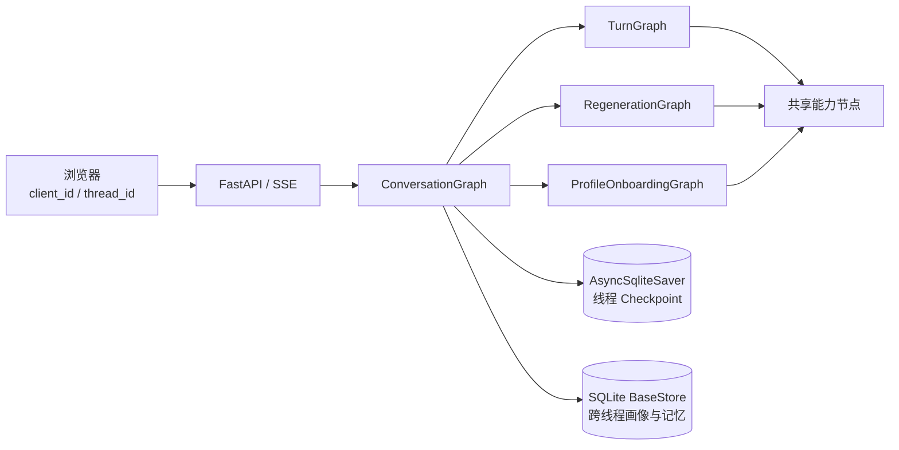
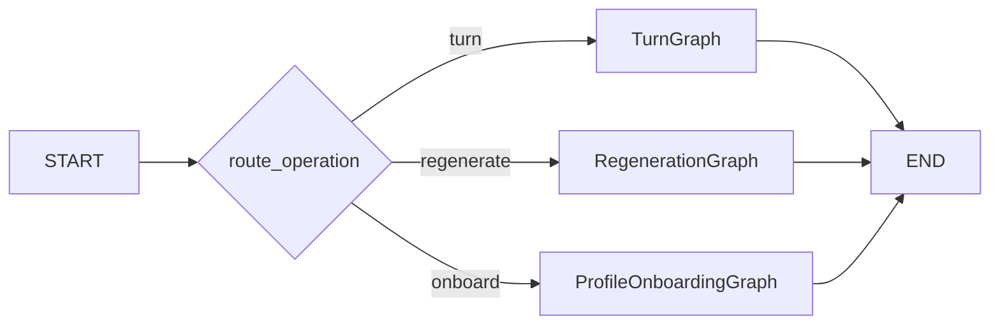
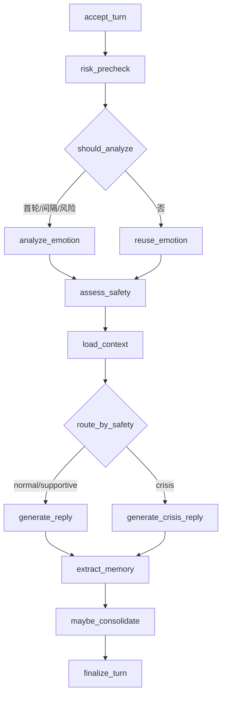

# HDU-erc LangGraph 架构改造设计

## 1. 文档状态

- 日期：2026-09-01
- 状态：设计已确认，等待实现计划
- 目标分支：`main`
- 设计范围：将在线对话编排从 `ChatService + RunnableWithMessageHistory` 改为 LangGraph，同时保留现有用户功能与研究实验能力

## 2. 背景与问题

当前在线流程由 `ChatService` 以命令式方式串联：保存输入、记忆检索、按固定间隔分析情绪、安全判断、回复生成、历史写入、记忆抽取和周期性提炼。重新生成又通过手动快照和恢复 LangChain 内存历史来避免污染原会话。

这种实现可以工作，但存在以下结构问题：

1. 对话状态分散在 `ChatService` 实例字段、LangChain 进程内消息历史、`RuntimeStore` 和独立记忆数据库之间。
2. 正常回复、流式回复和重新生成重复实现相似的上下文与生成步骤。
3. 条件分支隐藏在方法内部，难以单独观察、恢复和测试。
4. 流式生成中途失败依赖手工回滚，恢复边界不清晰。
5. 当前 Web 服务仍以全局单用户、固定会话为核心，无法在同一浏览器中管理多个独立对话。

本次改造使用 LangGraph 统一在线对话状态与编排，但不把普通 CRUD、离线评估或所有工程模块机械地改造成图。

## 3. 目标与非目标

### 3.1 目标

1. 使用一个主图和三个领域子图承载正常聊天、重新生成和画像引导。
2. 使用 LangGraph Checkpointer 作为线程内消息与对话状态的唯一事实源。
3. 支持浏览器匿名 `client_id` 下的多个 `thread_id`，线程之间共享画像和长期记忆，但隔离消息与情绪轨迹。
4. 保留流式聊天、情绪轨迹、画像引导、长期记忆、点赞/点踩、按原因重新生成和情绪反馈。
5. 将安全策略变为显式条件路由；明确危机信号进入专用回复节点。
6. 将情绪分析改为首轮、固定间隔和风险信号共同决定的混合触发策略。
7. 使用本地 SQLite 完成 Checkpointer 和跨线程 Store 持久化，并支持应用重启恢复。
8. 保持情绪 Benchmark、Ablation 和报告脚本可运行。

### 3.2 非目标

1. 不迁移旧 `runtime.sqlite3`、旧记忆数据库或其他历史运行数据。
2. 不引入登录、账号、云同步或跨设备身份。
3. 不部署 PostgreSQL、LangGraph Platform 或 LangSmith 服务。
4. 不建设人工危机审核后台。
5. 不把简单 CRUD、Benchmark、Ablation 和报告生成改造成图。
6. 不把系统描述为临床诊断、风险评估或专业干预工具。

## 4. 选择的总体架构

采用“轻量主图 + 领域子图 + 共享能力节点”的结构：



各层职责如下：

- 浏览器：保存匿名客户端标识和当前线程，负责会话切换与流式渲染。
- FastAPI：校验请求和线程归属，将 LangGraph 流转换为稳定的 SSE DTO；不执行业务编排。
- `ConversationGraph`：根据 `operation` 路由到对应子图。
- 领域子图：拥有一类用例的完整业务闭环。
- 共享能力节点：封装风险、情绪、上下文、生成和记忆能力。
- Checkpointer：保存线程内图状态和每个 super-step。
- Store：保存按 `client_id` 共享的数据。

### 4.1 推荐目录

```text
chatbot/
├── graphs/
│   ├── state.py
│   ├── conversation.py
│   ├── turn.py
│   ├── regeneration.py
│   ├── onboarding.py
│   ├── routing.py
│   └── nodes/
│       ├── input.py
│       ├── risk.py
│       ├── emotion.py
│       ├── context.py
│       ├── generation.py
│       ├── memory.py
│       └── finalization.py
├── persistence/
│   ├── checkpoint.py
│   └── store.py
├── models/
│   ├── graph.py
│   ├── events.py
│   └── safety.py
├── core/
│   ├── config.py
│   ├── llm_adapter.py
│   └── prompt_config.py
├── emotion/
├── memory/
├── profile/
├── static/
└── web.py
```

`graphs` 只负责状态推进和路由；情绪标签、Prompt、解析、记忆抽取与冲突规则继续保留在各自领域模块中。

## 5. 图状态与数据边界

### 5.1 线程持久状态

`ConversationState` 只保存恢复下一轮所需的线程事实：

```python
class ConversationState(TypedDict):
    messages: Annotated[list[AnyMessage], add_messages]
    turn_count: int
    emotion_state: EmotionStateData | None
    emotion_timeline: list[EmotionSnapshot]
    recent_emotions: list[str]
    safety_state: SafetyDecision
    last_emotion_analysis_turn: int
    thread_meta: ThreadMetadata
    processed_requests: dict[str, RequestResult]
```

约束：

- `messages` 中的每条消息必须具有稳定 ID。
- AI Message 元数据保存当轮情绪快照、反馈状态和重新生成信息。
- `processed_requests` 最多保留最近 64 个请求，用于网络重试幂等；完成节点负责裁剪。
- `emotion_timeline` 设置明确的最大长度，完整历史可从 Checkpoint history 获取，最新状态不无限增长。
- 状态只使用 JSON 可序列化数据和 LangChain Message 类型。

### 5.2 单次运行字段

调用输入包含：

```python
class ConversationInput(TypedDict):
    operation: Literal["turn", "regenerate", "onboard"]
    request_id: str
    message: NotRequired[str]
    target_message_id: NotRequired[str]
    regeneration_reason: NotRequired[str]
    profile_answers: NotRequired[list[ProfileAnswer]]
```

风险信号、检索到的记忆、待生成上下文和候选回复属于单次运行字段。它们可以出现在中间 Checkpoint 中以支持失败恢复，但 `finalize` 必须清空，不在最新会话状态中长期累积。

### 5.3 运行时上下文

`RuntimeContext` 不进入 Checkpoint：

```python
@dataclass(frozen=True)
class RuntimeContext:
    client_id: str
    request_id: str
    locale: str
```

LLM 客户端、配置、时钟、Store、连接对象和线程锁由图工厂或 LangGraph `Runtime` 注入，不写入 Graph State。节点不得保存 API Key、完整 Prompt、迭代器、异常对象或数据库连接。

为兼容 Python 3.10 的异步上下文传播限制，节点显式接收 `Runtime` 和 `StreamWriter`，不依赖 `get_store()` 或 `get_stream_writer()` 的隐式上下文获取。

### 5.4 跨线程 Store

SQLite Store 使用以下命名空间：

```text
(client_id, "profile")
(client_id, "memories")
(client_id, "memory_meta")
(client_id, "threads")
(client_id, "emotion_feedback", thread_id)
```

- `profile`：当前画像。
- `memories`：长期记忆正文、类别、置信度、状态和使用信息。
- `memory_meta`：周期性提炼游标和幂等记录。
- `threads`：该匿名客户端的会话目录、标题和更新时间。
- `emotion_feedback`：不影响对话继续执行的实验反馈记录。

消息点赞/点踩属于对应 AI Message 元数据，通过 `aupdate_state` 产生新的 Checkpoint，不另建双写副本。

## 6. 主图与子图

### 6.1 ConversationGraph



主图只做操作校验和路由，不承载具体聊天逻辑。未知操作返回稳定的 `invalid_operation` 业务错误。

### 6.2 TurnGraph



节点职责：

1. `accept_turn`：清洗输入、验证 `request_id`、检查重复请求、追加 HumanMessage、增加回合数。
2. `risk_precheck`：使用本地规则提取高召回风险信号，只决定是否强制分析，不直接作临床判断。
3. `should_analyze`：首轮、达到配置间隔或命中风险信号时进入情绪分析。
4. `analyze_emotion`：复用现有标签、Prompt、动态示例和结构化解析；成功后更新情绪状态与轨迹。
5. `reuse_emotion`：没有触发分析时沿用最近有效状态。
6. `assess_safety`：合并风险信号和情绪状态，生成结构化安全决策。
7. `load_context`：按 `client_id` 加载画像，并结合当前输入和情绪检索长期记忆。
8. `generate_reply`：生成 normal/supportive 回复并流式输出模型 token。
9. `generate_crisis_reply`：使用独立受限 Prompt；先完整生成并校验，再作为单个文本片段输出。模型失败时只返回本地兜底文本，避免把残缺模型内容与兜底内容拼接给用户。
10. `extract_memory`：复用现有保守抽取、去重、冲突和替代规则，幂等写入 Store。
11. `maybe_consolidate`：按配置间隔提炼稳定偏好和重复压力源。
12. `finalize_turn`：记录请求结果、裁剪有界状态、更新时间并发出完成事件。

### 6.3 情绪分析触发

混合策略如下：

```text
首个用户回合                     -> 分析
turn_count - last_analysis >= interval -> 分析
risk_precheck.force_analysis     -> 分析
其他情况                         -> 复用最近情绪
```

这意味着风险信号不会等待固定的第五轮；普通中间回合也不会无条件增加一次模型调用。

### 6.4 安全判定与路由

`risk_precheck` 识别以下信号组：

- 第一人称死亡或自伤意图。
- 计划、时间、方式、工具或可用手段。
- 正在实施或近期准备行为。
- 告别、交代后事或明显的无望、受困、负担表达。
- 近期负面情绪持续升高并伴随强烈痛苦表达。

规则必须区分第一人称当前表达、第三人称转述、引用、否定和一般讨论，避免把单个词语直接等同于危机。第三人称或引用命中可以强制情绪分析，但不能仅凭词面直接进入危机分支。

`SafetyDecision` 至少包含：

```python
class SafetyDecision(TypedDict):
    level: Literal["normal", "supportive", "crisis"]
    signals: list[str]
    reason_code: str
    guidance: str
```

确定性保底规则：

- 明确第一人称当前意图、计划或正在实施的行为不能被情绪模型降级。
- 强风险信号存在且情绪模型失败时仍进入 `crisis`。
- 只有绝望、崩溃或高置信度负面情绪而没有明确行动信号时，默认进入 `supportive`。
- 危机回复节点不得作诊断；应使用支持性语言，鼓励联系可信任的人和所在地可用的紧急或专业支持。

风险信号参考 NIMH 对“想死、制定计划、寻找方式、告别和强烈绝望”等警示信号的公开说明：<https://www.nimh.nih.gov/health/publications/warning-signs-of-suicide>。

### 6.5 RegenerationGraph

流程：

1. `validate_target`：目标必须是当前线程内的 AI Message，原因必须属于允许集合，且默认只允许重新生成一次。
2. `rebuild_context`：从消息列表中截取目标 AI Message 之前的对话，定位其直接对应的 HumanMessage。
3. `load_context`：加载当前共享画像和与原问题相关的长期记忆。
4. `generate_variant`：将用户选择的原因加入专用提示，生成替代回复并流式输出。
5. `replace_message`：使用相同 `message_id` 更新 AI Message，使 `add_messages` reducer 执行替换而不是追加。

替换后的消息元数据保存 `original_content`、`regeneration_reason`、`regenerated_at` 和 `regenerated=true`。这样刷新页面后仍能识别已重新生成状态，同时保留原内容审计信息。

重新生成不增加用户回合数，不重新抽取相同用户输入的长期记忆，也不覆盖当前线程最新情绪状态。

### 6.6 ProfileOnboardingGraph

流程：

1. `validate_answers`：清洗字段和值。
2. `draft_profile`：调用聊天模型生成受 Schema 约束的画像草稿。
3. `fallback_draft`：模型或解析失败时使用现有规则生成草稿。
4. `return_draft`：返回草稿供用户确认。

用户确认或直接编辑画像属于普通 CRUD，由 API 校验后写入 `(client_id, "profile")`，不再次运行图。

画像草稿 API 的请求体必须携带当前客户端已有的 `thread_id`，API 校验归属后以该线程配置调用 `ConversationGraph(operation="onboard")`。画像仍写入 client-scoped Store；线程只用于统一运行配置、审计和错误恢复。

## 7. 持久化与一致性

### 7.1 数据库划分

使用两个 SQLite 文件：

```text
data/langgraph/checkpoints.sqlite3  # AsyncSqliteSaver 专有
data/langgraph/store.sqlite3        # SQLite BaseStore 专有
```

拆分原因：

- 不直接依赖或混用 Saver 的内部表结构。
- Checkpointer 可以独立升级。
- Store 领域表和索引可以独立迁移与测试。
- 降低长事务之间的锁竞争。
- 明确不存在跨两个文件的原子事务。

依赖中应直接声明与验证：

```text
langgraph>=1.2,<1.3
langgraph-checkpoint-sqlite>=3.1,<4
aiosqlite>=0.20,<1
```

最终版本约束应在实现时通过全量测试验证；不能只依赖 `langchain` 的传递安装。SQLite Saver 仅定位于本地和轻量部署。

### 7.2 应用生命周期

FastAPI 使用 `lifespan`：

1. 启动时打开 `AsyncSqliteSaver` 和 SQLite Store。
2. 执行必要的 Store Schema 初始化。
3. 使用同一组依赖编译一次 Graph Runtime。
4. 所有请求复用该 Runtime。
5. 关闭时等待活动流结束并释放连接。

实现同时消除当前 `@app.on_event("startup")` 弃用用法。

### 7.3 序列化安全

- 设置 `LANGGRAPH_STRICT_MSGPACK=true`，或显式限制允许反序列化的模块。
- Graph State 不使用 pickle fallback。
- 不把密钥、连接、锁或任意用户提供的 Python 对象写入 Checkpoint。
- API 输出通过 DTO 转换，不直接暴露原始 `StateSnapshot`。

### 7.4 幂等策略

| 操作 | 幂等键 | 重复执行规则 |
| --- | --- | --- |
| 接受用户回合 | `thread_id + request_id` | 返回已有结果，不重复追加消息或增加回合数 |
| 抽取长期记忆 | `client_id + normalized_content_hash` | upsert 或合并，不插入副本 |
| 周期性提炼 | `client_id + source_checkpoint_id` | 已处理检查点直接跳过 |
| 重新生成 | `thread_id + target_message_id` | 已重新生成返回冲突 |
| 会话目录 | `client_id + thread_id` | 更新标题和时间，不重复建档 |

跨 Checkpointer 和 Store 的副作用采用 at-least-once + 幂等写入，不伪造 exactly-once 保证。

### 7.5 并发边界

单进程内为每个 `thread_id` 维护 `asyncio.Lock`，同一线程的发送、反馈和重新生成串行执行，不同线程可以并行。锁不进入 Checkpoint。

SQLite 模式不支持多进程下的可靠线程级互斥。本次部署文档必须明确使用单个 Uvicorn worker；如果未来需要多 worker 或多实例，应先迁移 PostgreSQL Checkpointer/Store 和分布式并发控制。

## 8. 流式输出与 API

### 8.1 匿名身份

首次打开页面时，`POST /api/clients/bootstrap` 由服务端签发随机 `client_id`。前端将其和当前 `thread_id` 保存到 `localStorage`。

新建线程时由服务端生成 `thread_id` 并写入 `(client_id, "threads")`。每个线程相关 API 都必须先验证 `thread_id` 属于传入的 `client_id`。

该方案只提供本地匿名隔离，不属于身份认证。任何能访问本机应用和获得 UUID 的主体仍可能读取对应数据。

### 8.2 API 契约

```text
POST   /api/clients/bootstrap

GET    /api/clients/{client_id}/threads
POST   /api/clients/{client_id}/threads
GET    /api/clients/{client_id}/threads/{thread_id}
DELETE /api/clients/{client_id}/threads/{thread_id}

POST   /api/clients/{client_id}/threads/{thread_id}/messages:stream
POST   /api/clients/{client_id}/threads/{thread_id}/messages/{message_id}/regenerate:stream

GET    /api/clients/{client_id}/profile
PUT    /api/clients/{client_id}/profile
POST   /api/clients/{client_id}/profile/draft

PATCH  /api/clients/{client_id}/threads/{thread_id}/messages/{message_id}/feedback
POST   /api/clients/{client_id}/threads/{thread_id}/emotion-feedback
GET    /api/clients/{client_id}/threads/{thread_id}/emotion-timeline
```

聊天和重新生成改用 `fetch + ReadableStream` 的流式 POST。消息、`request_id` 和 SSE 响应属于同一个请求，删除当前进程内 `stream_id -> message` 中转表。

### 8.3 SSE 事件

| 事件 | 来源 | 数据 |
| --- | --- | --- |
| `run_started` | API | `request_id`、`thread_id` |
| `user_message` | `accept_turn` custom stream | 稳定 `message_id` 和正文 |
| `emotion_start` | 情绪节点 custom stream | `turn_count`、触发原因 |
| `emotion_done` | 情绪节点 custom stream | 结构化情绪状态；最终安全等级由后续 `safety` 事件给出 |
| `emotion_error` | 情绪节点 custom stream | 稳定错误码和降级说明 |
| `safety` | 安全节点 custom stream | 等级与公开 guidance，不返回内部 Prompt |
| `token` | LangGraph messages stream | 仅生成节点的模型文本片段 |
| `done` | `finalize` custom stream | `message_id`、`checkpoint_id`、最终元数据 |
| `error` | API 或图适配器 | `code`、`retryable`、用户可读说明 |

API 同时订阅 `messages` 和 `custom` stream mode，并用 `langgraph_node` 元数据过滤 token，只转发 `generate_reply`、`generate_crisis_reply` 和 `generate_variant` 的输出。普通回复和重新生成按模型 token 流式转发；危机回复在完整生成和校验后以一个文本片段输出。参考：<https://docs.langchain.com/oss/python/langgraph/streaming>。

### 8.4 读取与简单修改

- 读取线程：`aget_state` 后转换为稳定 DTO。
- 读取历史：从当前状态和必要的 Checkpoint history 构造，不读取 Saver 私有表。
- 点赞/点踩：校验目标 AI Message 后，通过 `aupdate_state` 用相同 ID 替换消息元数据。
- 情绪反馈：写入 Store 的线程子命名空间，供实验分析读取。
- 删除线程：先调用 Saver 删除 Checkpoint，成功后删除线程目录；默认不删除该客户端共享的画像和长期记忆。如果目录删除失败，查询线程列表时将无对应 Checkpoint 的目录项识别为 stale 并清理。Saver 删除失败时保留目录项并向调用方返回失败。

## 9. 错误处理与恢复

### 9.1 可降级错误

| 失败点 | 行为 |
| --- | --- |
| 情绪模型调用或解析失败 | 发出 `emotion_error`，沿用最近有效情绪；强风险信号仍进入危机路由 |
| 记忆检索失败 | 使用空记忆继续生成 |
| 记忆抽取或提炼失败 | 保留成功回复，发出内部告警并允许幂等重试 |
| 画像草稿模型失败 | 使用规则化 fallback 草稿 |
| 危机回复模型失败 | 返回本地安全兜底文本，不返回空白 |

### 9.2 必须终止的错误

- 空消息、非法操作或非法重新生成原因。
- `client_id` 与 `thread_id` 不匹配。
- 目标消息不存在、不是 AI Message 或已重新生成。
- 普通回复模型失败且没有可接受的兜底结果。

### 9.3 流式失败边界

普通回复和重新生成的模型 token 可以在节点执行期间通过 SSE 发出，但 AI Message 只有在模型节点成功返回后才写入状态。危机回复不转发未校验的模型增量，只在完整内容可用后输出。

若模型中途失败：

1. 已完成的 HumanMessage、风险和情绪步骤保留在 Checkpoint。
2. 已传输的部分 token 不保存为 AI Message。
3. 前端收到 `error`，将部分文本丢弃或明确标记为未完成。
4. 使用相同 `request_id` 重试时，不重复追加 HumanMessage。

如果相同 `request_id` 对应的回复已经完成，图不重新调用模型，而是从 `processed_requests` 返回已有 `message_id` 和完整内容，并直接发出 `done`。客户端用该完整内容校正本地可能缺失的 token。

LangGraph Checkpointer 的步骤级持久化和 pending writes 用于恢复已成功步骤；参考：<https://docs.langchain.com/oss/python/langgraph/persistence>。

## 10. 现有模块迁移

### 10.1 替换或删除

- `chatbot/chat_service.py`：由 Graph Runtime 和各子图替代。
- `RunnableWithMessageHistory`、`InMemoryChatMessageHistory` 及其全局 `store`。
- `chatbot/core/history.py` 的单会话历史机制。
- `chatbot/core/runtime_store.py` 的通用 JSON namespace 存储。
- 旧 profile repository 的全局单画像接口。
- 旧 `SQLiteLocalMemoryProvider` 接口和独立数据库生命周期。
- 两段式 `stream_id` API 和进程内 stream 映射。

删除前必须通过引用搜索确认没有在线或实验入口仍依赖这些接口。

### 10.2 保留并适配

- FastAPI、前端视觉与现有交互功能。
- OpenAI-compatible LLM 配置和适配层。
- 情绪标签、Prompt、输出解析、动态示例检索和 EICL 示例。
- 记忆抽取、去重、冲突、替代和词法排序规则。
- Benchmark、Ablation、统计和报告脚本。
- 用户画像清洗和规则化 fallback 能力。

在线 `analyze_emotion` 应改为返回结果而不写全局运行数据库；在线轨迹进入 Checkpoint。离线实验调用同一纯分析能力，并自行管理其输出文件或报告记录。

## 11. 数据迁移策略

不编写旧数据迁移器，也不执行双写：

```text
旧 runtime.sqlite3 / memory.sqlite3
              └── 不读取、不转换

新 checkpoints.sqlite3 / store.sqlite3
              └── 首次运行为空白状态
```

旧文件默认只被忽略，不在应用启动时自动删除。若之后需要物理清理，应作为单独的、明确授权的可恢复清理任务执行。

前端 API 可以不兼容旧内部路径，但视觉、功能入口和用户可见行为必须保留。前后端切换必须在同一任务提交中完成，避免新旧协议错配。

## 12. 测试设计

### 12.1 纯函数单元测试

- 风险信号的第一人称、第三人称、引用、否定和普通讨论。
- 情绪分析触发条件。
- 安全等级不可被错误降级的保底规则。
- 条件边路由函数。
- 记忆抽取、去重、冲突、替代和排序。
- DTO 与 SSE 分帧。
- 状态裁剪和同 ID Message 替换。

### 12.2 节点测试

- 每个节点只断言输入、状态更新、Store 副作用和自定义事件。
- LLM、Store、时钟和 StreamWriter 均使用可控 fake。
- 节点异常分别验证降级或终止语义。

### 12.3 图集成测试

使用 `InMemorySaver` 和 `InMemoryStore`：

- 正常、支持性和危机三条回复路径。
- 首轮、间隔和风险强制分析。
- 情绪失败降级。
- 正常回复和重新生成的 token 过滤。
- `request_id` 重试不重复追加消息。
- 重新生成同 ID 替换和一次限制。
- 画像草稿 fallback。

### 12.4 持久化契约测试

使用临时 SQLite 文件：

- 关闭并重新创建 Runtime 后恢复线程。
- 同 client 跨线程共享画像与记忆。
- 不同 client 完全隔离。
- 删除线程不删除共享画像和记忆。
- 记忆和提炼副作用重复运行仍保持幂等。
- 严格序列化配置可正常读写允许类型。

### 12.5 API 与端到端测试

- bootstrap、新建、切换、读取和删除线程。
- 线程归属校验。
- 流式 POST 的完整 SSE 顺序和错误帧。
- 浏览器中止请求时图状态保持一致。
- 点赞、点踩、重新生成和情绪反馈刷新后仍可读取。
- 前端新建会话、切换会话和继续对话。

### 12.6 实验回归

- 现有 Benchmark、Ablation 和统计测试继续通过。
- 情绪标签 Schema、Prompt variant 和报告输入格式不因在线图改造而改变。
- 对现有公开数据基准运行至少一次不调用真实 LLM 的确定性验证。

## 13. 验收标准

1. 全部自动化测试通过，且新增图路径、SQLite 重启和失败恢复测试。
2. 同一 `client_id` 的多个线程共享画像与长期记忆，但消息和情绪轨迹隔离。
3. 不同 `client_id` 无法访问对方线程。
4. 首轮、间隔到期和风险信号均正确触发情绪分析。
5. 明确危机信号绕过普通回复；危机模型失败仍有安全兜底。
6. 流式中断不保存残缺 AI Message；相同请求重试不重复 HumanMessage。
7. 应用重启后线程、画像和长期记忆可恢复。
8. 重新生成保留原内容元数据，且刷新后仍显示已重新生成状态。
9. 点赞/点踩和情绪反馈持久化。
10. `ChatService`、进程内 LangChain 会话历史和旧两段式 stream API 不再参与在线调用链。
11. README 更新架构图、配置、Python 要求、启动方式、会话模型和 SQLite 限制。
12. 使用单个 Uvicorn worker 完成一次本地 Web 人工验收。

## 14. 已知限制与后续演进边界

- SQLite 方案服务于单机研究原型和轻量部署，不支持多 worker 的强并发一致性。
- 匿名 `client_id` 是数据分区键，不是身份认证凭据。
- 词法长期记忆检索继续保持本地、可解释和无外部向量服务；本次不引入 Embedding。
- Checkpoint history 会随线程增长，后续应根据真实数据量评估归档或保留策略，本次不提前加入复杂清理机制。
- 若将来迁移 PostgreSQL，应保持 Graph State、Store namespace 和节点接口不变，只替换 Checkpointer/Store 工厂及并发控制实现。

## 15. 参考资料

- LangGraph Persistence：<https://docs.langchain.com/oss/python/langgraph/persistence>
- LangGraph Streaming：<https://docs.langchain.com/oss/python/langgraph/streaming>
- LangGraph Checkpointer Reference：<https://reference.langchain.com/python/langgraph/checkpoints>
- LangGraph SQLite Checkpoint：<https://reference.langchain.com/python/langgraph.checkpoint.sqlite>
- NIMH Suicide Warning Signs：<https://www.nimh.nih.gov/health/publications/warning-signs-of-suicide>
