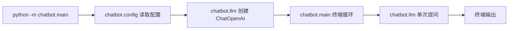

# 聊天机器人模块拆分设计

## 背景

当前项目已经在 `dev` 分支实现了一个最小 LangChain CLI 聊天机器人。所有运行逻辑都集中在根目录 `chat.py` 中，包括配置读取、LangChain 模型构建、单次问答、终端循环和入口函数。

现在需要把不同功能的方法按模块拆分到不同文件中，同时保持功能简单，不引入额外抽象。

## 目标

1. 删除根目录 `chat.py`。

2. 新增 `chatbot/` Python 包。

3. 按功能拆分为配置、LLM 调用、CLI 入口 3 个模块。

4. 保持现有一问一答、无记忆行为不变。

5. 更新测试导入路径并保持测试通过。

## 非目标

1. 不新增 Web API、数据库、日志系统或记忆功能。

2. 不新增兼容层来保留 `python chat.py` 运行方式。

3. 不引入复杂包管理配置，例如 `pyproject.toml` 或 console scripts。

4. 不扩大测试范围到真实 OpenAI API 调用。

## 文件结构

计划新增以下文件：

1. `chatbot/__init__.py`：标记 `chatbot` 为 Python 包，内容保持为空。

2. `chatbot/config.py`：配置读取和校验。

3. `chatbot/llm.py`：LangChain 模型构建和单次问答。

4. `chatbot/main.py`：终端循环和入口函数。

计划删除以下文件：

1. `chat.py`：根目录单文件入口。

计划修改以下文件：

1. `tests/test_config.py`：从 `chatbot.config` 导入 `ConfigError` 和 `load_config`。

## 模块职责

`chatbot/config.py` 负责：

1. 定义 `DEFAULT_MODEL` 和 `DEFAULT_TEMPERATURE`。

2. 定义 `ConfigError`。

3. 定义 `ChatConfig`。

4. 解析命令行参数。

5. 读取 `.env` 和环境变量。

6. 校验 API Key 和温度值。

`chatbot/llm.py` 负责：

1. 根据 `ChatConfig` 创建 `ChatOpenAI`。

2. 使用 `llm.invoke(question)` 完成一次独立模型调用。

3. 返回文本形式的回答。

`chatbot/main.py` 负责：

1. 调用 `load_config()`。

2. 调用 `build_llm()`。

3. 运行终端输入输出循环。

4. 处理 `ConfigError`、单次模型调用异常和 `KeyboardInterrupt`。

5. 提供 `python -m chatbot.main` 入口。

## 数据流



## 运行方式

重构后使用以下命令运行：

```bash
.venv/bin/python -m chatbot.main
```

不再支持以下命令：

```bash
.venv/bin/python chat.py
```

## 行为保持

重构后应保持以下行为不变：

1. `.env` 和环境变量提供默认配置。

2. `--model`、`--temperature`、`--base-url` 可以覆盖默认配置。

3. 每次用户输入都是独立模型调用，不传递历史消息。

4. 空输入、`exit` 或 `quit` 会退出。

5. 缺少 `OPENAI_API_KEY` 时返回配置错误。

6. 非法 `OPENAI_TEMPERATURE` 会返回配置错误。

7. 单次模型调用失败时打印错误并继续等待下一次输入。

## 测试与验证

测试策略保持轻量，不真实调用 OpenAI API。

需要验证：

1. `tests/test_config.py` 更新导入后继续覆盖配置合并逻辑。

2. `.venv/bin/python -m pytest -v` 通过。

3. `.venv/bin/python -m py_compile chatbot/*.py tests/test_config.py` 通过。

4. 缺少 `OPENAI_API_KEY` 时运行 `.venv/bin/python -m chatbot.main` 会输出配置错误并以状态码 `1` 退出。

真实 API 调用仍然需要用户提供有效 `.env` 后手动验证。

## 验收标准

1. `chat.py` 已删除。

2. 功能代码拆分到 `chatbot/config.py`、`chatbot/llm.py` 和 `chatbot/main.py`。

3. `.venv/bin/python -m chatbot.main` 是新的运行入口。

4. 配置测试通过。

5. Git 工作树在提交后保持干净。
