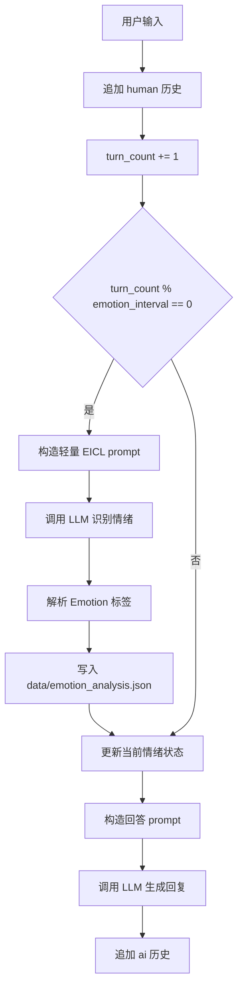

# EICL 情绪 Prompt 集成设计

## 背景

当前 chatbot 会把用户画像和聊天历史注入回答链，但不会显式识别用户情绪。`EICL` 文件夹中的核心思路是通过情绪标签集合、对话上下文、候选情绪提示和固定输出格式，让 LLM 在回答前先推断一个细粒度情绪标签。

本次不接入完整的 `EICL` 检索、embedding、RoBERTa 概率生成和本地大模型推理流程，而是复现它的轻量 prompt 逻辑：按固定轮次分析聊天记录，得到一个最终情绪标签，再把该标签放进 chatbot 的回答 prompt 中。

## 目标

1. 支持按每 `m` 轮用户输入触发一次情绪识别，`m` 可配置，默认值为 `5`。

2. 在回答用户之前，如果当前轮次需要触发情绪识别，则使用之前的聊天记录和当前用户输入构造轻量 `EICL` 分析 prompt。

3. 解析情绪识别模型输出，得到最终情绪标签，并将该标签注入后续回答 prompt。

4. 将每次情绪识别的完整细节写入新的 JSON 文件，包含原始 input、原始 output、解析后的情绪标签、轮次、时间戳和是否解析成功。

## 非目标

1. 不加载 `EICL` 的本地 LLM 权重。

2. 不运行 `EICL` 的 embedding 检索、RoBERTa 情绪概率生成或批量评测流程。

3. 不改变现有聊天历史 `data/chat_history.json` 的格式。

4. 不在非触发轮次额外调用情绪识别模型。

## 设计

### 配置

在 `ChatConfig` 中新增 `emotion_interval: int`，来源优先级如下：

1. 命令行参数 `--emotion-interval`

2. 环境变量 `EMOTION_INTERVAL`

3. 默认值 `5`

若配置值不是正整数，则抛出 `ConfigError`，提示 `EMOTION_INTERVAL must be a positive integer.`

### 情绪识别触发规则

主循环维护本次会话的用户输入轮次 `turn_count`。每次收到普通用户输入后先递增计数，再判断：

```python
should_analyze = turn_count % config.emotion_interval == 0
```

若 `should_analyze` 为 `True`，则在回答用户之前调用情绪识别；否则沿用上一次成功识别到的情绪标签。若尚未有情绪标签，则回答 prompt 不注入该字段。

### 轻量 EICL Prompt

新增独立模块 `chatbot/emotion.py`，负责情绪识别相关逻辑。它会复用 `EICL` 中 `EI + ED` 的细粒度情绪标签集合：

```text
surprised, excited, annoyed, proud, angry, sad, grateful, lonely, impressed, afraid, disgusted, confident, terrified, hopeful, anxious, disappointed, joyful, prepared, guilty, furious, nostalgic, jealous, anticipating, embarrassed, content, devastated, sentimental, caring, trusting, ashamed, apprehensive, faithful
```

构造 prompt 时采用 `EICL` 风格的约束：

- 根据对话上下文推断用户当前情绪。

- 只能从给定 `Emotion labels` 中选择一个标签。

- 输出格式必须为 `Emotion: [a single inferred emotion]`。

- 若已有上一轮情绪标签，则作为 `More likely emotion label` 提供给模型参考，但不强制覆盖当前上下文。

### 聊天记录输入

情绪识别 input 使用最近聊天记录加当前用户输入，格式沿用 `EICL` 的 `Dialogue context` 思路，并用 `</s>` 分隔 utterance。输入内容包含：

1. 最近若干历史消息。

2. 当前用户问题。

3. 上一次成功识别的情绪标签（如果存在）。

为避免 prompt 无限增长，默认分析最近 `emotion_interval` 轮聊天记录对应的消息片段。当前轮用户输入必须包含在分析 input 中。

### 回答 Prompt 注入

`build_chain()` 改为接收当前情绪提供器或可变状态，而不是只在启动时固定 system message。每次回答前，system prompt 中加入当前情绪标签：

```text
Current detected user emotion: anxious
```

若没有成功识别到情绪，则不加入该字段。用户画像仍按原有方式保留。

### 情绪识别明细存储

新增 JSON 文件：

```text
data/emotion_analysis.json
```

每次触发情绪识别后追加一条记录，结构如下：

```json
{
  "timestamp": "2026-05-13T13:00:00+08:00",
  "turn_count": 5,
  "emotion_interval": 5,
  "input": "完整情绪识别 prompt",
  "output": "Emotion: anxious",
  "emotion": "anxious",
  "success": true,
  "error": ""
}
```

如果情绪识别调用失败，也要记录：

```json
{
  "timestamp": "2026-05-13T13:00:00+08:00",
  "turn_count": 5,
  "emotion_interval": 5,
  "input": "完整情绪识别 prompt",
  "output": "",
  "emotion": "",
  "success": false,
  "error": "错误信息"
}
```

写入失败只打印 warning，不中断正常聊天。

### 数据流



## 错误处理

1. 情绪识别调用失败：记录失败明细，保留上一次成功情绪标签，继续回答用户。

2. 情绪输出格式不符合 `Emotion: ...`：记录原始 output，`success` 为 `false`，保留上一次成功情绪标签。

3. 情绪标签不在允许集合中：记录原始 output，`success` 为 `false`，保留上一次成功情绪标签。

4. JSON 文件不存在：首次写入时自动创建。

5. JSON 文件为空或损坏：读取时视为空列表，写入新记录。

## 测试

新增或更新测试覆盖：

1. `EMOTION_INTERVAL` 默认值为 `5`。

2. 命令行参数和环境变量可覆盖 `emotion_interval`。

3. 非正整数和非法字符串会触发 `ConfigError`。

4. 情绪 prompt 包含 `Emotion labels`、`Dialogue context` 和固定输出格式。

5. `parse_emotion_output()` 能解析合法输出，并拒绝非法标签。

6. 情绪分析 JSON 会追加成功记录和失败记录。

7. 主循环在第 `m` 轮前调用情绪识别，并将情绪标签用于回答 prompt。

## 验收标准

1. 默认每 `5` 轮用户输入触发一次情绪识别。

2. 触发轮次发生在回答用户之前。

3. 情绪识别结果能进入回答 prompt。

4. 每次触发的 input 和 output 都完整写入 `data/emotion_analysis.json`。

5. 情绪识别失败不会阻塞正常聊天。
