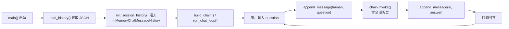

# JSON 聊天记录持久化设计

## 背景

当前聊天机器人已有单次运行内的对话记忆（`RunnableWithMessageHistory` + `InMemoryChatMessageHistory`），但程序退出后记忆即丢失。用户希望在每次启动时加载之前的聊天记录到记忆中，使机器人能跨会话回忆历史对话。

## 目标

1. 聊天记录以 JSON 文件形式存储到本地。

2. 每条记录包含三个属性：角色（human / ai）、对话发出时间、内容。

3. 项目重启时，JSON 文件中的历史记录被加载到 `InMemoryChatMessageHistory` 中，用户继续对话时能引用之前的对话。

4. 每次用户发出消息或收到 AI 回复时，自动追加记录到 JSON 文件。

## 非目标

1. 不实现多会话管理（始终使用默认 session）。

2. 不实现 JSON 文件的切割、归档或删除策略。

3. 不改变现有的 chain 构建和对话循环主体逻辑。

## 推荐方案

新增 `chatbot/history.py` 模块负责 JSON 文件的读写，在现有 `run_chat_loop` 启动前加载历史记录到 `InMemoryChatMessageHistory`，在每轮对话前后追加记录。

### 为什么选择此方案

1. 不侵入现有的 LCEL 链和 `RunnableWithMessageHistory` 结构。

2. `history.py` 是一个独立模块，职责单一，可单独测试。

3. 加载历史发生在 chain 构建之前，`get_session_history` 直接返回已包含历史记录的 `InMemoryChatMessageHistory` 实例，对 `RunnableWithMessageHistory` 完全透明。

## 文件结构

```
chatbot/
├── __init__.py
├── config.py
├── history.py      # 新增：JSON 文件读写
├── llm.py          # 修改：新增 init_session_history()
└── main.py         # 修改：启动时加载历史，对话后追加记录
```

## JSON 文件格式

文件路径：项目根目录 `chat_history.json`（与 `.env` 同级）。

```json
[
  {
    "role": "human",
    "content": "我的名字是张三",
    "timestamp": "2026-05-13T12:00:00+00:00"
  },
  {
    "role": "ai",
    "content": "你好，张三！有什么可以帮你的？",
    "timestamp": "2026-05-13T12:00:05+00:00"
  }
]
```

文件不存在时视为空历史，第一次写入时创建文件。

## 组件设计

### `chatbot/history.py`

`HISTORY_FILE` — 文件路径常量。

`load_history() -> list[dict]`：
- 读取 `chat_history.json`，解析为 Python 列表。
- 文件不存在或 JSON 解析失败时返回空列表。
- 不校验单条记录的结构完整性（信任自身写入的数据）。

`append_message(role: str, content: str) -> None`：
- 构造 `{"role": role, "content": content, "timestamp": <当前UTC时间>}`。
- 追加到 JSON 文件末尾。
- 文件不存在时创建文件并写入首条记录。

### `chatbot/llm.py`

新增 `init_session_history(session_id: str, records: list[dict]) -> None`：
- 遍历 records，将 `role: "human"` 转为 `HumanMessage`，`role: "ai"` 转为 `AIMessage`。
- 依次添加到 `store[session_id]` 的 `InMemoryChatMessageHistory` 中。
- 必须在构建 chain 之前调用，以确保 `get_session_history` 返回已包含历史的消息列表。

### `chatbot/main.py`

在 `main()` 中，`build_llm(config)` 之后、`build_chain(llm)` 之前插入：

```python
records = load_history()
init_session_history("default", records)
```

在 `run_chat_loop()` 中，每轮对话分别追加记录：

```python
# 用户输入后、调用 chain 前
append_message("human", question)

# 得到 AI 回复后
append_message("ai", answer)
```

## 数据流



## 交互行为保持

1. 空输入、`exit`/`quit` 退出行为不变。

2. `Ctrl+C` 处理行为不变。

3. 单次模型调用失败时仍应追加用户输入记录（已写入），但不追加失败的 AI 回复。

4. 缺失 `OPENAI_API_KEY` 时启动报错行为不变（历史文件不会被读取）。

## 错误处理

1. `chat_history.json` 不存在：视为空历史，不报错。

2. `chat_history.json` 损坏或格式错误：`load_history()` 返回空列表，不阻塞启动。

3. JSON 文件写入失败：打印警告但不中断对话循环（用户仍可正常聊天，只是不保存）。

## 依赖

不需要新增依赖。`json` 和 `datetime` 均为 Python 标准库。

## 验收标准

1. 首次运行，输入几轮对话后退出，检查 `chat_history.json` 文件生成，内容格式正确。

2. 重启项目，在对话中询问 "我们之前聊过什么？" 或类似问题，模型能复述之前对话的内容。

3. 删除 `chat_history.json` 后启动，新对话正常开始，历史为空，文件重新生成。

4. 文件损坏时启动不报错，对话正常进行。
