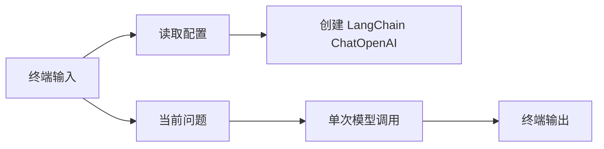

# LangChain CLI 聊天机器人设计

## 背景

当前项目目录是一个空 Python 项目，已有 `.venv` 和 PyCharm 配置，但还没有应用代码、依赖清单或 Git 仓库。

目标是使用 LangChain 完成一个最简单的聊天机器人。机器人只需要支持命令行一问一答，不需要记忆，不需要 Web 服务，也不需要数据库。

## 目标

1. 提供一个可直接运行的 Python CLI 入口。

2. 使用 LangChain 调用 OpenAI 兼容的聊天模型。

3. 默认配置从 `.env` 读取，命令行参数可以覆盖常用配置。

4. 每次提问独立发送给模型，不保存上下文历史。

5. 对缺少配置、模型调用失败和用户中断提供清楚提示。

## 非目标

1. 不实现多轮记忆。

2. 不实现用户系统、会话存储或日志数据库。

3. 不实现 FastAPI、Web UI 或桌面界面。

4. 不加入复杂 Prompt 管理或工具调用。

## 推荐方案

采用单文件 CLI 方案，并加入少量命令行参数覆盖 `.env` 配置。

该方案保留最小实现成本：一个 `chat.py` 文件即可完成运行入口、配置加载、模型构建和终端循环。同时，`--model`、`--temperature`、`--base-url` 等参数让后续切换模型或服务端地址更方便。

## 文件结构

计划新增以下文件：

1. `chat.py`：命令行聊天入口。

2. `requirements.txt`：运行和测试依赖。

3. `.env.example`：环境变量示例。

4. `tests/test_config.py`：配置合并和校验测试。

## 配置设计

`.env` 支持以下配置：

```text
OPENAI_API_KEY=your_api_key_here
OPENAI_MODEL=gpt-4o-mini
OPENAI_BASE_URL=
OPENAI_TEMPERATURE=0.7
```

命令行参数支持覆盖：

```text
python chat.py --model gpt-4o-mini --temperature 0.7 --base-url https://example.com/v1
```

配置优先级为：命令行参数优先于 `.env`，`.env` 优先于代码默认值。

## 组件设计

1. `load_config()` 负责加载 `.env`、解析命令行参数，并合并最终配置。

2. `build_llm()` 负责根据配置创建 LangChain 的 OpenAI 聊天模型。

3. `ask_once()` 负责把单次用户问题发送给模型，并返回回答文本。

4. `main()` 负责终端循环、退出命令、错误提示和用户中断处理。

## 数据流



每次用户输入都会作为独立问题发送，不读取上一轮问题，也不把上一轮回答传回模型。

## 交互行为

1. 启动后打印简短提示，说明可以输入问题，也可以输入 `exit` 或 `quit` 退出。

2. 用户输入空内容时退出。

3. 用户输入普通问题时，程序调用模型并打印回答。

4. 用户按 `Ctrl+C` 时，程序打印退出提示并结束。

## 错误处理

1. 缺少 `OPENAI_API_KEY` 时，启动阶段直接报错，提示用户配置 `.env` 或环境变量。

2. `OPENAI_TEMPERATURE` 不是数字时，启动阶段报错并提示合法格式。

3. 模型调用失败时，打印错误信息并继续等待下一次输入。

4. 无法读取 `.env` 时不报错，允许只使用系统环境变量和命令行参数。

## 依赖

```text
langchain
langchain-openai
python-dotenv
pytest
```

`pytest` 用于测试配置合并逻辑，不参与运行时聊天功能。

## 测试策略

测试不真实调用 OpenAI API，避免依赖网络和真实 Key。

重点测试：

1. `.env` 默认值可以被命令行参数覆盖。

2. 缺少 `OPENAI_API_KEY` 时会得到明确错误。

3. `OPENAI_TEMPERATURE` 可以被正确转换为数字。

4. 非法温度值会触发清楚错误。

模型调用部分通过手动运行验证，因为最小 CLI 的主要风险在配置和启动流程。

## 验收标准

1. 安装依赖后，复制 `.env.example` 为 `.env` 并填写 Key，可以运行 `python chat.py`。

2. 终端输入一个问题后，程序返回一次模型回答。

3. 连续提问时，每次都是无记忆的独立调用。

4. `--model`、`--temperature`、`--base-url` 可以覆盖 `.env` 配置。

5. 运行测试时，配置相关测试通过。
