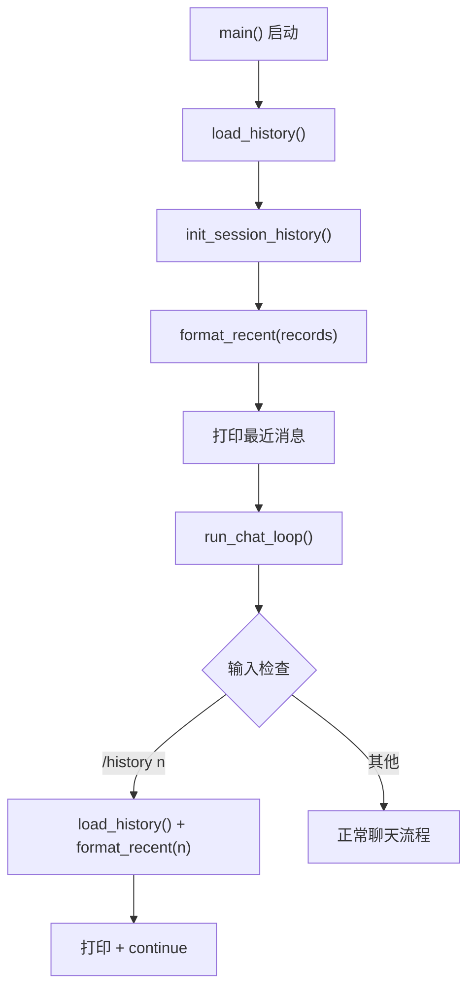

# 最近历史消息展示设计

## 背景

当前聊天机器人在启动时会将历史对话加载到记忆中（`init_session_history()`），但用户看不到这些历史消息。用户希望在启动时或通过命令查看最近的历史对话，以便了解对话上下文。

## 目标

1. 启动时自动展示最近最多 10 条历史消息（不足 10 条全部展示）。
2. 对话中支持 `/history [n]` 命令手动查看最近 n 条消息（默认 10 条）。
3. `/history` 是本地命令，不发送给 LLM，不写入 JSON 文件。

## 非目标

1. 不修改现有的 JSON 文件读写逻辑（`load_history()`、`append_message()`）。
2. 不修改聊天记忆系统（`init_session_history()`、`InMemoryChatMessageHistory`）。
3. 不新增配置文件项。

## 设计

### 组件变更

#### `chatbot/history.py`

新增函数：

```python
def format_recent(records: list[dict], n: int = 10) -> str:
```

- 取 `records` 末尾最多 `n` 条记录。
- 每条记录格式：`You: 内容`（role=human）或 `Bot: 内容`（role=ai）。
- `records` 为空时返回 `""`。
- `n` 超长则全部展示。
- `n` 为非正整数时兜底为 10。

示例输出：

```
You: 你好
Bot: 你好！有什么我可以帮助你的吗？
You: 我叫什么名字？
Bot: 你叫张三。
```

#### `chatbot/main.py`

**启动时**：在 `main()` 中 `init_session_history()` 之后、启动提示之前打印：

```python
recent = format_recent(records)
if recent:
    print("\n--- 最近消息 ---")
    print(recent)
    print("---")
```

**对话中**：在 `run_chat_loop()` 中，用户输入先检查是否为 `/history` 命令：

1. 输入以 `/history` 开头 → 提取后面的数字参数（无效时默认 10）。
2. 调用 `load_history()` + `format_recent(records, n)`。
3. 打印结果，`continue`（不追加 JSON、不 invoke chain）。
4. 其他输入行为不变。

### 数据流



### 测试

新增 `tests/test_history.py` 中 `format_recent()` 的测试：

- 空 records → 返回 `""`
- 1 条记录 → 正确格式（`You: ...` / `Bot: ...`）
- 多条记录，n=3 取末尾 3 条
- n 超过 records 长度 → 全部展示
- n=0 或负数 → 兜底为 10（`"No valid number..."`）—— 按用户实际行为测试
- 混合 human/ai 交替 → 格式正确

## 依赖

不需要新增依赖。`format_recent()` 只使用字符串拼接。
