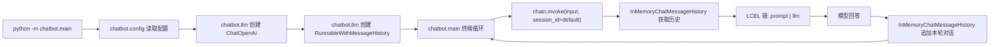

# 单次运行对话记忆设计

## 背景

当前 CLI 聊天机器人的每次 `ask_once()` 调用都是独立发送给模型的，上一轮的用户输入和模型回答不会传给下一轮。用户希望在一次运行过程中，机器人能记住之前说过的话。

记忆只在单次运行期间存在，程序退出后自动释放，不需要持久化。

## 目标

1. 在当前运行会话中，每一轮对话都能参考前几轮的用户输入和模型回答。

2. 退出程序后记忆自动释放，不写磁盘。

3. 改动保持最小，只修改 `chatbot/llm.py` 和 `chatbot/main.py`。

## 非目标

1. 不引入磁盘存储、数据库或序列化。

2. 不改变配置加载逻辑。

3. 不改变测试。

## 推荐方案

采用 LangChain 1.x 的 `RunnableWithMessageHistory` + `InMemoryChatMessageHistory` 方案，使用 LCEL（LangChain Expression Language）构建链。

LangChain 1.0+ 移除了 `LLMChain` 和 `ConversationBufferMemory` 等旧 API，推荐使用 LCEL 组合式 API。`RunnableWithMessageHistory` 是 LangChain 1.x 中管理对话历史的标准方式。

### 为什么选择此方案

1. 与已安装的 LangChain 1.3.0 兼容，使用受支持的最新 API。

2. `InMemoryChatMessageHistory` 是纯内存存储，进程退出自动释放。

3. LCEL 链（`prompt | llm`）比旧版 `LLMChain` 更简洁，也更具可组合性。

## 文件变更

### `chatbot/llm.py`

修改 `build_chain()` 的实现：

1. 添加必要的 import：`RunnableWithMessageHistory`、`InMemoryChatMessageHistory`、`ChatPromptTemplate`、`MessagesPlaceholder`。

2. 添加模块级 `store: dict[str, InMemoryChatMessageHistory]` 字典，用于按 `session_id` 存储对话历史。

3. 添加 `get_session_history(session_id: str)` 辅助函数，从 `store` 中获取或创建对应 session 的历史记录。

4. `build_chain(llm)` 函数：
   - 使用 LCEL 创建 `prompt | llm` 链
   - 用 `RunnableWithMessageHistory` 包装该链，指定 `input_messages_key="input"` 和 `history_messages_key="chat_history"`
   - 返回 `RunnableWithMessageHistory` 实例

`ask_once()` 保留不动，供无记忆场景使用。

### `chatbot/main.py`

1. 新增导入 `build_chain`。

2. `run_chat_loop()` 入参从 `ChatOpenAI` 改为 `RunnableWithMessageHistory`。

3. 循环体内的 `answer = ask_once(llm, question)` 改为调用 `chain.invoke({"input": question}, config={"configurable": {"session_id": "default"}})`。

4. `main()` 中顺序：`config → build_llm → build_chain → run_chat_loop`。

## 数据流

## 交互行为保持

1. 空输入、`exit`/`quit` 退出行为不变。

2. 缺少 `OPENAI_API_KEY` 时启动报错行为不变。

3. `Ctrl+C` 处理行为不变。

4. 单次模型调用失败时打印错误并继续行为不变。

唯一变化：连续提问时模型能引用前文。

## 依赖

不需要新增依赖。`RunnableWithMessageHistory` 来自 `langchain-core`，`InMemoryChatMessageHistory` 来自 `langchain-core`，均已随 `langchain` 安装。

## 验收标准

1. 启动后第一轮提问能得到回答。

2. 第二轮提问提及第一轮的内容时，模型能正确引用（例如，"我刚才说了什么？" 能复述第一轮的用户输入或自己的回答）。

3. 程序退出后重新启动，记忆清零，模型不再记得上一轮的对话。
