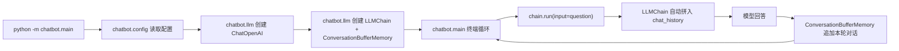

# 单次运行对话记忆设计

## 背景

当前 CLI 聊天机器人的每次 `ask_once()` 调用都是独立发送给模型的，上一轮的用户输入和模型回答不会传给下一轮。用户希望在一次运行过程中，机器人能记住之前说过的话。

记忆只在单次运行期间存在，程序退出后自动释放，不需要持久化。

## 目标

1. 在当前运行会话中，每一轮对话都能参考前几轮的用户输入和模型回答。

2. 退出程序后记忆自动释放，不写磁盘。

3. 改动保持最小，只修改 `chatbot/llm.py` 和 `chatbot/main.py`。

## 非目标

1. 不引入磁盘存储、数据库或序列化。

2. 不改变配置加载逻辑。

3. 不改变测试。

## 推荐方案

采用 LangChain 自带的 `LLMChain` + `ConversationBufferMemory` 方案。

### 为什么在选择阶段选了此方案

用户明确选择了此方案。其优势在于由 LangChain 框架自动管理消息历史，`chain.run(input)` 自动在每次调用前插入历史消息，调用后更新历史，接入代码最简洁。

## 文件变更

### `chatbot/llm.py`

新增 `build_chain()` 函数：

1. 定义 `ChatPromptTemplate`，结构为：
   - system 消息（"You are a helpful assistant."）
   - `MessagesPlaceholder(variable_name="chat_history")` — 用于插入历史对话
   - human 消息（`"{input}"`）

2. 创建 `ConversationBufferMemory(memory_key="chat_history", return_messages=True)`。

3. 构造 `LLMChain(llm=llm, prompt=prompt, memory=memory)` 并返回。

`ask_once()` 保留不动，供无记忆场景使用。

### `chatbot/main.py`

1. 新增导入 `build_chain`。

2. `run_chat_loop()` 入参从 `ChatOpenAI` 改为 `LLMChain`。

3. 循环体内的 `answer = ask_once(llm, question)` 改为 `answer = chain.run(input=question)`。

4. `main()` 中顺序不变：`config → build_llm → build_chain → run_chat_loop`。

## 数据流

## 交互行为保持

1. 空输入、`exit`/`quit` 退出行为不变。

2. 缺少 `OPENAI_API_KEY` 时启动报错行为不变。

3. `Ctrl+C` 处理行为不变。

4. 单次模型调用失败时打印错误并继续行为不变。

唯一变化：连续提问时模型能引用前文。

## 依赖

不需要新增依赖。`LLMChain` 和 `ConversationBufferMemory` 来自已安装的 `langchain` 包。

## 验收标准

1. 启动后第一轮提问能得到回答。

2. 第二轮提问提及第一轮的内容时，模型能正确引用（例如，"我刚才说了什么？" 能复述第一轮的用户输入或自己的回答）。

3. 程序退出后重新启动，记忆清零，模型不再记得上一轮的对话。
