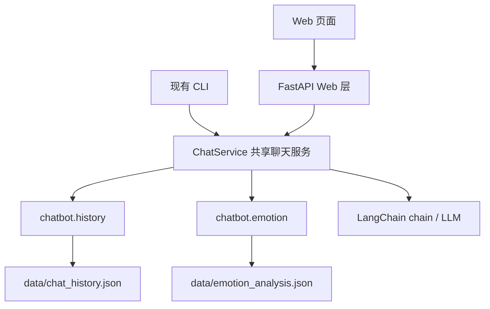
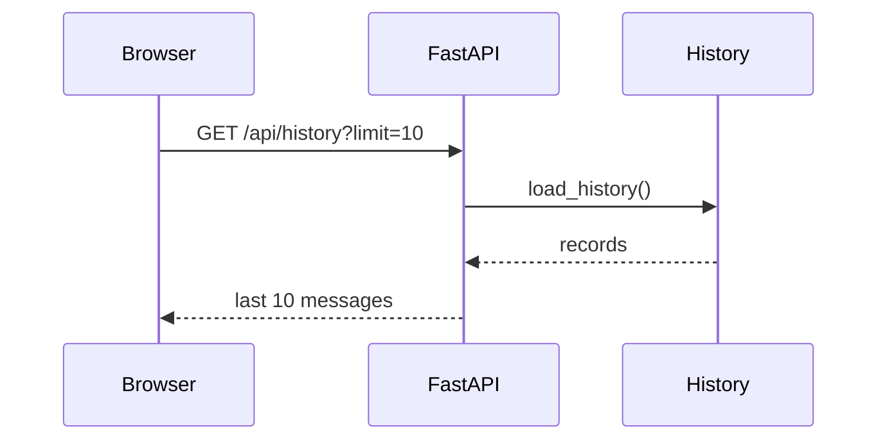
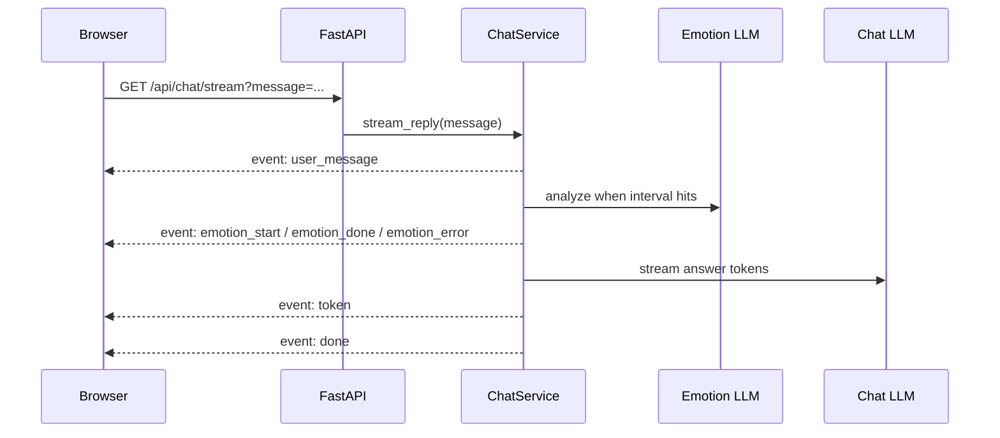

# Web Chat SSE Design

## 背景

当前项目是一个 Python CLI 情绪识别聊天机器人。`chatbot/main.py` 负责加载配置、初始化历史记录、加载用户画像、构建聊天 LLM 和情感分析 LLM，并运行控制台交互循环。

聊天历史已经通过 `chatbot/history.py` 持久化到 `data/chat_history.json`，并且 `format_recent(records, n=10)` 已经支持读取最近 10 条消息。情感分析逻辑在 `chatbot/emotion.py` 中按 `EMOTION_INTERVAL` 触发，分析结果持久化到 `data/emotion_analysis.json`。

本设计目标是新增一个可视化 Web 页面，把原本在控制台完成的聊天操作迁移到浏览器中，同时保留 CLI 入口。页面启动时加载最近 10 条消息，用户后续通过页面和 chatbot 沟通，AI 回复通过 SSE 协议流式显示。

## 已确认需求

1. 新增 Web 页面，采用 FastAPI + 原生 HTML/CSS/JS。

2. 保留现有 CLI，新增 Web 能力，不移除控制台聊天入口。

3. 页面启动时加载历史记录中的最近 10 条消息。

4. 用户发送消息后，后端使用 SSE 流式推送 AI 回复。

5. 情感分析状态需要在页面展示：触发时显示 “正在分析情绪…”，成功时显示当前 emotion，失败时显示低干扰错误提示。

6. 第一版面向本地单用户默认会话，不做登录、多用户隔离、数据库迁移或复杂会话管理。

## 方案选择

推荐方案是新增 Web 层，并抽出共享聊天服务。



这个方案让 CLI 和 Web 调用同一套单轮聊天流程，避免复制业务逻辑。Web 层只负责 HTTP、静态页面和 SSE 事件组织，聊天历史、情感分析、LLM 调用仍由共享服务协调。

未采用的方案：

1. 在 Web 层复刻 CLI 逻辑。优点是短期实现快，缺点是 CLI 和 Web 容易行为分叉。

2. 引入完整会话管理层。优点是后续支持多用户更自然，缺点是当前本地单用户需求不需要这部分复杂度。

## 组件设计

### `chatbot/chat_service.py`

新增共享服务模块，负责一轮聊天的业务流程。

主要职责：

1. 接收用户输入并追加 human 历史消息。

2. 维护当前运行期的 `session_records` 和 `turn_count`。

3. 按 `emotion_interval` 触发情感分析。

4. 将情感分析结果格式化为 `emotion_context`。

5. 调用 LangChain chain 生成 AI 回复。

6. 在回复成功完成后追加 ai 历史消息。

7. 为 CLI 提供整段回复方法，为 Web 提供流式事件生成方法。

CLI 现有行为会通过这个服务保留：用户输入、情感分析间隔、历史写入和错误处理语义保持一致。

### LLM 适配器流式能力

现有 `ChatModelAdapter` 只要求实现 `invoke`。为了支持 SSE 流式回复，需要扩展适配层，让 OpenAI 兼容模型提供 token 流。

设计约束：

1. 保留 `invoke`，继续服务 CLI 和现有测试。

2. 为支持流式的适配器新增 `stream` 能力，返回可迭代的回复片段。

3. `ChatService` 的流式方法优先使用 `stream`。如果当前适配器不支持 `stream`，则退化为一次性 `invoke`，再通过一个 `token` 事件推送完整回复。

4. OpenAI 兼容适配器使用 LangChain `ChatOpenAI.stream(...)` 作为第一版流式实现。

### `chatbot/web.py`

新增 FastAPI 应用入口。

主要接口：

1. `GET /`

   返回聊天页面。

2. `GET /api/history?limit=10`

   返回结构化历史消息，默认返回最近 10 条。

3. `GET /api/chat/stream?message=...`

   建立 SSE 连接，处理一轮用户输入，并按事件流推送情感分析状态和 AI 回复片段。`message` 由前端 URL 编码，后端拒绝空白消息。

Web 应用启动时加载配置、历史、用户画像、聊天 LLM 和情感分析 LLM，并初始化默认 session。

新增依赖控制在 Web 服务所需范围内：`fastapi`、`uvicorn`，以及用于接口测试的 `httpx`。不引入前端构建工具。

### `chatbot/static/`

新增原生前端资源。

包含：

1. `index.html`

   聊天页面结构。

2. `style.css`

   页面布局、消息气泡、状态提示和响应式样式。

3. `app.js`

   加载历史、提交消息、建立 SSE 连接、渲染流式回复、展示情绪状态和错误状态。

### `chatbot/main.py`

保留 CLI 入口，但将单轮聊天处理改为调用 `ChatService`。`/history` 命令继续保留，`exit`、`quit` 和空输入退出逻辑继续保留。

## 数据流

页面启动时加载历史：



用户发消息时：



## SSE 事件设计

SSE 事件使用 JSON 作为 `data` 内容。

示例：

```text
event: token
data: {"content":"你好"}
```

事件类型：

1. `user_message`

   后端确认接收并保存用户输入。前端可用它确认消息进入服务端历史。

2. `emotion_start`

   情感分析开始。前端显示 “正在分析情绪…”。

3. `emotion_done`

   情感分析成功。前端显示当前 emotion。

4. `emotion_error`

   情感分析失败。前端显示 “情感分析失败，本轮继续回复”。

5. `token`

   AI 回复片段。前端将内容追加到当前 AI 消息气泡。

6. `done`

   本轮回复完成。前端解除输入锁定。

7. `error`

   聊天模型调用失败。前端显示错误并解除输入锁定。

## 错误处理

1. 配置缺失或 LLM 初始化失败时，Web 服务启动应给出清晰错误，不进入半可用状态。

2. 历史文件不存在、为空或损坏时，复用现有 `load_history()` 行为，页面显示空历史。

3. 情感分析失败时，推送 `emotion_error`，但不阻断聊天回复。

4. 聊天 LLM 失败时，推送 `error`，不写入 AI 历史；已经写入的用户消息保留。

5. 浏览器中途断开 SSE 时，后端停止继续推送；如果 AI 回复没有完整生成并进入 `done` 流程，则不写入 AI 历史。

## 测试设计

1. 服务层测试

   覆盖用户消息写入、AI 回复写入、情感分析间隔、情感分析失败不阻断聊天、聊天失败不写入 AI 历史。

2. 历史接口测试

   覆盖 `/api/history?limit=10` 返回最近 10 条结构化消息，空历史返回空数组。

3. SSE 接口测试

   覆盖 `user_message`、`emotion_start`、`emotion_done` 或 `emotion_error`、`token`、`done`、`error` 的事件顺序和 JSON 数据结构。

4. CLI 回归测试

   保持现有 CLI 测试通过，证明控制台入口没有被 Web 改造破坏。

## 非目标

1. 不做多用户账号、登录或权限控制。

2. 不引入数据库，继续使用现有 JSON 文件持久化。

3. 不做复杂历史检索、分页或删除功能。

4. 不支持多个浏览器并发会话隔离。

5. 不重写情感分析 prompt 或情绪标签体系。

## 验收标准

1. 运行 Web 服务后，浏览器能打开聊天页面。

2. 页面启动后自动展示最近 10 条历史消息。

3. 用户能在页面输入消息并发送。

4. AI 回复通过 SSE 流式追加显示。

5. 情感分析触发时页面显示分析状态，成功时显示当前 emotion，失败时显示低干扰提示。

6. 用户消息和完整 AI 回复会写入 `data/chat_history.json`。

7. 原 CLI 入口仍可正常聊天，并保留 `/history`、退出命令和历史写入行为。

8. 新增和现有测试通过。
