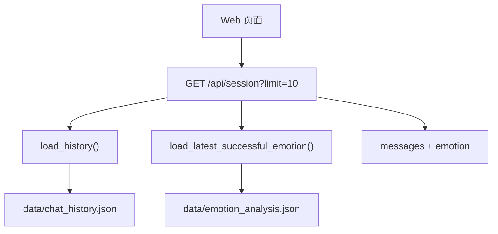
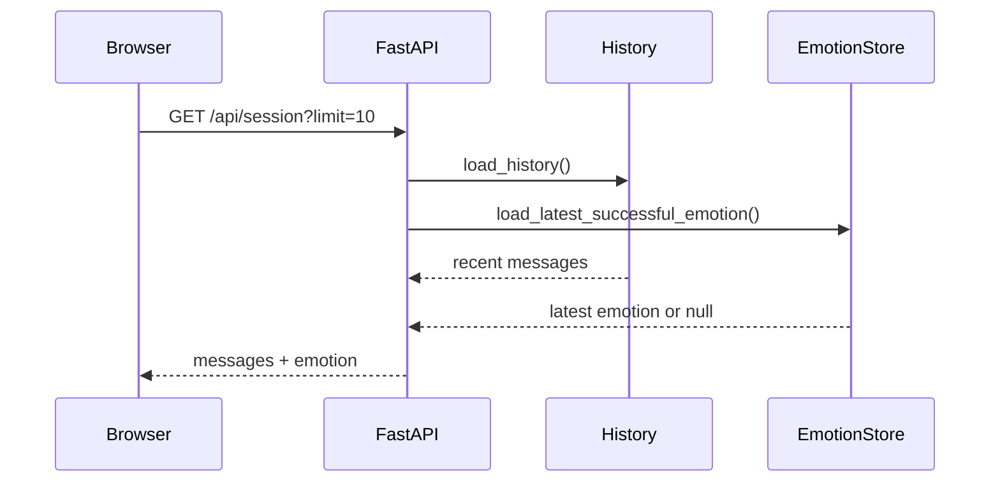
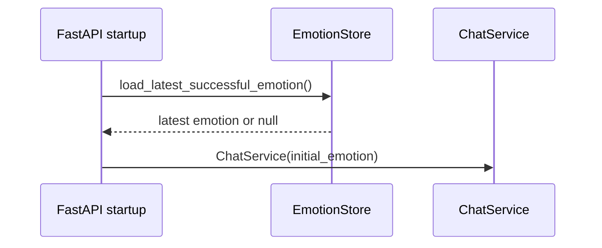
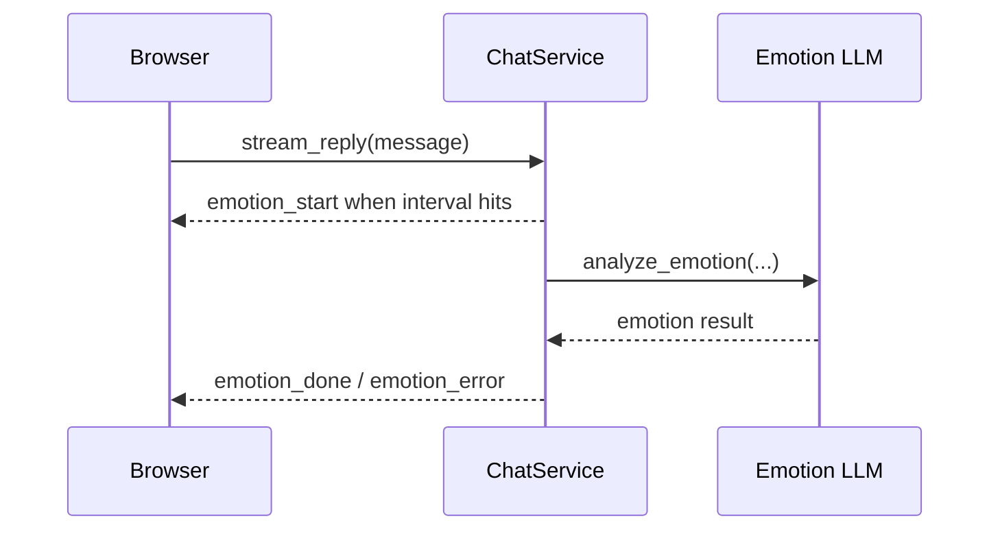

# Session Snapshot Emotion Design

## 背景

当前 Web 版本启动时，前端通过 `/api/history?limit=10` 加载最近 10 条聊天消息。情绪识别只会在用户继续对话并达到 `emotion_interval` 后触发，页面顶部的情绪状态因此会先显示 “情感状态：暂无”。

现有情绪分析结果已经由 `chatbot/emotion.py` 写入 `data/emotion_analysis.json`。问题不在于没有保存情绪，而在于启动链路没有读取最后一次成功情绪，也没有把这个状态返回给前端。

本设计目标是在不合并聊天历史和情绪分析文件的前提下，让 Web 页面启动时一次性加载最近聊天消息和上次成功情绪。

## 已确认需求

1. 聊天历史继续保存到 `data/chat_history.json`。

2. 情绪分析结果继续保存到 `data/emotion_analysis.json`。

3. 页面启动时使用一个接口加载初始状态，而不是分别请求聊天历史接口和情绪接口。

4. 初始状态包含最近 10 条聊天消息和最近一次成功情绪。

5. 后端启动后，第一次新对话也应该能使用上次成功情绪作为 `emotion_context`。

6. 如果没有成功情绪记录、情绪文件不存在或情绪文件损坏，页面仍正常启动，并显示 “情感状态：暂无”。

## 推荐方案

新增一个会话快照接口，并让前端初始化时使用它。



这个方案保留两个数据文件的职责边界，同时让 Web 初始化只走一次请求。它也避免把情绪状态塞进纯历史接口里，接口语义更接近 “启动快照”。

未采用的方案：

1. 只新增 `/api/emotion/latest`。

   优点是职责清楚。缺点是前端启动要发两个请求，不符合这次 “同一个接口 response 中输出” 的要求。

2. 直接扩展 `/api/history`。

   优点是改动更少。缺点是 `/api/history` 会从 “历史消息接口” 变成混合状态接口，后续维护时语义不够清楚。

## 接口设计

新增 `GET /api/session?limit=10`。

成功响应示例：

```json
{
  "messages": [
    {
      "role": "human",
      "content": "你好",
      "timestamp": "2026-05-13T04:53:49+00:00"
    }
  ],
  "emotion": {
    "emotion": "sad",
    "timestamp": "2026-05-19T18:34:42+08:00",
    "turn_count": 5
  }
}
```

没有可用情绪时：

```json
{
  "messages": [],
  "emotion": null
}
```

`messages` 只包含 `human` 和 `ai` 角色，默认返回最近 10 条。`emotion` 只返回最近一条 `success: true` 且 `emotion` 非空的记录。

保留 `/api/history?limit=10` 作为兼容接口，但前端初始化改用 `/api/session?limit=10`。

## 后端设计

### `chatbot/emotion.py`

新增读取函数，例如 `load_latest_successful_emotion() -> dict | None`。

职责：

1. 调用现有 `load_analysis_records()` 读取情绪分析记录。

2. 从后往前查找最近一条成功记录。

3. 成功记录必须满足 `success` 为 `true`，并且 `emotion` 是非空字符串。

4. 返回精简数据：`emotion`、`timestamp`、`turn_count`。

5. 文件不存在、JSON 损坏或结构不符合预期时返回 `None`。

同时建议把 `EMOTION_ANALYSIS_FILE` 改为项目根目录锚定路径，和 `chatbot/history.py` 的 `HISTORY_FILE` 保持一致，避免不同启动目录导致读取到不同文件。

### `chatbot/chat_service.py`

`ChatService` 初始化时增加可选参数 `initial_emotion: str = ""`。

启动后：

1. `current_emotion` 使用 `initial_emotion`。

2. 如果 `initial_emotion` 为空，行为保持不变。

3. 后续 SSE 触发新的情绪识别时，仍由 `emotion_done` 更新 `current_emotion`。

这样第一次新消息构造 payload 时，`format_emotion_context(self.current_emotion)` 就能带上上次会话的情绪。

### `chatbot/web.py`

`build_service()` 在加载历史后，同时读取最近成功情绪，并传给 `ChatService`。

新增内部函数 `_session_snapshot(limit: int) -> dict`，负责组装：

1. 最近聊天消息。

2. 最近成功情绪。

新增接口：

```text
GET /api/session?limit=10
```

该接口调用 `_session_snapshot(limit)` 并返回统一 response。

### `chatbot/static/app.js`

前端初始化从 `loadHistory()` 调整为 `loadSession()`。

`loadSession()` 请求 `/api/session?limit=10`，然后：

1. 渲染 `payload.messages`。

2. 如果 `payload.emotion` 存在，显示 `情感状态：<emotion>`。

3. 如果 `payload.emotion` 为空，显示 `情感状态：暂无`。

4. 如果接口失败，显示 `历史加载失败`，并保持输入框可恢复。

现有 SSE 事件处理保持不变。

## 数据流

页面启动：



服务启动：



对话中：



## 错误处理

1. `data/emotion_analysis.json` 不存在时，返回 `emotion: null`。

2. `data/emotion_analysis.json` 为空、损坏或不是列表时，返回 `emotion: null`。

3. 最近记录是失败记录时，继续向前查找上一条成功记录。

4. 所有情绪记录都失败时，返回 `emotion: null`。

5. `/api/session` 中历史消息读取失败时，沿用现有 `load_history()` 行为，返回空消息列表。

6. 启动情绪加载失败不阻塞 Web 服务启动。

## 测试设计

1. `chatbot.emotion.load_latest_successful_emotion()` 能读取最近成功情绪。

2. 情绪文件不存在、损坏、为空、没有成功记录时返回 `None`。

3. 最近记录失败但更早有成功记录时，返回更早的成功情绪。

4. `ChatService` 初始化后会使用 `initial_emotion` 构造下一轮 `emotion_context`。

5. `GET /api/session?limit=10` 返回最近 10 条消息和最近成功情绪。

6. 前端初始化请求 `/api/session?limit=10`，并能显示历史消息和初始情绪。

7. 现有 SSE 情绪事件继续更新页面状态。

## 非目标

1. 不合并 `chat_history.json` 和 `emotion_analysis.json`。

2. 不新增数据库。

3. 不新增多用户或多 session 管理。

4. 不改变情绪识别触发间隔。

5. 不重新分析历史聊天来补算情绪，只读取已有成功记录。
