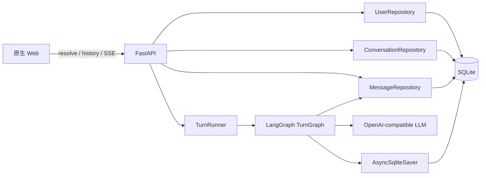

# LangGraph 多用户 ChatBot 重建设计

- 日期：2026-09-03
- 状态：已由用户批准
- 目标分支：`main`
- 设计分支：`codex/langgraph-multi-user-chatbot-design`
- 旧项目基线提交：`86220ac52df1641fee051bae8e4e04fd09ff6e40`

## 1. 背景

当前仓库是一套已经包含情绪识别、画像、长期记忆、安全判断、实验评估和 LangGraph 多流程编排的情绪陪伴机器人。新版不在旧架构上继续裁剪，而是将旧项目完整归档到仓库内，重新构建一个边界清晰的多用户 ChatBot。

新版首期只解决以下问题：

1. 前端允许输入字符串用户标识。
2. 后端将外部标识解析为内部用户 ID；不存在时自动创建用户。
3. 不同内部用户 ID 的聊天、历史和 LangGraph Checkpoint 严格隔离。
4. 每个用户首期只有一个连续对话，但表结构允许以后扩展为多个对话。
5. 使用 OpenAI-compatible LLM 和 SSE 流式输出。
6. 使用同一个 SQLite 文件保存用户、对话、完整消息、模型实际返回的 reasoning、执行追踪和 LangGraph Checkpoint。

## 2. 范围

### 2.1 首期包含

- FastAPI 后端。
- 原生 HTML、CSS、JavaScript 单页聊天界面。
- 一个线性、可扩展的 LangGraph 对话图。
- OpenAI-compatible 单模型配置。
- 用户标识自动匹配或创建。
- 每用户一个默认对话。
- SQLite 业务表和官方 `AsyncSqliteSaver`。
- SSE 流式回复、幂等重放、同用户并发保护和失败记录。
- 完整消息、Prompt 快照、模型参数、Token、耗时、错误、实际 reasoning 和可观测节点追踪。

### 2.2 首期不包含

- 注册、登录、Token、权限或防冒用能力。
- 多对话列表及新建对话 UI。
- 情绪识别、画像扩展、长期记忆、向量检索和安全判断。
- 工具调用、Agent 循环或多模型路由。
- reasoning 或内部执行追踪的前端展示。
- 生产级多进程、多实例或横向扩容。
- 旧项目数据迁移或新旧运行时代码共享。

手工输入的用户标识只用于数据分区，不等于身份认证。任何人只要输入相同标识，就会访问同一用户的数据。该限制必须写入新版 README。

## 3. 旧项目归档

### 3.1 归档位置

旧项目基线提交中受 Git 跟踪的内容统一移动到：

```text
archive/emotion-aware-chatbot-v1/
```

归档包含旧代码、测试、数据集、实验输出、交付物、文档、依赖配置、环境变量模板和工具配置。归档目录增加说明文件，记录：

- 原始提交 `86220ac52df1641fee051bae8e4e04fd09ff6e40`。
- 归档日期和范围。
- 归档项目的原始用途。
- 从归档目录参考或尝试运行旧项目的方式。
- 归档代码不会与新版共享依赖或模块。

设计文档及后续新版文件不属于旧项目，不移入归档。

### 3.2 本地忽略内容

- `.idea/` 保留在原工作区，不加入 Git，也不移入归档。
- `.pytest_cache/`、`__pycache__/` 和 `.pyc` 等缓存不进入归档或 Git。
- 缓存可安全重新生成；归档过程应避免把被忽略的缓存随目录整体移动进去。
- `.git/` 和任务工作树目录不属于归档内容。

### 3.3 新版顶层结构

```text
archive/emotion-aware-chatbot-v1/  # 冻结的旧项目参考
chatbot/
  api/                             # FastAPI 路由与 SSE 适配
  core/                            # 配置、时间和错误类型
  db/                              # Schema、连接和三个业务仓储
  graph/                           # State、节点、构图和运行时依赖
  llm/                             # OpenAI-compatible 适配与流式块解析
  models/                          # API 和领域模型
  static/                          # 原生 Web 页面
  main.py                          # 应用入口
tests/
data/                              # 默认 SQLite 文件目录，运行数据不提交
.env.example
.gitignore
README.md
requirements.txt
pytest.ini
```

模块保持单一职责，不从归档目录导入 Python 模块。

## 4. 总体架构



职责边界如下：

- FastAPI 负责请求校验、用户解析、会话归属、HTTP/SSE 协议和错误映射。
- LangGraph 负责单轮对话的可恢复编排。
- 三个业务仓储分别负责用户、对话和消息。
- `messages` 是聊天历史、reasoning 和审计数据的唯一业务事实来源。
- `AsyncSqliteSaver` 的内部表只用于恢复图状态；业务接口不解析其 BLOB。
- LLM、数据库仓储、时钟和 SSE 发布器通过运行时依赖传给节点，不写入 Graph State。

## 5. ID 与身份规则

### 5.1 外部标识

- 前端提交 `string` 类型的 `identifier`。
- 后端先执行 `strip()`；结果长度必须为 1 到 128 个 Unicode 字符。
- 标识保留大小写，并使用 SQLite `BINARY` 规则精确匹配。
- 不存在时在事务中自动创建；数据库唯一约束负责并发去重。
- `identifier` 只在解析接口中使用。解析完成后，所有业务接口和内部隔离都使用 `users.id`。

### 5.2 内部 ID

- `users.id`：SQLite 自增整数。
- `conversations.id`：UUID4 字符串，业务会话 ID。
- `conversations.thread_id`：独立 UUID4 字符串，只作为 LangGraph `thread_id`。
- `messages.id`：UUID4 字符串。
- `messages.request_id`：客户端为一次发送生成的 UUID4，同一轮用户消息和助手消息共享该值。

首期只创建一个 `is_default = 1` 的对话。`user_id` 与 `thread_id` 不直接等同，以便以后自然扩展为一名用户多个对话。

## 6. SQLite 设计

### 6.1 连接与版本

所有表使用同一个 SQLite 文件。业务连接和 Checkpointer 连接可以分开，但必须指向同一路径，并统一设置：

```sql
PRAGMA journal_mode = WAL;
PRAGMA foreign_keys = ON;
PRAGMA busy_timeout = 5000;
PRAGMA synchronous = NORMAL;
```

首期只支持一个应用进程和一个 Uvicorn worker。业务 Schema 使用 `PRAGMA user_version` 记录版本，不新增迁移记录表。实现时锁定并记录 `langgraph` 与 `langgraph-checkpoint-sqlite` 的确切版本，通过集成测试验证该版本实际创建的内部表结构。

### 6.2 `users`

```sql
CREATE TABLE users (
    id INTEGER PRIMARY KEY AUTOINCREMENT,
    identifier TEXT COLLATE BINARY NOT NULL UNIQUE,
    created_at TEXT NOT NULL,
    updated_at TEXT NOT NULL,
    CHECK (length(identifier) BETWEEN 1 AND 128)
);
```

### 6.3 `conversations`

```sql
CREATE TABLE conversations (
    id TEXT PRIMARY KEY,
    user_id INTEGER NOT NULL,
    thread_id TEXT NOT NULL UNIQUE,
    is_default INTEGER NOT NULL DEFAULT 1,
    title TEXT NOT NULL DEFAULT '新对话',
    status TEXT NOT NULL DEFAULT 'active',
    created_at TEXT NOT NULL,
    updated_at TEXT NOT NULL,
    FOREIGN KEY (user_id) REFERENCES users(id) ON DELETE CASCADE,
    CHECK (is_default IN (0, 1)),
    CHECK (status IN ('active', 'archived'))
);

CREATE UNIQUE INDEX ux_conversations_default_user
    ON conversations(user_id)
    WHERE is_default = 1;

CREATE INDEX ix_conversations_user_updated
    ON conversations(user_id, updated_at DESC);
```

部分唯一索引保证每个用户只有一个默认对话，同时允许未来增加任意数量的非默认对话。

### 6.4 `messages`

```sql
CREATE TABLE messages (
    id TEXT PRIMARY KEY,
    conversation_id TEXT NOT NULL,
    request_id TEXT NOT NULL,
    sequence_no INTEGER NOT NULL,
    role TEXT NOT NULL,
    status TEXT NOT NULL,
    content TEXT NOT NULL DEFAULT '',
    reasoning_content TEXT,
    trace_json TEXT NOT NULL DEFAULT '{"schema_version":1,"events":[]}',
    prompt_json TEXT,
    provider TEXT,
    model TEXT,
    parameters_json TEXT,
    input_tokens INTEGER,
    output_tokens INTEGER,
    total_tokens INTEGER,
    latency_ms INTEGER,
    finish_reason TEXT,
    error_code TEXT,
    error_message TEXT,
    created_at TEXT NOT NULL,
    updated_at TEXT NOT NULL,
    completed_at TEXT,
    FOREIGN KEY (conversation_id) REFERENCES conversations(id) ON DELETE CASCADE,
    UNIQUE (conversation_id, sequence_no),
    UNIQUE (conversation_id, request_id, role),
    CHECK (role IN ('user', 'assistant')),
    CHECK (status IN ('pending', 'streaming', 'completed', 'failed')),
    CHECK (sequence_no > 0),
    CHECK (input_tokens IS NULL OR input_tokens >= 0),
    CHECK (output_tokens IS NULL OR output_tokens >= 0),
    CHECK (total_tokens IS NULL OR total_tokens >= 0),
    CHECK (latency_ms IS NULL OR latency_ms >= 0)
);

CREATE INDEX ix_messages_conversation_sequence
    ON messages(conversation_id, sequence_no);

CREATE INDEX ix_messages_status_updated
    ON messages(status, updated_at);
```

用户消息创建后直接是 `completed`；助手消息依次经历 `pending → streaming → completed`，失败时转为 `failed`。失败消息保留已经收到的部分正文、reasoning、追踪和错误。

每次发送在 `BEGIN IMMEDIATE` 事务中计算下一组 `sequence_no`，同时插入用户消息和助手占位消息，避免并发分配重复序号。

### 6.5 JSON 字段

`prompt_json` 保存真正发给聊天模型的消息数组及系统提示快照。保存前必须删除 API Key、认证头、Cookie 和其他密钥；普通历史接口不返回该字段。

`parameters_json` 保存实际模型调用参数，例如温度、最大输出长度、超时和其他非密钥选项。API Key 永不写入数据库。

`trace_json` 使用可演进结构：

```json
{
  "schema_version": 1,
  "run_id": "uuid",
  "nodes": [
    {
      "name": "generate_response",
      "status": "completed",
      "started_at": "ISO-8601",
      "ended_at": "ISO-8601",
      "duration_ms": 1234
    }
  ],
  "model_calls": [
    {
      "call_id": "uuid",
      "provider": "openai-compatible",
      "model": "model-name",
      "request_parameters": {},
      "response_metadata": {},
      "usage": {
        "input_tokens": 0,
        "output_tokens": 0,
        "total_tokens": 0
      },
      "finish_reason": "stop"
    }
  ],
  "stream": {
    "chunk_count": 0,
    "first_token_ms": null,
    "client_disconnected": false
  },
  "errors": []
}
```

未来一条回复发生多次模型调用时，继续追加 `model_calls`，不需要增加运行表。

### 6.6 Reasoning 边界

- `reasoning_content` 只保存模型 API 实际返回的 reasoning 文本或 reasoning 增量。
- 若供应商不返回该字段，值为 `NULL`；系统不会推断、补写或伪造隐藏思维链。
- 可观测节点、参数、工具事件、Token、耗时和错误放入 `trace_json`。
- 首期前端及普通历史 API 不展示或返回 reasoning、Prompt 和 trace。

### 6.7 LangGraph 官方内部表

`AsyncSqliteSaver` 负责创建和维护内部表，业务迁移不得手工修改。当前目标版本的 SQLite Saver 使用以下结构；实现集成测试必须以锁定版本实际生成的 Schema 为准：

```sql
CREATE TABLE checkpoints (
    thread_id TEXT NOT NULL,
    checkpoint_ns TEXT NOT NULL DEFAULT '',
    checkpoint_id TEXT NOT NULL,
    parent_checkpoint_id TEXT,
    type TEXT,
    checkpoint BLOB,
    metadata BLOB,
    PRIMARY KEY (thread_id, checkpoint_ns, checkpoint_id)
);

CREATE TABLE writes (
    thread_id TEXT NOT NULL,
    checkpoint_ns TEXT NOT NULL DEFAULT '',
    checkpoint_id TEXT NOT NULL,
    task_id TEXT NOT NULL,
    idx INTEGER NOT NULL,
    channel TEXT NOT NULL,
    type TEXT,
    value BLOB,
    PRIMARY KEY (thread_id, checkpoint_ns, checkpoint_id, task_id, idx)
);
```

不在内部表上增加指向 `conversations` 的外键。删除或重置线程时只通过 Saver API 操作。

## 7. LangGraph 设计

### 7.1 图结构


- `prepare_turn`：校验预写的用户消息和助手占位消息，记录开始时间，将助手状态改为 `streaming`。
- `generate_response`：从 `messages` 查询该对话最近的已完成历史，构造并保存 Prompt，流式调用模型，发布正文 Token，收集 reasoning、参数和响应元数据，并节流写入部分结果。
- `finalize_turn`：成功时完成助手消息并更新对话时间；失败时保存部分结果和标准化错误。

`generate_response` 将可预期异常转换为状态，使 `finalize_turn` 始终有机会执行。图外层仍设置最终故障保护，处理进程取消、数据库异常和未预期异常。

### 7.2 Graph State

```python
class TurnState(TypedDict, total=False):
    user_id: int
    conversation_id: str
    request_id: str
    user_message_id: str
    assistant_message_id: str
    phase: str
    error_code: str | None
```

Graph State 不包含：

- 完整聊天历史或完整 Prompt。
- 用户输入正文和助手生成正文的累计副本。
- reasoning 和详细追踪。
- LLM 客户端、数据库连接、Repository、SSE 队列或密钥。

这样可以避免完整历史同时在 `messages` 和每个 Checkpoint BLOB 中重复累积。模型上下文在节点运行时从 `messages` 加载。

### 7.3 上下文窗口

- 所有消息永久保存在数据库。
- 模型默认只读取最近 40 条 `completed` 消息，数量由环境变量配置。
- 当前新写入的用户消息包含在上下文中。
- `failed`、`pending` 和仍在 `streaming` 的助手消息不进入下一次 Prompt。
- 首期不做摘要或长期记忆；上下文截断不删除数据库记录。

未来加入情绪识别、记忆检索或安全判断时，在 `prepare_turn` 与 `generate_response` 之间插入独立节点，不改变现有业务表身份关系。

## 8. 单轮写入与流式流程

1. API 校验 `user_id` 和请求体，并查找该用户的默认对话。
2. 获取以 `user_id` 为键的进程内互斥锁，并在写入前检查 `request_id`；同一用户正在生成时拒绝第二次请求，不同用户可并发。
3. 若不是可重放的既有请求，则在一个业务事务中分配两个连续序号，写入 `completed` 用户消息和 `pending` 助手消息。
4. 创建独立后台生产任务和进程内 SSE 队列。
5. 使用 `{"configurable": {"thread_id": conversation.thread_id}}` 运行 LangGraph。
6. Checkpointer 在 super-step 边界保存轻量状态和节点写入。
7. 模型正文 Token 写入 SSE 队列；reasoning 只在后端收集。
8. 后台按照时间或累计字符阈值节流更新助手的正文、reasoning 和 trace，避免每个 Token 执行一次 SQLite 写入。
9. 模型与 `finalize_turn` 成功后，事务性地把助手消息改为 `completed`。
10. 只有最终数据库提交成功，SSE 才发送 `done`，随后释放用户锁。

浏览器断开只停止消费 SSE，不取消后台生产任务。发布器检测到消费者离开后停止向 SSE 队列放入新事件，但后台任务继续生成和写库，避免无人消费的队列持续增长。

## 9. 幂等、并发与恢复

### 9.1 幂等请求

- 客户端为每次发送生成 UUID4 `request_id`。
- 相同用户、相同 `request_id` 已经 `completed`：不调用模型，从 `messages` 重放保存的助手回复，并标记 `replayed = true`。
- 相同请求仍在当前进程运行：返回 `turn_in_progress`。
- 相同请求已经 `failed`：返回已保存的失败结果；重新生成必须使用新的 `request_id`。
- 数据库唯一约束是最终防重保障。

### 9.2 并发

- 前端在生成期间禁用发送按钮。
- 后端必须独立校验，不能依赖前端。
- 首期使用每用户 `asyncio.Lock`；它只适用于单进程。
- SQLite 使用 WAL 和 `busy_timeout` 缓解不同用户之间的短时写竞争。

### 9.3 失败与恢复

- 模型失败：助手消息标记 `failed`，保留部分正文、reasoning、追踪和错误。
- 最终业务提交失败：SSE 发送 `error`，不得发送 `done`。
- 优雅关闭：停止接收新请求，并在限定时间内等待后台生成；超时任务标记失败。
- 进程意外终止：下次启动将遗留 `pending` 或 `streaming` 消息标记为 `failed`，错误码为 `process_interrupted`。
- 对存在遗留消息的对话，通过 Saver API 清除该 `thread_id` 的不完整 Checkpoint；下一次请求从业务消息历史重新建立轻量图状态。
- 正常完成的 Checkpoint 首期不自动删除。未来若需要保留策略，必须先验证不会破坏仍在使用的父链和 pending writes。

业务表和 Saver 使用不同连接，无法跨两套写入形成单一 SQLite 事务。因此明确采用最终一致性：`messages` 是业务真相，Checkpoint 是可重建的运行状态。

## 10. API 设计

### 10.1 解析或创建用户

```http
POST /api/users/resolve
Content-Type: application/json

{"identifier":"alice"}
```

成功响应：

```json
{
  "user": {"id": 1, "identifier": "alice"},
  "conversation": {"id": "uuid", "title": "新对话"}
}
```

`thread_id` 不返回前端。并发创建使用唯一约束和事务后重查，不能使用“先查再无保护插入”。

### 10.2 查询历史

```http
GET /api/users/{user_id}/messages?limit=100&before_sequence=200
```

- 默认返回最新 100 条，再按 `sequence_no` 正序展示。
- 支持向前分页。
- 只返回 `id`、`request_id`、`sequence_no`、`role`、`status`、`content`、公开错误摘要和时间。
- 不返回 `thread_id`、`reasoning_content`、`prompt_json`、`parameters_json` 或 `trace_json`。

### 10.3 流式发送

```http
POST /api/users/{user_id}/messages:stream
Content-Type: application/json
Accept: text/event-stream

{"request_id":"uuid4","content":"你好"}
```

开始流之前可返回标准 HTTP 错误：

- `400 invalid_identifier_or_message`
- `404 user_not_found`
- `409 turn_in_progress`

流开始后的事件：

```text
event: run_started
data: {"request_id":"...","user_message_id":"...","assistant_message_id":"..."}

event: user_message
data: {"id":"...","content":"你好","sequence_no":1}

event: token
data: {"content":"你"}

event: done
data: {"message":{"id":"...","content":"...","status":"completed"},"replayed":false}
```

失败使用 `error` 事件，携带稳定错误码和可展示说明。SSE 不传 reasoning、Prompt、trace、密钥或原始异常堆栈。

## 11. 前端设计

### 11.1 用户进入

- 首屏只有用户标识输入框和进入按钮。
- 提交后调用 `/api/users/resolve`，不存在时后端自动创建。
- 前端只在当前页面会话中保存解析后的 `user_id`；切换用户时重新解析。
- 首期不把用户标识包装成登录状态，也不显示安全性承诺。

### 11.2 聊天界面

- 顶部显示当前外部标识和“切换用户”。
- 主区显示数据库历史消息及发送状态。
- 底部提供多行输入框和发送按钮。
- 生成期间禁用重复发送。
- SSE 断线后重新请求历史，以数据库状态校准页面。
- `failed` 助手消息显示简短失败状态和已保存的部分正文；不显示内部错误或 reasoning。

首期不提供多会话侧栏、删除记录、编辑历史、重新生成、反馈、情绪展示或调试追踪页面。

## 12. 模型配置

使用单一 OpenAI-compatible 聊天模型。环境变量至少包括：

```env
LLM_API_KEY=
LLM_MODEL=
LLM_BASE_URL=
LLM_TEMPERATURE=0.7
LLM_TIMEOUT_SECONDS=60
CHAT_CONTEXT_MESSAGE_LIMIT=40
SQLITE_DB_PATH=data/chatbot.sqlite3
```

适配层负责：

- 创建聊天模型。
- 将供应商流式块拆分为正文和实际 reasoning 增量。
- 统一 Token、结束原因和响应元数据。
- 保证密钥不进入日志、Prompt 快照、参数 JSON 或 trace。

供应商未提供 reasoning 时，`reasoning_content` 保持 `NULL`。

## 13. 测试设计

### 13.1 单元测试

- 标识去空白、长度、大小写精确匹配。
- JSON 结构版本、序列化和密钥脱敏。
- 模型流式块的正文、reasoning、usage 和结束原因解析。
- Graph State 字段边界和节点路由。
- 上下文只选择当前对话已完成消息。
- 稳定错误码映射。

### 13.2 SQLite 集成测试

- 首次启动创建三个业务表和锁定版本 Saver 的内部表。
- `user_version`、WAL、外键和超时设置生效。
- 同一标识并发解析只产生一个用户和一个默认对话。
- 不同 `thread_id` 的 Checkpoint 严格隔离。
- 应用重启后用户、消息、reasoning、trace 和 Checkpoint 仍可读取。
- 相同 `(conversation_id, request_id, role)` 无法重复写入。
- 遗留 `pending/streaming` 恢复为 `failed`，业务历史仍完整。

### 13.3 Graph 与 API 测试

- 使用确定性假模型验证完整节点顺序。
- 两个用户并行聊天且上下文不互相泄漏。
- 相同用户切换回来继续其默认对话。
- SSE 顺序为 `run_started → user_message → token* → done|error`。
- `done` 仅在最终消息提交后出现。
- 客户端断线不取消后台生成。
- 相同 `request_id` 重放而不再次调用模型。
- 同用户并发发送返回冲突，不同用户可并行。
- 历史接口不泄露 reasoning、Prompt、trace 或 `thread_id`。
- 数据库和模型异常均留下可解释的失败消息。

默认自动化测试不访问真实模型。另提供必须显式设置环境变量才会执行的真实模型冒烟测试，并把“测试通过”和“真实模型调用成功”作为不同验收结论。

### 13.4 归档与项目结构测试

- 旧基线提交的受跟踪路径均可在归档清单中找到。
- 新版代码不导入归档目录。
- 缓存、SQLite 运行文件和 `.env` 不受 Git 跟踪。
- README 的安装、启动和安全边界与实现一致。

## 14. 验收标准

首期完成必须同时满足：

1. 旧项目受跟踪内容完整归档，归档说明可追溯到原始提交。
2. 用户可在网页输入任意合法字符串标识，不存在时自动创建。
3. 后续用户识别、会话归属和图隔离全部使用内部 `users.id`。
4. 每个用户首期自动获得一个默认对话和唯一 `thread_id`。
5. 不同用户可以并发流式聊天，且历史和 Prompt 不互相泄漏。
6. 用户消息、助手消息、实际 reasoning、Prompt、模型参数、Token、耗时、错误和节点追踪均按设计落库。
7. reasoning 和追踪不通过首期前端或普通历史 API 暴露。
8. 应用重启后聊天历史及正常 Checkpoint 可恢复；中断消息被明确标记失败。
9. 幂等重试不会重复调用模型或产生重复消息。
10. 自动化测试通过；真实模型验证结果单独报告。

## 15. 后续扩展边界

- 多对话：开放已有 `users 1:N conversations` 关系并增加会话 CRUD/UI。
- 情绪识别：增加独立节点及其领域表，不把情绪字段塞入用户表。
- 长期记忆：使用独立 Store 或领域表，不把 Checkpoint 当长期记忆。
- 认证：在外部标识与内部用户 ID 之间加入可信身份层，现有业务外键不变。
- 生产部署：SQLite 迁移到 PostgreSQL Checkpointer 和业务数据库，并替换进程内锁。
- 调试界面：如以后展示 reasoning 或 trace，必须新增受保护接口和访问控制，不能直接扩展普通消息接口。

这些能力均不在首期预建空模块，待需求明确后按独立设计实施。
