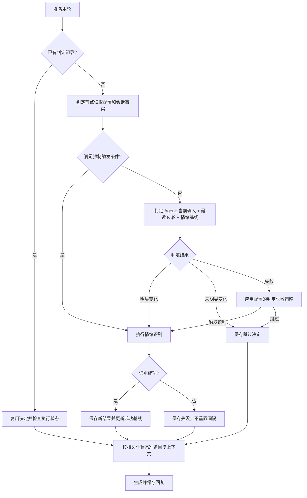

# 按情绪变化与轮次间隔触发识别的设计

## 状态与范围

本设计基于 main 的已提交 HEAD ea08ec1。用户已确认聊天中的触发规则、失败处理、历史结果复用和全面配置化要求；本文待用户审阅后进入 writing-plans 阶段，尚未实现业务代码。

把当前每轮情绪识别改为：识别前增加判定节点，由程序检查强制触发条件，必要时调用判定 Agent 决定是否提前识别。默认最大间隔为 15 轮，判定历史窗口为最近 5 轮完整对话，两者均可配置。窗口可大于 5，当前用户输入另算。

本次范围为情绪判定、识别调度、历史情绪引用及其配置、审计和测试。不扩展记忆系统、危机专用路由或界面功能。现有情绪识别仍使用自己的历史选择和 token 预算，不受判定 Agent 的历史轮数限制。

## 已确认的行为

- 一条被接受的新用户输入计为一轮，同一 request_id 的重复请求不重复计数。同文不同 request_id 是新轮次。
- 计数按 conversation_id 隔离，以用户输入的时间顺序为准，不能直接把包含双方消息的 sequence_no 差当作轮数。助手回复失败不撤销已接受的用户轮次。
- 默认首轮直接识别；成功识别建立或更新基线，重置间隔。第 1 轮成功后，无提前触发时，第 16 轮必须识别；第 8 轮提前成功后，下一次最迟第 23 轮识别。
- 当前轮与最近成功识别轮的用户轮次差达到配置的 max_interval_turns 时，由程序强制执行，Agent 无权否决。
- 未满足强制条件时，Agent 判断是否发生明显变化；发生变化即执行识别，否则跳过。
- 默认判定失败触发正式识别；正式识别失败不重置计数，本轮不注入旧情绪，下一条新输入再尝试。
- 默认跳过识别时，复用当前会话最近一次成功结果，明确标注源消息、源轮次及间隔。不得把历史结果伪装成本轮新识别结果。

## 方案选择

采用“程序检查间隔＋Agent 判断变化”。相比全部交给 Agent，该方案严格保证间隔上限；相比每轮都调用 Agent 再兜底，该方案省去强制识别轮次无必要的判定调用。

判定节点是独立运行单元，包含确定性调度和条件执行的 Agent 调用。正式识别继续使用现有情绪子图。

## 数据流

K 是 history_turn_limit，强制间隔 N 是 max_interval_turns。强制条件依次包括：配置要求的首次识别、配置要求的上次识别失败重试、间隔达到上限。即使修改首轮或失败策略，上限检查也不能被关闭。

若当前会话没有成功结果且首轮强制识别关闭，则从会话首条输入开始累计，到第 N 轮最迟强制识别；此前交给 Agent 判断，基线为空。迁移后的旧会话无成功结果时采用相同规则，不回填历史调用。

## 判定 Agent 输入与输出

输入包含当前用户输入一次、当前输入之前最近最多 K 轮完整对话和最近成功识别结果。每个历史轮次包含配对的用户消息与已完成助手回复；失败或不完整轮次整体排除。历史按时间正序排列，不包含未来输入或其他会话。

情绪基线以结构化参考信息单独提供，并附来源和间隔。Agent 必须关注用户情绪，不能把助手表达归给用户。除突变外，也比较当前输入与历史基线的累计偏离，避免逐轮小变化一直不触发。

独立提示词定义“明显变化”：情绪类别转变、强度明显升降、逐渐偏离基线，以及用户明确表达状态变化。当前设计采用布尔判定，不引入无依据的数值评分阈值；将来若引入评分，其阈值必须配置化。

输出协议为 JSON 对象，包含 should_analyze（布尔值）和 reason（非空简短理由）。提示词可配置输出要求的措辞，但字段名和类型属于解析协议，不能通过任意提示词破坏。理由只记录可观察的简要依据，不要求模型输出隐含推理过程。非法 JSON、字段不合法、超时或模型调用失败统一进入判定失败策略。

先按 K 选历史，再按判定模型 token 预算从最早完整轮次开始裁剪；不截断单条消息、不跳选更早轮次。固定提示词、基线、当前输入与输出预留无法容纳时，记录预算失败并执行配置的判定失败策略。

## 配置设计

所有本功能涉及的可调业务参数集中加载和校验，不在节点、模型调用或提示词构造中散落魔法数字。复用现有配置加载与独立 version/system 提示词格式。正确性约束（会话隔离、幂等、权限、角色完整性和强制间隔保证）不提供关闭开关。

策略文件建议为 data/config/emotion_gate.json，通过 EMOTION_GATE_CONFIG_PATH 覆盖位置；提示词文件为 data/config/prompts/emotion_gate_prompts.json，通过 EMOTION_GATE_SYSTEM_PROMPT_PATH 覆盖。非敏感策略与预算放在策略文件，连接凭据放环境变量。配置启动时校验、重启生效，每次判定记录实际配置快照和提示词版本。

| 策略字段 | 默认值 | 语义及校验 |
| --- | --- | --- |
| max_interval_turns | 15 | 正整数，成功识别之间允许的最大轮次差 |
| history_turn_limit | 5 | 非负整数，0 表示仅当前输入和基线，不人为固定上限为 5 |
| force_first_analysis | true | 是否首轮直接识别 |
| gate_failure_action | analyze | 枚举 analyze/skip；skip 仅适用于未触发强制条件的轮次 |
| retry_failed_analysis_next_turn | true | 上一次正式识别失败后，下一条新输入是否强制再试；false 仍保留间隔上限 |
| reuse_last_success_on_skip | true | 跳过时是否提供最近成功情绪，无成功结果时不注入 |
| reuse_last_success_on_analysis_failure | false | 本轮正式识别失败时是否提供历史结果 |
| model_retry_count | 0 | 判定调用的额外尝试次数，非负整数，SDK 隐式重试关闭 |
| retry_delay_seconds | 0 | 非负有限数，显式重试间的固定等待时间 |
| context_tokens / output_tokens / safety_tokens / history_ratio / tokenizer_model | 沿用有效情绪预算与计数配置 | 可分别覆盖，比例范围为 (0,1]，预留必须可容纳；不同模型必须提供匹配的预算与计数方案 |

判定模型支持独立 EMOTION_GATE_LLM_API_KEY、MODEL、BASE_URL、TEMPERATURE、TIMEOUT_SECONDS 环境变量（均带 EMOTION_GATE_LLM_ 前缀）；未覆盖字段沿用有效情绪模型配置。temperature、超时、输出预留等都可配置并验证有限性和合法范围，不猜测未知模型的上下文容量。

配置文件中的 schema version 与提示词 version 用于审计。未知策略键、重复键、非法枚举、缺失必需字段、非整数轮数和非有限数值均在启动时报告配置错误，避免拼写错误静默失效。可选字段的默认值只在集中配置定义中出现；默认策略文件应显式列出上述默认值和继承含义。

本次同时检查所触及情绪调用路径中现有固定业务数值，已有配置继续复用，尚未暴露的历史预算比例等应集中配置。协议字段、数据库版本和算法结构常量不视为可调业务参数；不借此改造全仓库所有数字。

## 持久化、幂等与恢复

新增 emotion_gate_decisions 表，由独立仓储管理，唯一关联 user_message_id，同时绑定 conversation_id 和 request_id。保留决定状态（pending/running/completed/failed）、最终 analyze/skip、触发原因、当前轮序号、基线 analysis_id 与间隔、输入消息 ID、配置与提示词快照、输出和失败信息、时间戳。触发原因区分 first_turn、previous_analysis_failed、interval_reached、emotion_changed、unchanged、gate_failed。

判定调用开始前落库输入及参数，结束后保存输出、模型元数据、token、耗时和可获取的错误信息；凭据脱敏。启用显式重试时每次调用单独保存 attempt 记录，不能覆盖上一次失败。重试耗尽后应用 gate_failure_action。

跳过只创建判定记录，不伪造 emotion_analyses 成功记录。触发识别时关联既有 emotion_analyses，继续使用其唯一约束和生命周期。

同一请求重复进入时复用已完成决定；识别未开始时可按已有决定进入子图，已有终态时复用，不重复调用模型。遇到仍在执行的记录使用现有冲突处理，不并行重复执行。启动恢复把遗留判定/attempt 标为中断失败，不自动再次发起已可能执行过的外部调用；沿用现有消息恢复机制，不承诺崩溃后自动续写回复。

SQLite 业务记录是计数和审计依据，checkpoint 仅携带引用和路由状态，不以进程内计数器作为唯一事实来源。每次查询仅使用本轮之前的会话事实。迁移是增量迁移，保留既有消息和识别记录，不回填判定。

数据库持久化失败进入现有基础设施错误路径，不当作普通 Agent 失败继续回复。模型失败与存储失败必须区分。

## 回复上下文与模块改动

主图 chatbot/graph/builder.py 增加判定节点和条件边；nodes.py/state.py/dependencies.py 接入判定运行时、决定引用、结果来源和必要状态。正式情绪子图继续负责实际识别。

新增判定配置、提示词构造、结果解析、Agent 调用和仓储模块，分别负责可独立测试的职责。chatbot/web.py 在启动时组装依赖；chatbot/db/schema.py 增量迁移；消息仓储提供按用户轮次和完整历史窗口查询。

当前回复代码只接受本轮 user_message_id 的识别结果，需要拆分“本轮识别”和“历史引用”的验证路径。历史引用必须验证同一会话、结果成功且早于当前输入，附来源和间隔；不能简单删除现有身份校验。成功的本轮识别优先使用本轮结果；识别失败和跳过分别应用自己的配置策略。

## 验证与交付

实现阶段使用假模型验证调用次数和路由，覆盖：

- 默认间隔 15、配置间隔 1 及其他值、边界前一轮和到达边界、提前成功后重新计数、失败不重置。
- 默认历史 5 轮及配置 0、1、超过 5，当前输入只出现一次，完整配对、角色保留、未来消息和跨会话排除、token 预算裁剪。
- 判定 true/false、非法输出、超时、预算不足、可配置失败策略、显式重试次数和逐次审计。
- 首轮开关、无基线、识别失败重试开关、跳过复用开关和识别失败复用开关；任何组合都不能绕过间隔上限。
- 重复 request_id 不重复计数/调用，同文新请求计数，助手回复失败仍计入用户轮次，重启后间隔不丢失。
- 本轮情绪与历史引用的身份验证、来源标注、没有成功结果时普通回复、数据库失败不继续回复。
- 配置默认值、覆盖与继承、独立提示词加载、缺失/非法文件、未知或重复字段、非法数值和连接信息脱敏。
- 增量迁移保留现有数据，判定/调用中断恢复，现有情绪分析和聊天流程回归。

当前交付仅为设计文档，执行文档一致性和 Git diff 检查，不声称业务测试通过。用户审阅本文后，下一步使用 writing-plans 编写实施计划。所有写入和后续测试在本任务隔离 worktree 内进行，默认提交任务变更，不自动合并或推送。
