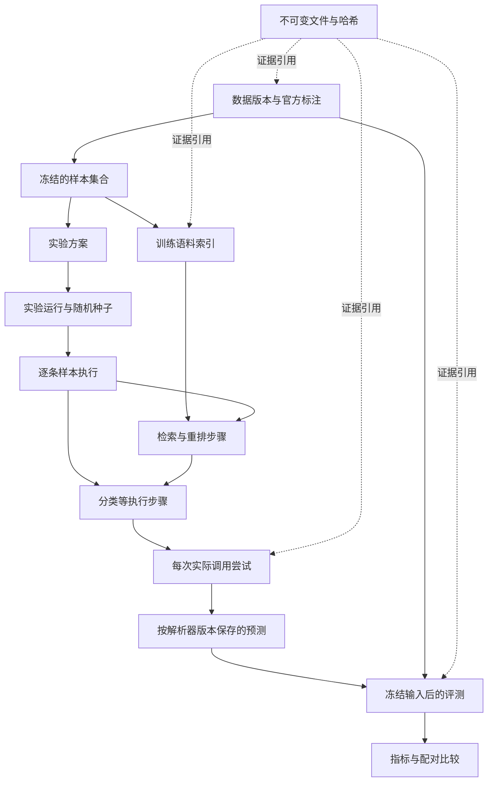

# 情绪识别实验工程与 SQLite 数据库设计

日期：2026-09-08。状态：用户已批准并进入实施；具体执行与验证结果见 docs/research/implementation-verification.md。

用户已确认：创建独立 SQLite 实验数据库，继续使用当前 Git 分支。工作分支为 `codex/goemotions-config-20260908`，设计前代码提交为 `131b5a5`。`main` 保持原聊天工程，本次不合并、不推送。

## 1. 目标与范围

把该研究分支整理为仅用于文本情绪识别、检索方法实验和结果验证的 Python 工程。以 GoEmotions 原生 28 类、多标签任务为基准，固定现成模型，不进行模型训练。

一次实验必须回答：使用哪个版本的数据、哪些样本、什么模型和提示词、检索到了什么、实际发出了哪些请求、每次返回了什么、失败和重试发生在哪里、怎样得到最终预测、怎样计算指标与费用。

“完整记录”指保存程序实际可获得的信息。供应商没有返回的内部推理、真实模型构建版本、Token 或费用填 NULL 并记录缺失原因，不能补造。请求已发出但响应未可靠落盘时必须显示结果未知，不能将其描述为未调用或零费用。

### 1.1 本次架构选择

采用命令行实验程序、独立 SQLite 数据库、带 SHA-256 的不可变文件存储。批量模型调用可并发，数据库由一个写入队列串行提交；不建立 Web 服务或前端。

其他方案的取舍：全部用 JSONL 较容易起步，但会增加关系一致性、断点恢复和多轮评分的处理成本；PostgreSQL 适合多主机工作者，当前会引入额外部署与维护。因此本阶段按用户已确认的 SQLite 实施。

### 1.2 第一次实施的交付范围

- 精简现有工程，提供初始化、导入、运行、恢复、评分、比较、导出和校验命令。
- 建立本文的数据库与文件存储，导入完整官方数据，保留多标签。
- 实现 zero-shot、随机示例和词面检索基线，保证各组运行与审计完整。词面检索明确标为 lexical，不冒充向量相似检索。
- 预留向量索引、候选重排、对比检索所需的明确存储接口；现成嵌入模型及对比方法将在独立实验配置中指定。未实现策略应显式报错，不悄悄退回其他方法，也不生成虚假索引或结果。
- 完成离线验收并创建实验数据库。真实模型批量调用、付费向量生成及正式 test 评测须遵循另行确定的模型与运行预算，不因初始化数据库而自动执行。

## 2. 当前代码证据与删减范围

当前识别结果和执行记录绑定 `conversation_id/request_id/user_message_id`；`chatbot/emotion/graph.py` 依赖聊天消息仓储。`chatbot/emotion/prompt.py` 每次保存完整 examples 列表，`chatbot/emotion/model.py` 从聊天适配器导入返回解析和供应商参数函数。不能通过直接删除目录完成迁移，需要先提取共用能力。

| 当前路径或内容 | 实施动作 | 原因 |
| --- | --- | --- |
| `chatbot/api/`、`chatbot/static/`、`chatbot/web.py` | 删除已跟踪内容 | 实验程序不需要浏览器、HTTP 接口和 SSE |
| `chatbot/services/`、`chatbot/graph/`、`chatbot/emotion_gate/` | 删除已跟踪内容 | 用户、会话、回复、恢复聊天与跳过识别不属于独立样本评测 |
| `chatbot/db/` 原有业务表和仓储 | 用独立实验数据库模块替换 | 不创建用户或伪造聊天轮次，不迁移聊天数据库 |
| `chatbot/llm/bubbles.py`、聊天流式适配器和聊天 Prompt | 删除；先提取被识别模型使用的共用函数 | 消除分段回复协议与聊天依赖 |
| `chatbot/emotion/history.py`、历史预算分配 | 删除历史逻辑；保留完整请求 Token 预算检查 | 单条样本之间没有会话历史 |
| 模型参数、单次调用、错误脱敏、Token 计数及 vendor 文件 | 移入 `emotion_lab/llm/`；保留对应许可证与有效测试 | 复用已有供应商能力，不同时更换模型提供商 |
| 标签、family 与配置校验 | 移入 `emotion_lab/taxonomy/`；只保留一份正式配置 | 避免两份默认配置漂移 |
| 当前单标签 examples 接口和识别输出解析 | 替换为原生多标签接口 | 完整训练集和预测都应保存标签集合 |
| 当前检索代码 | 移入 `emotion_lab/retrieval/`，移除历史情绪先验，适配多标签元数据 | 所有检索信息仅来自当前文本和训练语料 |
| `archive/`、旧聊天验收截图、旧聊天设计/实施说明及对应测试 | 删除本分支中的已跟踪内容；Git 历史与 main 保留原文件 | 按用户要求保留实验相关工程，避免归档旧评测被误调用 |
| README、依赖清单、`.env.example`、启动脚本 | 改为实验快速开始与命令行配置 | 去掉 FastAPI、uvicorn、LangGraph、聊天 checkpoint 的运行依赖 |

只对该 worktree 的已跟踪文件进行可审阅删除；不得对目录执行无差别清空。原主工作区及其 `.env`、`.venv`、`.idea`、数据库等不复制、不删除。实施中保留本设计和新的实验文档；旧材料已经处于 Git 历史，无需再创建一套 archive。

完整 GoEmotions 已存在于数据分支 `codex/goemotions-benchmark-20260908` 的提交 `3fa3928`。实施时只将该提交的 `data/benchmarks/goemotions/` 数据包及其来源、许可和校验材料带入当前研究分支，不合并其他分支、不改 main。更新其中描述“当前应用”的旧段落，避免与精简后的工程矛盾。

目前的 56 条示例只保留为有来源的离线小样本夹具，不再作为正式运行程序的默认完整检索库。正式 corpus 来自导入后的 train。

## 3. 工程结构与数据路径

以下为实施后的结构，路径以当前隔离工作区为项目根：

```text
emotion_lab/
  cli.py                  命令入口
  config.py               实验环境和参数加载
  taxonomy/               标签与结果格式
  datasets/               数据导入、样本清单、数据审计
  llm/                    模型调用、供应商参数、Token 与脱敏
  retrieval/              随机、词面、向量和对比策略接口
  runner/                 单条执行、步骤、写队列、恢复
  evaluation/             多标签评分、配对比较和切片
  storage/                migrations、仓储、文件存储与备份
config/
  emotion_labels.json
  emotion_families.json
  prompts/emotion.json
  experiments/            固定实验配置
data/
  benchmarks/goemotions/  固定官方原文件，纳入版本控制
  research/
    experiments.sqlite3   新实验数据库，不纳入 Git
    artifacts/            完整请求、响应、向量和报告，不纳入 Git
    exports/              JSONL/CSV 导出，不作为第二份事实来源
    backups/              带清单的完整归档
tests/                    与实验目标相关的离线测试和小夹具
docs/                     本设计、操作说明与正式实验报告
```

新配置使用 `EXPERIMENT_DATA_DIR` 和可选 `EXPERIMENT_DB_PATH`。默认数据库位于项目根的 `data/research/experiments.sqlite3`；相对路径按项目根解析，不随执行命令时的 cwd 漂移。实现时应将数据库、WAL/SHM、文件缓存与导出目录加入忽略规则。

不沿用旧的 `SQLITE_DB_PATH`。初始化时检查专用 `application_id` 与迁移表；若已有文件属于聊天库或未知 schema，报错退出，不能覆盖或原地升级。普通命令不得自动清库。创建空目录和新库不代表已经运行实验。

模型仍可使用当前的 `LLM_*` / `EMOTION_LLM_*` 参数规则，凭据只在进程内读取。默认只加载当前项目明确指定的环境文件，不向父目录自动查找；不把整个环境变量或 `.env` 内容记录成实验快照。

## 4. 数据与执行关系



三个概念不能混用：

- **实验方案 experiment**：比较问题、数据集合、共同约束与预先定义的评测规则。
- **实验运行 run**：一个具体方法配置、一个重复编号/随机种子的一次运行；换配置或独立重复产生新 run。
- **调用尝试 call_attempt**：一次实际外部请求或本地模型推理。一次样本可以经历查询向量、候选判断、重排、分类和重试，不能只有一行最终结果。

## 5. 建表共同约定

设计包含 **22 张业务表及 1 张迁移表**。表数量来自不同数据生命周期，不对应 22 个服务或复杂部署。

- 标识符默认 TEXT UUID；`label_id` 使用官方整数 ID，必须连同 `dataset_version_id` 使用。下面标注 `?` 的字段可为空，其他字段必填；所有业务表都有 `created_at`（UTC ISO 8601，微秒精度）。状态变更时间与请求耗时分别使用墙钟和单调时钟计算，耗时为非负整数毫秒。
- JSON 作为 TEXT 保存并验证语法及版本化结构。业务关联、状态、排序、计数和指标放在明确字段，不能仅藏在任意 JSON 里。
- 外键默认 RESTRICT；禁止删除已被实验引用的数据、配置、调用和证据。样本及标签集合封存后不可更新；执行记录只按合法状态推进；已完成的调用、预测、评测和事件不能覆盖。
- 金额使用整数微货币单位（百万分之一基础货币单位）加币种，原始价格与计算输入另存。未知值为 NULL；不能用 0 表示未获得。
- NULL 的含义按字段明确区分“未发生”“未提供”“未知”，需要时配套 status/reason。排序从 1 开始，向量数组 offset 从 0 开始。
- CHECK 检查枚举、数值和空值关系；复合外键限制数据集/样本/标签归属；跨行规则用触发器配合仓储事务校验。SQLite CHECK 不承担跨表查询。
- 每张 SQL 表和列都提供中文注释；迁移文件以 schema 版本管理，禁止启动时悄悄重建有数据的表。

### 5.1 `schema_migrations`：数据库版本

字段：`version INTEGER PK`、`migration_sha256 TEXT UNIQUE`、`applied_at TEXT`。迁移摘要不同或版本未知时中止，不能假设兼容。

### 5.2 `artifacts`：完整信息与文件登记

字段：`artifact_id TEXT PK`（UUID）、`content_sha256 TEXT`、`kind TEXT`、`media_type TEXT`、`encoding TEXT`、`compression TEXT`、`logical_bytes INTEGER`、`stored_bytes INTEGER`、`storage_sha256 TEXT`、`inline_bytes BLOB?`、`relative_path TEXT?`、`redaction_policy_version TEXT`、`capture_level TEXT`、`metadata_json TEXT`。

约束：inline_bytes 与 relative_path 恰有一个非空；大小非负；路径必须位于 artifact 根目录。content_sha256 针对脱敏后、压缩前的实际保存字节，storage_sha256 校验磁盘字节。小文件可内联，大文件存文件系统；相同字节可复用物理存储，不因为内容相同而覆盖另一种用途、媒体类型或采集来源的登记记录。无脱敏操作使用明确版本值 `none`。文件寻址由 storage_sha256 决定，压缩或序列化策略版本必须可追溯。

用途：源数据包、配置快照、执行环境、实际请求体、响应体、供应商返回的 reasoning、错误体、完整候选得分、向量矩阵、预测快照、报告和备份清单。配置不只存哈希，还必须保存实际内容。

文件不可变，按哈希寻址。所有正式业务证据由显式 `*_artifact_id` 外键关联；一个 bundle 内部的文件由该 bundle 自带清单与哈希校验，不能出现只有随意路径而未被归档的关键证据。

### 5.3 `dataset_versions`：原始数据版本

字段：`dataset_version_id TEXT PK`、`name TEXT`、`version_key TEXT`、`source_repository TEXT`、`source_revision TEXT`、`source_manifest_artifact_id FK`、`source_bundle_artifact_id FK`、`label_manifest_sha256 TEXT`、`importer_version TEXT`、`normalization_version TEXT`、`expected_counts_json TEXT`、`actual_counts_json TEXT`、`status TEXT`、`sealed_at TEXT?`。

唯一键：`(name, version_key)`；同一源版本、相同导入规则的重复导入幂等。状态为 importing/ready/failed。source bundle 包含未改字节的官方 train/dev/test、标签、许可和源说明；manifest 保存各文件 URL、大小与哈希。源标签变化、原文变化或规范化版本变化要创建新版本。

### 5.4 `label_definitions`：数据集原生标签

字段：`dataset_version_id FK`、`label_id INTEGER`、`label_name TEXT`、`source_order INTEGER`。联合主键 `(dataset_version_id, label_id)`，名称和 source_order 在数据版本内唯一。

GoEmotions 为 ID 0～27；不存旧标签别名。运行时的中文显示名、识别描述与 family 属于配置快照，不能修改原生标签真值。family 评分引用自己的映射快照。

### 5.5 `samples`：原始样本

字段：`sample_id TEXT PK`、`dataset_version_id FK`、`source_id TEXT`、`split TEXT`、`source_line INTEGER`、`language TEXT`、`raw_text TEXT`、`text_sha256 TEXT`、`normalized_text_sha256 TEXT`、`source_record_sha256 TEXT`、`metadata_json TEXT`。

唯一键：`(dataset_version_id, source_id)` 与 `(dataset_version_id, split, source_line)`；split 限 train/dev/test。原文中的空格、标点、拼写和大小写保持不变；规范化文本只用于去重，不覆盖原文。`(sample_id, dataset_version_id)` 提供复合父键。

### 5.6 `sample_labels`：原始多标签标注

字段：`sample_id TEXT`、`dataset_version_id TEXT`、`label_id INTEGER`、`annotation_source TEXT`、`source_label_position INTEGER`。主键 `(sample_id, label_id)`；分别以复合外键关联 samples 和 label_definitions，禁止跨数据版本关联。

一条文本可以有多行标签，包括 neutral 与其他情绪共现。source_label_position 只追溯文件顺序，不表示主次情绪。封存数据版本前，每个样本必须至少有一个有效标签。

### 5.7 `sample_sets`：冻结的实验样本集合

字段：`sample_set_id TEXT PK`、`dataset_version_id FK`、`name TEXT`、`purpose TEXT`、`source_split TEXT`、`selection_config_artifact_id FK`、`members_sha256 TEXT`、`sample_count INTEGER`、`status TEXT`、`frozen_at TEXT?`。

purpose 限 corpus/dev_pilot/dev_tuning/final_test/diagnostic。状态 building/frozen；corpus 必须来自 train，开发集合来自 dev，正式测试来自 test。抽样种子和算法、去重规则、固定顺序完整保存。全集也要登记集合，不依赖执行时临时 SQL 返回顺序。

### 5.8 `sample_set_members`：集合中的具体样本

字段：`sample_set_id FK`、`sample_id TEXT`、`dataset_version_id TEXT`、`ordinal INTEGER`、`selection_reason TEXT`。主键 `(sample_set_id, sample_id)`，唯一 `(sample_set_id, ordinal)`；复合外键及触发器保证所属数据版本和 split 与集合一致。

集合冻结后禁止新增、删除、重排。先生成并校验样本清单，再创建 run；运行器不边跑边随意抽样。

### 5.9 `embedding_indexes`：共享索引版本

字段：`index_id TEXT PK`、`corpus_set_id FK`、`index_config_artifact_id FK`、`model_config_artifact_id FK`、`build_environment_artifact_id FK`、`input_manifest_artifact_id FK`、`index_bundle_artifact_id FK?`、`dimension INTEGER?`、`dtype TEXT?`、`metric TEXT`、`fingerprint TEXT UNIQUE`、`status TEXT`、`started_at TEXT?`、`completed_at TEXT?`。

状态 planned/building/ready/failed。指纹覆盖训练集合、文本预处理、模型请求版本、向量维度、精度、索引算法和参数。模型实际解析版本若供应商未提供，在配置/调用记录中明确未知。只有 ready 索引可被正式检索引用，不能在运行中替换矩阵。

### 5.10 `embedding_items`：向量与样本映射

字段：`index_id FK`、`sample_id FK`、`vector_offset INTEGER`、`input_sha256 TEXT`、`vector_sha256 TEXT`、`source_call_attempt_id FK?`、`batch_offset INTEGER?`。

主键 `(index_id, sample_id)`，唯一 `(index_id, vector_offset)`。样本必须属于 index 的训练集合。向量生成的实际模型调用关联 call_attempts；现成外部索引导入时引用有来源的 bundle，不能伪造一次调用。索引封存前核对所有条目、行序、矩阵维度和哈希。

### 5.11 `experiments`：比较问题与共同协议

字段：`experiment_id TEXT PK`、`name TEXT`、`research_question TEXT`、`dataset_version_id FK`、`corpus_set_id FK`、`evaluation_set_id FK`、`protocol_artifact_id FK`、`comparison_group TEXT`、`status TEXT`、`frozen_at TEXT?`。

protocol 包含允许的策略、共同模型与标签描述、示例数/Token 上限、重试预算、指标定义、最终预测选择规则、数据重复处理和运行预算。状态 draft/frozen/closed；实验配置冻结后再运行。跨不同条件的探索实验可以存在，但不能混作同条件方法对比。

### 5.12 `experiment_runs`：具体一次运行

字段：`run_id TEXT PK`、`experiment_id FK`、`method_name TEXT`、`method_config_artifact_id FK`、`model_config_artifact_id FK`、`prompt_config_artifact_id FK`、`taxonomy_config_artifact_id FK`、`environment_artifact_id FK`、`price_snapshot_artifact_id FK?`、`index_id FK?`、`code_commit TEXT`、`working_diff_artifact_id FK?`、`seed INTEGER`、`repetition_no INTEGER`、`config_sha256 TEXT`、`status TEXT`、`started_at TEXT?`、`completed_at TEXT?`、`stop_reason TEXT?`。

方法配置保存所有影响结果的参数：检索 k、候选数、混淆类别规则文件及其构建来源、去重策略、生成参数、解析器版本、重试策略和并发度。环境保存 Python、依赖版本/锁文件、平台、CPU/内存、实际使用的加速设备、驱动/计算库与线程参数，未使用或无法取得的项目明确标记，排除秘密环境变量。模型别名与实际返回版本分别记录，不保证远端服务按别名永久不变。

状态 created/ready/running/paused/completed/completed_with_errors/failed/cancelled。同一配置可以有多次独立运行，不能仅凭 config_sha256 将其合并。ready 后配置不可变；恢复沿用同一个 run_id，独立重复创建新 run。

### 5.13 `run_items`：单条样本执行

字段：`run_item_id TEXT PK`、`run_id FK`、`sample_id FK`、`ordinal INTEGER`、`input_sha256 TEXT`、`status TEXT`、`final_prediction_id FK?`、`worker_id TEXT?`、`lease_token TEXT?`、`lease_expires_at TEXT?`、`started_at TEXT?`、`completed_at TEXT?`、`failure_stage TEXT?`、`failure_code TEXT?`、`error_artifact_id FK?`。

唯一 `(run_id, sample_id)` 与 `(run_id, ordinal)`。创建运行时，一次性物化完整 evaluation_set 清单。状态 pending/running/succeeded/failed/cancelled；可重试失败的 item 通过显式 resume 回到待执行，历史尝试和状态事件保留。成功项默认不重复执行。

final_prediction 必须是同一 item 的有效预测，使用复合父键约束；其选择规则在实验协议中预先固定，不能根据测试真值挑选“最好的一次”。并发领取使用事务与租约比较，过期工作者不能覆盖新租约的状态；迟到响应仍保存为原尝试的事实。

### 5.14 `execution_steps`：可观察的算法步骤

字段：`step_id TEXT PK`、`run_item_id FK?`、`index_id FK?`、`step_key TEXT`、`step_no INTEGER`、`parent_step_id FK?`、`kind TEXT`、`implementation_version TEXT`、`config_artifact_id FK`、`input_artifact_id FK`、`output_artifact_id FK?`、`status TEXT`、`started_at TEXT?`、`completed_at TEXT?`、`latency_ms INTEGER?`、`error_artifact_id FK?`、`trace_complete INTEGER`。

run_item_id 与 index_id 恰有一个非空，分别用于单条实验和共享索引构建。step_key 在各自 owner 内唯一；parent 必须属于同一 owner。kind 包括 preprocess/index_embed/query_embed/retrieve/candidate_predict/rerank/classify/validate。步骤记录实际执行，不为未发生的步骤创建“成功”结果。

输入输出可以包含结构化中间标签、过滤统计、候选得分、预算裁剪与最终请求构造信息；未对外调用的本地检索也计时并保留结果。

### 5.15 `call_attempts`：每次调用尝试和费用证据

字段：`call_attempt_id TEXT PK`、`step_id FK`、`attempt_no INTEGER`、`retry_of_attempt_id FK?`、`transport_kind TEXT`、`provider TEXT`、`requested_model TEXT`、`resolved_model TEXT?`、`endpoint TEXT?`、`request_artifact_id FK`、`request_sha256 TEXT`、`response_artifact_id FK?`、`reasoning_artifact_id FK?`、`error_artifact_id FK?`、`response_metadata_artifact_id FK?`、`usage_artifact_id FK?`、`http_status INTEGER?`、`provider_request_id TEXT?`、`idempotency_key TEXT?`、`finish_reason TEXT?`、`status TEXT`、`prepared_at TEXT`、`dispatch_started_at TEXT?`、`first_response_at TEXT?`、`completed_at TEXT?`、`latency_ms INTEGER?`、`input_tokens INTEGER?`、`output_tokens INTEGER?`、`cached_input_tokens INTEGER?`、`reasoning_tokens INTEGER?`、`total_tokens INTEGER?`、`usage_source TEXT`、`billing_state TEXT`、`estimated_cost_micros INTEGER?`、`currency TEXT?`、`price_snapshot_artifact_id FK?`、`cost_calculation_artifact_id FK?`。

唯一 `(step_id, attempt_no)`；retry_of 必须属于同一 step 的更早尝试。transport_kind 为 remote/local；status 为 prepared/dispatched/response_received/transport_error/outcome_unknown/cancelled_before_dispatch。dispatched 只表示本地已开始派发，不独自证明供应商已接受请求。HTTP 成功与输出解析成功分开：HTTP 200 返回非法 JSON 时，该调用仍是已获得响应的真实调用，解析错误记入 predictions。

outcome_unknown 是等待事实补全的状态，不等于已收到响应的终态。能明确关联同一请求的迟到响应允许补全空的响应/使用量字段，并追加状态事件；既有错误工件及先前事件保留。已经保存的完整响应不能替换，冻结评测也不能随该补全改变。无法关联或没有可验证响应时保持未知。

实际序列化的请求、供应商响应体及 usage 原结构在摘要解析前保存；不能只保留 SDK 提取出的正文。记录可获得的请求/响应标识与允许保存的头字段；凭据、Cookie、Authorization、带密钥 URL 必须脱敏，保留脱敏策略版本。SDK 不提供完整 HTTP 数据时显式记录 capture_level，适配器需要补充传输层采集才能标为完整。

供应商未返回 reasoning 时字段为 NULL，不生成或推断推理过程。Token 来源 provider/local_estimate/unavailable 分开；本地估算不覆盖真实 usage。reasoning_tokens、cached_input_tokens 可能已经包含在总量中，不能再次相加。已知估算费用、供应商账单确认、未知和未派发分开记录；响应未知时费用未知，而不是 0。

预处理调用、查询向量、索引批量向量、重排、候选判断、分类及失败重试都经此表。共享索引成本按 index_id 只计一次，报告中另列构建成本与每次查询成本；不同 run 使用相同 index 不得重复声称产生构建费用。

### 5.16 `predictions`：解析后的预测版本

字段：`prediction_id TEXT PK`、`run_item_id FK`、`call_attempt_id FK`、`purpose TEXT`、`parser_version TEXT`、`output_schema_version TEXT`、`source_response_sha256 TEXT`、`parsed_artifact_id FK?`、`evidence_artifact_id FK?`、`validation_artifact_id FK`、`status TEXT`。

唯一 `(call_attempt_id, parser_version, output_schema_version)`；purpose 区分 candidate/final/review。status 为 valid/invalid；validation 必须保存错误字段、未知标签、重复标签、空标签集合等诊断。解析器更新后追加新预测记录，不重新调用模型，也不覆盖旧记录；已经冻结的 evaluation 保持引用原预测。

调用必须经 execution_steps 属于同一个 run_item；索引构建调用不能生成分类预测。输出协议使用原生 `labels` 数组，不要求主次排名、reply_strategy、trajectory_note 或聊天安全级别。有效 GoEmotions 预测至少含一个合法标签；失败不归一化成 neutral。

### 5.17 `prediction_labels`：预测标签集合

字段：`prediction_id FK`、`dataset_version_id FK`、`label_id INTEGER`、`output_position INTEGER`、`reported_score REAL?`、`score_kind TEXT?`、`evidence_json TEXT?`。

主键 `(prediction_id, label_id)`；标签与样本的数据版本必须一致，预测须 valid。reported_score 只保存模型确实返回的分数，score_kind 区分模型自述置信度、logprob 等；没有分数即 NULL，不伪造概率。用于评分时不使用 output_position 的顺序，不强制 neutral 互斥。

### 5.18 `retrieval_items`：检索候选与入选详情

字段：`retrieval_step_id FK`、`sample_id FK`、`stage TEXT`、`candidate_rank INTEGER`、`similarity_score REAL?`、`rerank_score REAL?`、`score_components_json TEXT`、`decision TEXT`、`reason_code TEXT`、`selected_rank INTEGER?`、`example_tokens INTEGER?`。

主键 `(retrieval_step_id, stage, sample_id)`；候选名次在步骤/stage 内唯一，selected_rank 在最终选择阶段内唯一。所有候选必须来自本实验冻结的 train corpus。记录重复过滤、标签覆盖、混淆对、Token 预算等决策原因；随机基线记录候选顺序与种子，不虚构相似度。

对于实际参与筛选和重排的候选，保留全部明细，不只记录最终 top-k。若算法显式计算了整个语料的得分，完整得分向量和样本顺序放入步骤 output artifact，保持原精度；数据库保留进入后续处理的候选明细以便查询。若近似索引只返回 top-N，保存它实际返回的完整列表、索引参数和可用搜索统计，不声称知道内部未暴露的全量得分。trace_complete 的口径在步骤配置中写清楚。

### 5.19 `evaluations`：一次可复现评分

字段：`evaluation_id TEXT PK`、`run_id FK`、`sample_set_id FK`、`scorer_version TEXT`、`evaluation_config_artifact_id FK`、`prediction_snapshot_artifact_id FK`、`ground_truth_manifest_sha256 TEXT`、`family_mapping_artifact_id FK?`、`scope TEXT`、`status TEXT`、`expected_items INTEGER`、`observed_items INTEGER`、`failed_items INTEGER`、`completed_at TEXT?`。

prediction snapshot 固定每个 run_item 使用哪个 prediction（或为何缺失），不能在重试后让历史分数自动变化。evaluation_config 固定 28 类标签全集、zero_division、失败处理、切片定义及置信区间方法。expected_items 是集合大小，observed_items 是已执行到 succeeded/failed 的样本数，failed_items 是其中失败数。scope 区分 official_full/diagnostic_partial/diagnostic_slice；official_full 必须满足 observed_items=expected_items。中途取消或不足全集时不能报告为官方完整评测。

最终评分先冻结输入快照，再在一个可恢复的评测作业中生成 evaluation_items 与指标；成功后封存。更改评分规则、新增切片或使用新解析版本均创建新的 evaluation_id，保留旧分数。

### 5.20 `evaluation_items`：逐条评分与错误分析

字段：`evaluation_id FK`、`run_item_id FK`、`prediction_id FK?`、`outcome TEXT`、`missing_reason TEXT?`、`tp INTEGER`、`fp INTEGER`、`fn INTEGER`、`exact_match INTEGER`、`missing_label_ids_json TEXT`、`extra_label_ids_json TEXT`、`slice_memberships_json TEXT`。

主键 `(evaluation_id, run_item_id)`，引用的样本必须在 evaluation 的集合中，prediction 必须来自同一 item 且符合快照。每个计划样本都有一行，失败或缺失也保留。对完整运行中的失败预测，F1 按空预测集合计算并另报失败率；缺失项不能通过成功样本过滤从分母中消失。未完成全体计划项时只能得到显式 partial 诊断报告。

GoEmotions 真值共同包含 anger 与 annoyance 时，少预测一个是漏报，不算二选一标签替换。按漏报/误报定义易混分析；共同出现的正确标签不能当作互斥错误。

### 5.21 `comparisons`：运行间的配对比较

字段：`comparison_id TEXT PK`、`baseline_evaluation_id FK`、`candidate_evaluation_id FK`、`analysis_config_artifact_id FK`、`paired_members_artifact_id FK`、`result_artifact_id FK?`、`status TEXT`、`completed_at TEXT?`。

只允许比较具有相同数据版本、样本 ID 集合、标签全集与主评分定义的冻结 evaluation。按 sample_id 对齐，不按文件位置或随机顺序对齐。analysis_config 保存差值方向、重采样方法、种子、重复次数与置信水平；置信区间结果可复算。不同样本集合需要先明确产生共同集合的诊断 evaluation，不能偷偷取交集冒称完整测试比较。

### 5.22 `metric_values`：可查询的指标结果

字段：`metric_id TEXT PK`、`evaluation_id FK?`、`comparison_id FK?`、`metric_name TEXT`、`scope_key TEXT`、`value REAL?`、`numerator REAL?`、`denominator REAL?`、`support INTEGER?`、`ci_low REAL?`、`ci_high REAL?`、`undefined_reason TEXT?`。

evaluation_id 与 comparison_id 恰有一个非空；每个 owner 内 `(metric_name, scope_key)` 唯一。scope_key 明确 overall、label/name、family/name、slice/name；不能混算不同粒度。主指标为包含 neutral 的 28 类 Macro-F1 与 Micro-F1，另报各类 P/R/F1/support、精确集合匹配率、失败率与成本。

零分母按 evaluation_config 的既定规则处理并保留标志；禁止 NaN/Infinity 隐式进入 JSON。不能因为试跑子集没有某个稀有类，就悄悄缩小 Macro-F1 的标签集合。

### 5.23 `audit_events`：状态与操作事件

字段：`event_id INTEGER PK AUTOINCREMENT`、`artifact_id FK?`、`dataset_version_id FK?`、`index_id FK?`、`run_id FK?`、`run_item_id FK?`、`step_id FK?`、`call_attempt_id FK?`、`evaluation_id FK?`、`comparison_id FK?`、`event_type TEXT`、`from_status TEXT?`、`to_status TEXT?`、`actor TEXT`、`payload_artifact_id FK?`、`occurred_at TEXT`。

恰有一个目标引用非空，其他归属沿外键查询；全库备份、初始化或校验事件可关联相应报告 artifact，不伪造一个 run。payload_artifact_id 是事件正文，不计入目标引用的互斥检查。事件追加不可修改，记录导入/封存、启动、领取、调用前落盘、暂停、恢复、取消、失败、完成、备份和校验。关键状态更新与事件插入属于同一数据库事务。

## 6. 关键约束和查询索引

除了各表主键/唯一键，至少建立以下索引：

- samples：`(dataset_version_id, split, source_id)`、`(dataset_version_id, normalized_text_sha256)`。
- sample_labels：`(dataset_version_id, label_id, sample_id)`，支持按标签构造训练候选。
- experiment_runs：`(experiment_id, method_name, seed, repetition_no)`、`(status, created_at)`。
- run_items：`(run_id, status, ordinal)`、`(status, lease_expires_at)`。
- execution_steps：各自 owner 内的 step_key 唯一索引；`(run_item_id, kind, step_no)` 与 `(index_id, kind, step_no)`。
- call_attempts：`(step_id, attempt_no)`、`(status, dispatch_started_at)`、`(provider, provider_request_id)` 普通索引；不能假设不同供应商的 request_id 全局唯一。
- predictions：`(run_item_id, purpose, status, created_at)` 与调用/解析版本唯一键。
- retrieval_items：`(retrieval_step_id, stage, candidate_rank)`、`(sample_id, decision)`，最终选择序号使用条件唯一索引。
- evaluation_items：`(evaluation_id, outcome)`；metric_values 按 owner、指标名和 scope 唯一。
- audit_events：每个非空目标引用与 event_id 的条件索引，支持按执行对象还原时间线。

必须有集成测试阻止：把 dev/test 样本放入训练 corpus 或索引；把其他数据版本标签写到样本/预测；把其他 run_item 的预测设为最终结果；让过期 lease 覆盖新工作者；修改冻结集合或既有评测；删除被引用证据。

提供不增加事实副本的只读视图：`v_run_summary` 展示计划/完成/失败数量和已知费用及未知用量调用数；`v_call_audit` 展示每次请求、状态、响应与工件位置；`v_evaluation_errors` 展示原文、真实标签、预测标签、漏报与误报。聚合时先分别按 owner 汇总，避免多标签、多次调用与候选列表连接后重复累计 Token 或费用；未知用量不能通过 COALESCE 伪装为全量已知。可直接在数据库工具中查询，无需恢复聊天界面。

## 7. 调用持久化、恢复与并发

1. 冻结 run 配置并物化全部 run_items，写入启动事件。预测执行器只能取得待测正文和 ID，真值只能由数据审计/评分模块查询；检索器能读取训练样本的标注。
2. 通过短事务领取 item，分配 lease_token。准备步骤和完整请求文件，验证 Token 预算；请求文件落盘并登记后才能调用模型。
3. 在调用前创建 call_attempt，提交 dispatch 意图后发出请求。网络等待期间不持有 SQLite 写事务。隐藏 SDK 自动重试关闭，所有重试由 runner 分配新 attempt_no。
4. 收到响应后先可靠保存完整响应工件，再登记 usage、元数据与调用状态；随后解析成 predictions/prediction_labels。最终预测选择与 item 状态在事务中提交。
5. HTTP 200 不等于识别成功，解析成功不等于评分正确。只有原始证据可读、标签校验通过和最终预测提交完成，item 才能 succeeded。
6. 请求派发附近进程退出、超时或响应无法落盘时，call_attempt 保留 outcome_unknown 或相应错误，不能自动伪装成未派发。恢复时可按预先配置的新尝试策略重试，但保留重复计费可能性与未知使用量。数据库幂等不能保证外部服务只执行一次。
7. 后续迟到响应在原 attempt 上完成记录；item 的最终选择必须比较 lease，并遵守固定选择规则，不由“哪个预测更接近真值”决定。已冻结评测仍保持旧 prediction snapshot。
8. 本地响应重新解析和重新评分不调用模型。首次实现不跨独立 run 复用分类响应；向量索引可共享，已完成 item 可在同 run 恢复时跳过。由此避免把独立重复实验变成缓存重放。

采用 WAL、foreign_keys=ON、busy_timeout 与 synchronous=FULL，优先保证已付费调用记录的持久性。SQLite WAL 同时只有一个 writer，因此使用单写队列，模型请求并发度独立配置。依据 [SQLite WAL 文档](https://www.sqlite.org/wal.html) 和 [同步设置说明](https://www.sqlite.org/pragma.html#pragma_synchronous)。

首次实现只运行一个调度进程；租约用于崩溃恢复与防止重复领取，不因此宣称已支持多主机分布式调度。数据库放在本机文件系统，部署到远程共享文件系统不是本阶段设计。

## 8. 文件完整性、备份和存储规模

文件以临时文件写入、刷新并原子替换到哈希路径后，再提交数据库引用；引用缺失或哈希错误会阻止正式完成/评分。写文件成功但 DB 提交失败形成的孤儿工件可通过校验命令识别；不自动删除未归档证据。

原始文本和共享配置存一份；每次调用保存实际请求（含选中示例的原文）以准确重放。完整候选分数与向量按 bundle 压缩保存，不将四万多条训练文本复制到每个 item，也不为每次排序机械插入四万多行数据库候选。

向量与得分必须保留实际使用精度、维度、样本顺序和归一化规则。以 43,410×1,024 的 float32 矩阵为例，裸数据约 178 MB；这是尺寸示例，不是已选模型或实际容量结果。模型响应、reasoning 和重复实验次数决定额外体积，200 条 dev 试跑后再根据实测给出全量存储与费用预算。

备份使用 SQLite backup API 取得一致快照，再根据快照中引用的不可变 artifacts 生成完整归档，校验清单后标记成功；不能直接复制运行中的单个 `.sqlite3` 文件而忽略 WAL。恢复时同时验证数据库与工件集合。[SQLite Backup API](https://www.sqlite.org/backup.html)

Git 保存代码、正式配置、固定官方数据、来源清单和精简报告。SQLite、完整调用文件、向量、临时导出不进 Git。导出由数据库快照生成，有独立 export manifest，记录 run/evaluation、生成器版本、样本数和哈希；CSV 不是另一份可手工覆盖实验事实的数据库。

## 9. 实验与评测规范

- 全部原生标签保留为集合，不把多标签记录降成单标签，不使用 family 替代细粒度主指标。
- 训练库只使用 train；重复检查可检查各 split 的文本/ID，但测试标签不进入策略或提示词。查询时和入选示例之间均按冻结规则去重，并记录排除原因。
- 固定 200 条左右的 dev_pilot 仅验证数据流、失败恢复、费用和容量。稀有类可能样本不足，试跑分数不能当完整主结果。
- 易混对/权重由 train/dev 和基线错误产生，工件保存构建程序版本、来源 run/evaluation 和统计口径。策略不能根据当前测试样本真值挑标签。
- 对比检索与其他带示例方法共享 train corpus、模型设置、示例数和输入预算。额外候选判断或复核调用计入成本；需要同调用预算或相应消融，不能将更多计算量直接解释为检索创新。
- 最终 test 前冻结实验协议和评分规则。测试集合发生文本去重切片时，官方完整集合与诊断切片分开登记和报告。
- 默认模型输出仅要求 labels；可配置返回引用证据，但同一比较组必须一致。输出的标签数、是否含 neutral 不由参考示例的单标签形式限制。既有聊天字段全部移除。

## 10. 用户命令与审阅结果

以下为拟定命令接口，尚未创建可执行入口：

| 命令 | 结果 |
| --- | --- |
| `python -m emotion_lab db init` | 新实验库与完整 schema；拒绝覆盖聊天库 |
| `python -m emotion_lab dataset import-goemotions --source <目录>` | 固定来源导入及重复/多标签审计 |
| `python -m emotion_lab dataset make-set --config <配置>` | 固定样本 ID、顺序与选择规则 |
| `python -m emotion_lab run --config <配置> --dry-run` | 建议任务清单、参数/标签/预算检查，不调用模型 |
| `python -m emotion_lab run --config <配置>` | 新 run 与逐条详细执行 |
| `python -m emotion_lab resume --run-id <ID>` | 按固定恢复策略继续，并保留原调用记录 |
| `python -m emotion_lab evaluate --run-id <ID> --config <评分配置>` | 新 evaluation 与逐条错误、整体和逐类指标 |
| `python -m emotion_lab compare --baseline <evaluation> --candidate <evaluation>` | 按样本 ID 配对比较 |
| `python -m emotion_lab export --evaluation-id <ID>` | JSONL、CSV、配置与证据清单 |
| `python -m emotion_lab storage verify` | 外键、状态、文件、哈希与记录数量检查 |
| `python -m emotion_lab storage backup --output <目录>` | 可恢复的数据库与工件归档 |

## 11. 实施验收清单

1. 新工程不再导入 FastAPI、uvicorn、LangGraph、旧聊天模块；移除后的测试集合只覆盖实验相关职责；README 从空环境能够完成离线快速开始。
2. 新 SQLite 有 23 张设计表，主外键、CHECK、唯一索引、迁移和中文注释齐全；原聊天数据库与原主工作区哈希/状态不变。
3. 官方文件全部哈希一致；导入 54,263 条样本，split 分别为 43,410/5,426/5,427，28 个标签；多标签及 neutral 共现保留；重复导入无新增重复行。
4. train-only、跨版本标签、跨 item 预测、冻结后修改等负例均由实际数据库约束/仓储测试拒绝，不能只测参数字典。
5. 离线假模型覆盖正常多标签、neutral 共现、无效 JSON、未知标签、重复标签、空标签、超时、HTTP 错误、无 usage 和原始响应证据保存。
6. 在调用前、派发后、响应保存后、解析后、事务提交前注入故障；恢复不覆盖原尝试、不重复已经完成项，未知外部结果不冒称未调用。
7. 同一原始响应使用两个解析版本产生两份 predictions；同一 run 以两套评分规则产生两份 evaluation，旧评分保持可复算。
8. 使用手工可计算的小型多标签夹具核对 TP/FP/FN、Micro-F1、固定标签全集 Macro-F1、失败分母、类别共现与配对 ID 对齐。
9. 并发领取、过期 lease、暂停/恢复、只完成部分样本、后到响应均有实际状态/事件验证；schema 初始化不会伪造任何真实模型调用。
10. 文件缺失、同长度字节损坏、数据库外键损坏、配置指纹变化会被 storage verify 发现；备份还原后的样本、请求、预测和指标数量/哈希一致。
11. 200 条 dev 的 dry-run 不产生模型调用或伪造成功预测；真实 pilot 单独记录模型版本、预算、费用和全部运行状态。

## 12. 实施阶段与决策状态

用户已确定：SQLite、当前研究分支、删除实验无关功能、完整细节留档。用户已批准本文给出的实际删减边界、22 张业务表关系、命令行工程及恢复/评分规则。

实施顺序：先编写数据库与执行不变量测试；建立 storage 和数据导入；提取模型共用能力并提供多标签预测；完成逐条 runner 与调用审计；完成评分/比较/导出/备份；最后按依赖清单删除旧模块并运行完整离线验收。允许逐阶段提交，不能通过先删除全部代码再宣称重构完成。

实施计划已编写并在当前会话执行。最终交付保留研究分支，不自动合并 main 或推送；若继续以研究专用分支使用，聊天工程仍留在 main。
